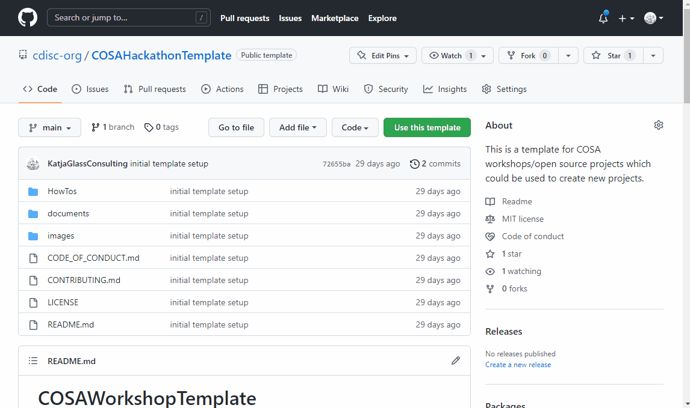

# Setup Repository (Create a copy, update and add members)

To use the template to create your own repository, you can create a new repository in your area by using this source.

## Create new repository from template

To create a new repository based from this template, just the "Use this template" needs to be clicked:

- Create GitHub account / login to GitHub
- Open https://github.com/cdisc-org/COSAHackathonTemplate 
- Click "Use this template"
- Edit project name
- Make the repository public to allow others to see and contribute
- Click "Begin import"

Now you need to wait until the import is finished. Then click the new link to your repository to update this.

The following animation shows this process:

## Update repository

As a next steps you need to update a few things which are noted in the README.md. The easiest way to update the repository is through the integrated Development environment within GitHub which can easily be started throuth pressing the dot character on your keyboard.

Remark: There are various tools and integrations available for git and GitHub, so if you are familar with e.g. eclipse, VSCode or similar you might want to work differently.

The following steps might be performed:

- click "." on your keyboard in GitHub in your repository to start a nice working environment
- click the files to updates 
  - README.md needs to be updated and contains also a list of what should be updated
  - When you edit a markdown file (.md), then you can also preview the result (top-right "Open preview to the side")
  - Use Ctrl+S to save changes in files
  - Optionally you might want to remove some "How To's"

Committing files: 

- After all changes are done, these needs to be "committed" 
  - Go to "Source Control" -> very left bar, third image from top
  - You can review all changes
  - Enter a commit message
  - "Commit and Push" to immediately put all changes live
  - or "Create Pull Request" to review and accept the changes in a separate step

The following animation shows this process:

## Grant members access

Project members should be able to work with the repository as well. For this you have to add the people to the repository members, ideally as Developer.

The following steps can be performed:

- In GitHub in your repository, go to "Settings" -> "Access" -> "Collaborators"
- Click "Add people", select the collaborator and "Add xxx to this repository"
- After the collaborator accepted the invite he/she is able to work in this repository as well.
