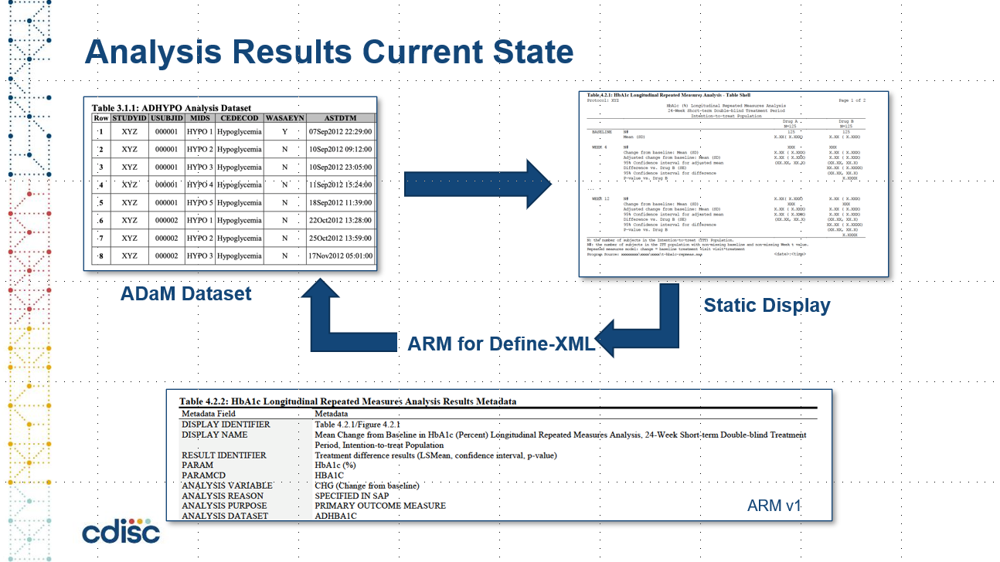
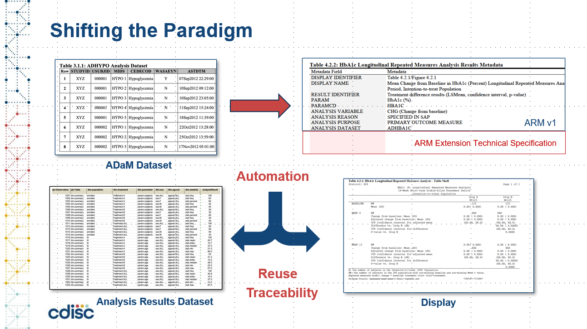

## Description

The goals of CDISC Analysis Results Standards team is to develop:
  - Analysis Results Metadata Technical Specification (ARM-TS), to support automation, traceability, and creation of data displays
  - Define an Analysis Results Data (ARD) structure, to support reuse and reproducibility of results data
  - Illustrate and exercise ARD and ARM-TS with a set of machine-readable common safety displays 
  - Develop a logical analysis results metamodel to support ARM and ARD
    - Including model definition
    - User Guide
    - API development
    - Conformance rules
    - Terminology

## Background

  - Unnecessary variation in analysis results reporting
  - Limited CDISC standards to support analysis results and associated metadata
  - CDISC has been working towards creating standards to support, consistency, traceability, and reuse of results data
  - We anticipate that the CDISC work will support sponsor submissions of analysis results in a standard format that aligns with the FDA effort

## Analysis Results Current State

- Static results created for Clinical Study Report
- May be hundred of tables in PDF format, often difficult to navigate
- Variability between sponsors 
- Expensive to generate and only used once, no or limited reusability 
- ARM v1.0 describes metadata about analysis displays and results (at a high level), no formal analysis and results model or results data
- Lack of features to drive automation 
- Limited regulatory use cases 
- Limited traceability 

## Analysis Results Future State
  - Formal model for describing analyses and results as data
  - Facilitate automated generation of results
  - From static to machine readable results
  - Improved navigation and reusability of analyses and results
  - Support storage, access, processing and reproducibility of results 
  - Traceability to Protocol/SAP and to input ADaM data 
  - Open-source tools to design, specify, build and generate analysis results
 

## Contribution

Project Contact: 
- Bhavin Busa (https://github.com/bhavinbusa): Product Owner and Co-lead
- Bess LeRoy: Co-lead
- Richard Marshall (https://github.com/ASL-rmarshall): ARS model developer
- Drew Mills (https://github.com/drewcdisc): Scrum Master

Contribution is very welcome. When you contribute to this repository you are doing so under the below licenses. Please checkout [Contribution](CONTRIBUTING.md) for additional information. All contributions must adhere to the following [Code of Conduct](CODE_OF_CONDUCT.md).

## License

 

### Code & Scripts

This project is using the [MIT](http://www.opensource.org/licenses/MIT "The MIT License | Open Source Initiative") license (see [`LICENSE`](LICENSE)) for code and scripts.

### Content

The content files like documentation and minutes are released under [CC-BY-4.0](https://creativecommons.org/licenses/by/4.0/). This does not include trademark permissions.

## Re-use

When you re-use the source, keep or copy the license information also in the source code files. When you re-use the source in proprietary software or distribute binaries (derived or underived), copy additionally the license text to a third-party-licenses file or similar.

When you want to re-use and refer to the content, please do so like the following:

> Content based on [Project CDISC Analysis Results Standards (GitHub)](https://github.com/cdisc-org/analysis-results-standard) used under the [CC-BY-4.0](https://creativecommons.org/licenses/by/4.0/) license.

