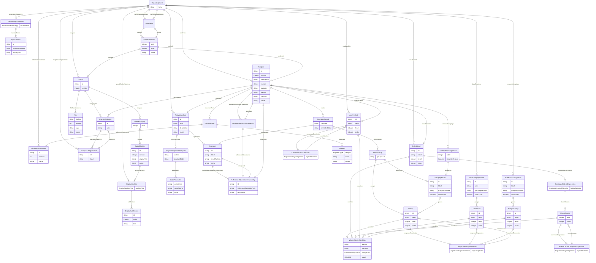

```mermaid
erDiagram
ReportingEvent {
    string name  
}
TerminologyExtension {
    ExtensibleTerminology enumeration  
}
SponsorTerm {
    string id  
    string submissionValue  
    string description  
}
ReferenceDocument {
    string id  
    uri location  
    string name  
}
Output {
    string id  
    integer version  
}
AnalysisCategory {
    string id  
    string label  
}
AnalysisCategorization {
    string id  
    string label  
}
OrderedDisplay {
    integer order  
}
OutputDisplay {
    string id  
    integer version  
    string displayTitle  
    string name  
}
DisplaySection {
    DisplaySectionType sectionType  
}
DisplaySubSection {
    string id  
    integer order  
    string text  
}
File {
    string fileType  
    uri location  
    string style  
    string name  
}
AnalysisMethod {
    string id  
    string label  
    string description  
    string name  
}
ProgrammingCodeTemplate {
    string context  
    string templateCode  
}
CodeParameter {
    string description  
    string valueSource  
    string name  
}
Operation {
    string id  
    string label  
    string resultPattern  
    string name  
}
ReferencedOperationRelationship {
    string id  
    string referencedOperationRole  
    string description  
}
Analysis {
    string id  
    integer version  
    string description  
    string reason  
    string purpose  
    string dataset  
    string variable  
    string name  
}
OperationResult {
    string rawValue  
    string formattedValue  
}
ResultGroup {
    string groupValue  
}
Group {
    string id  
    string label  
    integer level  
    integer order  
}
CompoundGroupExpression {
    ExpressionLogicalOperator logicalOperator  
}
WhereClauseCondition {
    string dataset  
    string variable  
    ConditionComparator comparator  
    stringList value  
}
GroupingFactor {
    string id  
    string label  
    string groupingVariable  
    boolean dataDriven  
}
ReferencedAnalysisOperation {

}
DataSubset {
    string id  
    string label  
    integer level  
    integer order  
}
CompoundSubsetExpression {
    ExpressionLogicalOperator logicalOperator  
}
WhereClause {
    integer level  
    integer order  
}
WhereClauseCompoundExpression {
    ExpressionLogicalOperator logicalOperator  
}
OrderedGroupingFactor {
    integer order  
    boolean resultsByGroup  
}
AnalysisSet {
    string id  
    string label  
    integer level  
    integer order  
}
CompoundSetExpression {
    ExpressionLogicalOperator logicalOperator  
}
DocumentRef {

}
PageRef {
    PageRefType refType  
    string label  
    string pages  
}
DataGroupingFactor {
    string id  
    string label  
    string groupingVariable  
    boolean dataDriven  
}
DataGroup {
    string id  
    string label  
    integer level  
    integer order  
}
SubjectGroupingFactor {
    string id  
    string label  
    string groupingVariable  
    boolean dataDriven  
}
AnalysisGroup {
    string id  
    string label  
    integer level  
    integer order  
}
NestedList {

}
OrderedListItem {
    integer level  
    integer order  
    string name  
}

ReportingEvent ||--|| NestedList : "listOfPlannedAnalyses"
ReportingEvent ||--|o NestedList : "listOfPlannedOutputs"
ReportingEvent ||--}o AnalysisSet : "analysisSets"
ReportingEvent ||--}o SubjectGroupingFactor : "analysisGroupings"
ReportingEvent ||--}o DataSubset : "dataSubsets"
ReportingEvent ||--}o DataGroupingFactor : "dataGroupings"
ReportingEvent ||--}o DisplaySection : "globalDisplaySections"
ReportingEvent ||--}o AnalysisCategorization : "analysisCategorizations"
ReportingEvent ||--}o Analysis : "analyses"
ReportingEvent ||--}o AnalysisMethod : "methods"
ReportingEvent ||--}o Output : "outputs"
ReportingEvent ||--}o ReferenceDocument : "referenceDocuments"
ReportingEvent ||--}o TerminologyExtension : "terminologyExtentions"
TerminologyExtension ||--}| SponsorTerm : "sponsorTerms"
Output ||--}o File : "fileSpecifications"
Output ||--}o OrderedDisplay : "displays"
Output ||--}o AnalysisCategory : "categoryIds"
AnalysisCategory ||--}o AnalysisCategorization : "subCategorizations"
AnalysisCategorization ||--}| AnalysisCategory : "categories"
OrderedDisplay ||--|o OutputDisplay : "display"
OutputDisplay ||--}o DisplaySection : "displaySections"
DisplaySection ||--}o DisplaySubSection : "subSections"
AnalysisMethod ||--}| Operation : "operations"
AnalysisMethod ||--|o ProgrammingCodeTemplate : "codeTemplate"
ProgrammingCodeTemplate ||--}o CodeParameter : "parameters"
Operation ||--}o ReferencedOperationRelationship : "referencedOperationRelationships"
ReferencedOperationRelationship ||--|| Operation : "operationId"
ReferencedOperationRelationship ||--|o Analysis : "analysisId"
Analysis ||--}o AnalysisCategory : "categoryIds"
Analysis ||--}o DocumentRef : "documentRefs"
Analysis ||--|o AnalysisSet : "analysisSetId"
Analysis ||--}o OrderedGroupingFactor : "orderedGroupings"
Analysis ||--|o DataSubset : "dataSubsetId"
Analysis ||--|| AnalysisMethod : "methodId"
Analysis ||--}o ReferencedAnalysisOperation : "referencedAnalysisOperations"
Analysis ||--}o OperationResult : "results"
OperationResult ||--|| Operation : "operationId"
OperationResult ||--}o ResultGroup : "resultGroups"
ResultGroup ||--|o GroupingFactor : "groupingId"
ResultGroup ||--|o Group : "groupId"
Group ||--|o WhereClauseCondition : "condition"
Group ||--|o CompoundGroupExpression : "compoundExpression"
CompoundGroupExpression ||--}o Group : "whereClauses"
GroupingFactor ||--}o Group : "groups"
ReferencedAnalysisOperation ||--|o ReferencedOperationRelationship : "referencedOperationId"
ReferencedAnalysisOperation ||--|| Analysis : "analysisId"
DataSubset ||--|o WhereClauseCondition : "condition"
DataSubset ||--|o CompoundSubsetExpression : "compoundExpression"
CompoundSubsetExpression ||--}o WhereClause : "whereClauses"
WhereClause ||--|o WhereClauseCondition : "condition"
WhereClause ||--|o WhereClauseCompoundExpression : "compoundExpression"
WhereClauseCompoundExpression ||--}o WhereClause : "whereClauses"
OrderedGroupingFactor ||--|o GroupingFactor : "groupingId"
AnalysisSet ||--|o WhereClauseCondition : "condition"
AnalysisSet ||--|o CompoundSetExpression : "compoundExpression"
CompoundSetExpression ||--}o AnalysisSet : "whereClauses"
DocumentRef ||--|| ReferenceDocument : "referenceDocumentId"
DocumentRef ||--}o PageRef : "pageRefs"
DataGroupingFactor ||--}o DataGroup : "groups"
DataGroup ||--|o WhereClauseCondition : "condition"
DataGroup ||--|o CompoundGroupExpression : "compoundExpression"
SubjectGroupingFactor ||--}o AnalysisGroup : "groups"
AnalysisGroup ||--|o WhereClauseCondition : "condition"
AnalysisGroup ||--|o CompoundGroupExpression : "compoundExpression"
NestedList ||--}o OrderedListItem : "listItems"
OrderedListItem ||--|o NestedList : "sublist"
OrderedListItem ||--|o Analysis : "analysisId"
OrderedListItem ||--|o Output : "outputId"

```

