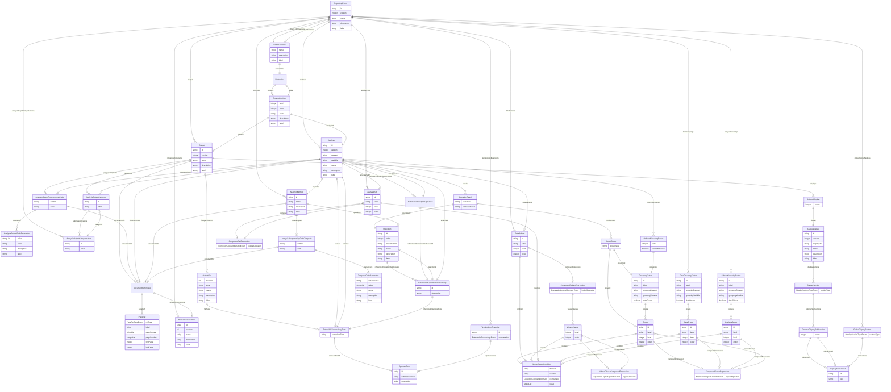

```mermaid
erDiagram
ReportingEvent {
    string id  
    integer version  
    string name  
    string description  
    string label  
}
Output {
    string id  
    integer version  
    string name  
    string description  
    string label  
}
AnalysisOutputProgrammingCode {
    string context  
    string code  
}
AnalysisOutputCodeParameter {
    stringList value  
    string name  
    string description  
    string label  
}
DocumentReference {

}
PageRef {
    PageRefTypeEnum refType  
    string label  
    stringList pageNames  
    integerList pageNumbers  
    integer firstPage  
    integer lastPage  
}
ReferenceDocument {
    string id  
    uri location  
    string name  
    string description  
    string label  
}
AnalysisOutputCategory {
    string id  
    string label  
}
AnalysisOutputCategorization {
    string id  
    string label  
}
OrderedDisplay {
    integer order  
}
OutputDisplay {
    string id  
    integer version  
    string displayTitle  
    string name  
    string description  
    string label  
}
DisplaySection {
    DisplaySectionTypeEnum sectionType  
}
OrderedDisplaySubSection {
    integer order  
}
DisplaySubSection {
    string id  
    string text  
}
OutputFile {
    uri location  
    string style  
    string name  
    string description  
    string label  
}
ExtensibleTerminologyTerm {
    string controlledTerm  
}
SponsorTerm {
    string id  
    string submissionValue  
    string description  
}
GlobalDisplaySection {
    DisplaySectionTypeEnum sectionType  
}
Analysis {
    string id  
    integer version  
    string dataset  
    string variable  
    string name  
    string description  
    string label  
}
OperationResult {
    string rawValue  
    string formattedValue  
}
ResultGroup {
    string groupValue  
}
Group {
    string id  
    string label  
    integer level  
    integer order  
}
CompoundGroupExpression {
    ExpressionLogicalOperatorEnum logicalOperator  
}
WhereClauseCondition {
    string dataset  
    string variable  
    ConditionComparatorEnum comparator  
    stringList value  
}
GroupingFactor {
    string id  
    string label  
    string groupingDataset  
    string groupingVariable  
    boolean dataDriven  
}
Operation {
    string id  
    integer order  
    string resultPattern  
    string name  
    string description  
    string label  
}
ReferencedOperationRelationship {
    string id  
    string description  
}
ReferencedAnalysisOperation {

}
AnalysisMethod {
    string id  
    string name  
    string description  
    string label  
}
AnalysisProgrammingCodeTemplate {
    string context  
    string code  
}
TemplateCodeParameter {
    string valueSource  
    stringList value  
    string name  
    string description  
    string label  
}
OrderedGroupingFactor {
    integer order  
    boolean resultsByGroup  
}
DataSubset {
    string id  
    string label  
    integer level  
    integer order  
}
CompoundSubsetExpression {
    ExpressionLogicalOperatorEnum logicalOperator  
}
WhereClause {
    integer level  
    integer order  
}
WhereClauseCompoundExpression {
    ExpressionLogicalOperatorEnum logicalOperator  
}
AnalysisSet {
    string id  
    string label  
    integer level  
    integer order  
}
CompoundSetExpression {
    ExpressionLogicalOperatorEnum logicalOperator  
}
DataGroupingFactor {
    string id  
    string label  
    string groupingDataset  
    string groupingVariable  
    boolean dataDriven  
}
DataGroup {
    string id  
    string label  
    integer level  
    integer order  
}
SubjectGroupingFactor {
    string id  
    string label  
    string groupingDataset  
    string groupingVariable  
    boolean dataDriven  
}
AnalysisGroup {
    string id  
    string label  
    integer level  
    integer order  
}
TerminologyExtension {
    string id  
    ExtensibleTerminologyEnum enumeration  
}
ListOfContents {
    string name  
    string description  
    string label  
}
NestedList {

}
OrderedListItem {
    integer level  
    integer order  
    string name  
    string description  
    string label  
}

ReportingEvent ||--|| ListOfContents : "mainListOfContents"
ReportingEvent ||--}o ListOfContents : "otherListsOfContents"
ReportingEvent ||--}o ReferenceDocument : "referenceDocuments"
ReportingEvent ||--}o TerminologyExtension : "terminologyExtensions"
ReportingEvent ||--}o AnalysisOutputCategorization : "analysisOutputCategorizations"
ReportingEvent ||--}o AnalysisSet : "analysisSets"
ReportingEvent ||--}o SubjectGroupingFactor : "analysisGroupings"
ReportingEvent ||--}o DataSubset : "dataSubsets"
ReportingEvent ||--}o DataGroupingFactor : "dataGroupings"
ReportingEvent ||--}o AnalysisMethod : "methods"
ReportingEvent ||--}o Analysis : "analyses"
ReportingEvent ||--}o GlobalDisplaySection : "globalDisplaySections"
ReportingEvent ||--}o Output : "outputs"
Output ||--}o OutputFile : "fileSpecifications"
Output ||--}| OrderedDisplay : "displays"
Output ||--}o AnalysisOutputCategory : "categoryIds"
Output ||--}o DocumentReference : "documentRefs"
Output ||--|o AnalysisOutputProgrammingCode : "programmingCode"
AnalysisOutputProgrammingCode ||--|o DocumentReference : "documentRef"
AnalysisOutputProgrammingCode ||--}o AnalysisOutputCodeParameter : "parameters"
DocumentReference ||--|| ReferenceDocument : "referenceDocumentId"
DocumentReference ||--}o PageRef : "pageRefs"
AnalysisOutputCategory ||--}o AnalysisOutputCategorization : "subCategorizations"
AnalysisOutputCategorization ||--}| AnalysisOutputCategory : "categories"
OrderedDisplay ||--|| OutputDisplay : "display"
OutputDisplay ||--}o DisplaySection : "displaySections"
DisplaySection ||--}o OrderedDisplaySubSection : "orderedSubSections"
OrderedDisplaySubSection ||--|o DisplaySubSection : "subSection"
OrderedDisplaySubSection ||--|o DisplaySubSection : "subSectionId"
OutputFile ||--|o ExtensibleTerminologyTerm : "fileType"
ExtensibleTerminologyTerm ||--|o SponsorTerm : "sponsorTermId"
GlobalDisplaySection ||--}o DisplaySubSection : "subSections"
Analysis ||--|| ExtensibleTerminologyTerm : "reason"
Analysis ||--|| ExtensibleTerminologyTerm : "purpose"
Analysis ||--}o DocumentReference : "documentRefs"
Analysis ||--}o AnalysisOutputCategory : "categoryIds"
Analysis ||--|o AnalysisSet : "analysisSetId"
Analysis ||--|o DataSubset : "dataSubsetId"
Analysis ||--}o OrderedGroupingFactor : "orderedGroupings"
Analysis ||--|| AnalysisMethod : "methodId"
Analysis ||--}o ReferencedAnalysisOperation : "referencedAnalysisOperations"
Analysis ||--|o AnalysisOutputProgrammingCode : "programmingCode"
Analysis ||--}o OperationResult : "results"
OperationResult ||--|| Operation : "operationId"
OperationResult ||--}o ResultGroup : "resultGroups"
ResultGroup ||--|| GroupingFactor : "groupingId"
ResultGroup ||--|o Group : "groupId"
Group ||--|o WhereClauseCondition : "condition"
Group ||--|o CompoundGroupExpression : "compoundExpression"
CompoundGroupExpression ||--}o Group : "whereClauses"
GroupingFactor ||--}o Group : "groups"
Operation ||--}o ReferencedOperationRelationship : "referencedOperationRelationships"
ReferencedOperationRelationship ||--|| ExtensibleTerminologyTerm : "referencedOperationRole"
ReferencedOperationRelationship ||--|| Operation : "operationId"
ReferencedOperationRelationship ||--|o Analysis : "analysisId"
ReferencedAnalysisOperation ||--|| ReferencedOperationRelationship : "referencedOperationRelationshipId"
ReferencedAnalysisOperation ||--|| Analysis : "analysisId"
AnalysisMethod ||--}o DocumentReference : "documentRefs"
AnalysisMethod ||--}| Operation : "operations"
AnalysisMethod ||--|o AnalysisProgrammingCodeTemplate : "codeTemplate"
AnalysisProgrammingCodeTemplate ||--|o DocumentReference : "documentRef"
AnalysisProgrammingCodeTemplate ||--}o TemplateCodeParameter : "parameters"
OrderedGroupingFactor ||--|| GroupingFactor : "groupingId"
DataSubset ||--|o WhereClauseCondition : "condition"
DataSubset ||--|o CompoundSubsetExpression : "compoundExpression"
CompoundSubsetExpression ||--}o WhereClause : "whereClauses"
WhereClause ||--|o WhereClauseCondition : "condition"
WhereClause ||--|o WhereClauseCompoundExpression : "compoundExpression"
WhereClauseCompoundExpression ||--}o WhereClause : "whereClauses"
AnalysisSet ||--|o WhereClauseCondition : "condition"
AnalysisSet ||--|o CompoundSetExpression : "compoundExpression"
CompoundSetExpression ||--}o AnalysisSet : "whereClauses"
DataGroupingFactor ||--}o DataGroup : "groups"
DataGroup ||--|o WhereClauseCondition : "condition"
DataGroup ||--|o CompoundGroupExpression : "compoundExpression"
SubjectGroupingFactor ||--}o AnalysisGroup : "groups"
AnalysisGroup ||--|o WhereClauseCondition : "condition"
AnalysisGroup ||--|o CompoundGroupExpression : "compoundExpression"
TerminologyExtension ||--}| SponsorTerm : "sponsorTerms"
ListOfContents ||--|| NestedList : "contentsList"
NestedList ||--}o OrderedListItem : "listItems"
OrderedListItem ||--|o Analysis : "analysisId"
OrderedListItem ||--|o Output : "outputId"
OrderedListItem ||--|o NestedList : "sublist"

```

