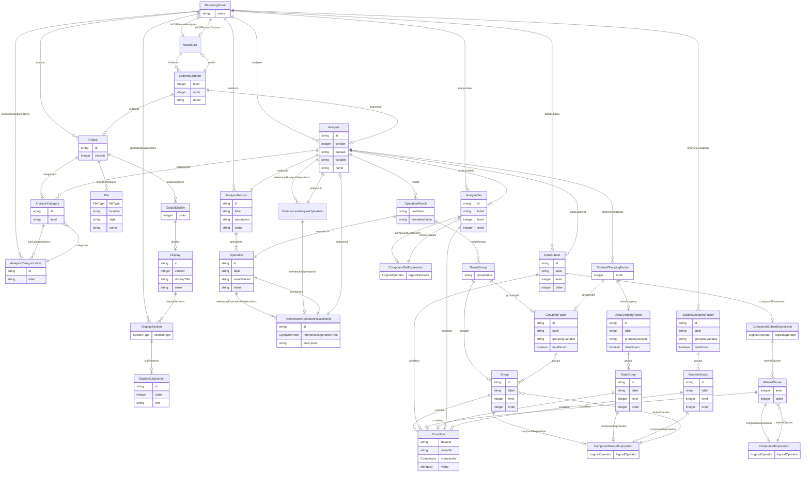

```mermaid
erDiagram
ReportingEvent {
    string name  
}
Output {
    string id  
    integer version  
}
AnalysisCategory {
    string id  
    string label  
}
AnalysisCategorization {
    string id  
    string label  
}
OutputDisplay {
    integer order  
}
Display {
    string id  
    integer version  
    string displayTitle  
    string name  
}
DisplaySection {
    SectionType sectionType  
}
DisplaySubSection {
    string id  
    integer order  
    string text  
}
File {
    FileType fileType  
    string location  
    string style  
    string name  
}
AnalysisMethod {
    string id  
    string label  
    string description  
    string name  
}
Operation {
    string id  
    string label  
    string resultPattern  
    string name  
}
ReferencedOperationRelationship {
    string id  
    OperationRole referencedOperationRole  
    string description  
}
Analysis {
    string id  
    integer version  
    string dataset  
    string variable  
    string name  
}
OperationResult {
    string rawValue  
    string formattedValue  
}
ResultGroup {
    string groupValue  
}
Group {
    string id  
    string label  
    integer level  
    integer order  
}
CompoundGroupExpression {
    LogicalOperator logicalOperator  
}
Condition {
    string dataset  
    string variable  
    Comparator comparator  
    stringList value  
}
GroupingFactor {
    string id  
    string label  
    string groupingVariable  
    boolean dataDriven  
}
ReferencedAnalysisOperation {

}
DataSubset {
    string id  
    string label  
    integer level  
    integer order  
}
CompoundSubsetExpression {
    LogicalOperator logicalOperator  
}
WhereClause {
    integer level  
    integer order  
}
CompoundExpression {
    LogicalOperator logicalOperator  
}
OrderedGroupingFactor {
    integer order  
}
DataGroupingFactor {
    string id  
    string label  
    string groupingVariable  
    boolean dataDriven  
}
DataGroup {
    string id  
    string label  
    integer level  
    integer order  
}
AnalysisSet {
    string id  
    string label  
    integer level  
    integer order  
}
CompoundSetExpression {
    LogicalOperator logicalOperator  
}
SubjectGroupingFactor {
    string id  
    string label  
    string groupingVariable  
    boolean dataDriven  
}
AnalysisGroup {
    string id  
    string label  
    integer level  
    integer order  
}
NestedList {

}
OrderedListItem {
    integer level  
    integer order  
    string name  
}

ReportingEvent ||--|| NestedList : "listOfPlannedAnalyses"
ReportingEvent ||--|o NestedList : "listOfPlannedOutputs"
ReportingEvent ||--}o AnalysisSet : "analysisSets"
ReportingEvent ||--}o SubjectGroupingFactor : "analysisGroupings"
ReportingEvent ||--}o DataSubset : "dataSubsets"
ReportingEvent ||--}o DisplaySection : "globalDisplaySections"
ReportingEvent ||--}o AnalysisCategorization : "analysisCategorizations"
ReportingEvent ||--}o Analysis : "analyses"
ReportingEvent ||--}o AnalysisMethod : "methods"
ReportingEvent ||--}o Output : "outputs"
Output ||--}o File : "fileSpecifications"
Output ||--}o OutputDisplay : "outputDisplays"
Output ||--}o AnalysisCategory : "categoryIds"
AnalysisCategory ||--}o AnalysisCategorization : "subCategorizations"
AnalysisCategorization ||--}| AnalysisCategory : "categories"
OutputDisplay ||--|o Display : "display"
Display ||--}o DisplaySection : "displaySections"
DisplaySection ||--}o DisplaySubSection : "subSections"
AnalysisMethod ||--}| Operation : "operations"
Operation ||--}o ReferencedOperationRelationship : "referencedOperationRelationships"
ReferencedOperationRelationship ||--|| Operation : "operationId"
ReferencedOperationRelationship ||--|o Analysis : "analysisId"
Analysis ||--}o AnalysisCategory : "categoryIds"
Analysis ||--|o AnalysisSet : "analysisSetId"
Analysis ||--}o OrderedGroupingFactor : "orderedGroupings"
Analysis ||--|o DataSubset : "dataSubsetId"
Analysis ||--|| AnalysisMethod : "methodId"
Analysis ||--}o ReferencedAnalysisOperation : "referencedAnalysisOperations"
Analysis ||--}o OperationResult : "results"
OperationResult ||--|| Operation : "operationId"
OperationResult ||--}o ResultGroup : "resultGroups"
ResultGroup ||--|o GroupingFactor : "groupingId"
ResultGroup ||--|o Group : "groupId"
Group ||--|o Condition : "condition"
Group ||--|o CompoundGroupExpression : "compoundExpression"
CompoundGroupExpression ||--}o Group : "whereClauses"
GroupingFactor ||--}o Group : "groups"
ReferencedAnalysisOperation ||--|o ReferencedOperationRelationship : "referencedOperationId"
ReferencedAnalysisOperation ||--|| Analysis : "analysisId"
DataSubset ||--|o Condition : "condition"
DataSubset ||--|o CompoundSubsetExpression : "compoundExpression"
CompoundSubsetExpression ||--}o WhereClause : "whereClauses"
WhereClause ||--|o Condition : "condition"
WhereClause ||--|o CompoundExpression : "compoundExpression"
CompoundExpression ||--}o WhereClause : "whereClauses"
OrderedGroupingFactor ||--|o GroupingFactor : "groupingId"
OrderedGroupingFactor ||--|o DataGroupingFactor : "dataGrouping"
DataGroupingFactor ||--}o DataGroup : "groups"
DataGroup ||--|o Condition : "condition"
DataGroup ||--|o CompoundGroupExpression : "compoundExpression"
AnalysisSet ||--|o Condition : "condition"
AnalysisSet ||--|o CompoundSetExpression : "compoundExpression"
CompoundSetExpression ||--}o AnalysisSet : "whereClauses"
SubjectGroupingFactor ||--}o AnalysisGroup : "groups"
AnalysisGroup ||--|o Condition : "condition"
AnalysisGroup ||--|o CompoundGroupExpression : "compoundExpression"
NestedList ||--}o OrderedListItem : "listItems"
OrderedListItem ||--|o NestedList : "sublist"
OrderedListItem ||--|o Analysis : "analysisId"
OrderedListItem ||--|o Output : "outputId"

```

