# Class: Analysis


_An analysis that is designed to meet a requirement of the reporting event. Each analysis is defined as a set of specifications, including:_

_* The analysis variable that is the subject of the analysis._

_* The analysis method (set of statistical operations) that is performed for the analysis variable._

_* The analysis set (subject population) for which the analysis is performed._

_* The subset of data records on which the analysis is performed (optional)._

_* One or more factors by which either subjects or data records are grouped for analysis (optional)._

__


URI: [ars:Analysis](https://www.cdisc.org/ars/1-0/Analysis)

```mermaid
erDiagram
Analysis {
    string id  
    integer version  
    string description  
    string dataset  
    string variable  
    string name  
}
OperationResult {
    string rawValue  
    string formattedValue  
}
ResultGroup {
    string groupValue  
}
Operation {
    string id  
    string label  
    string resultPattern  
    string name  
}
AnalysisOutputProgrammingCode {
    string context  
    string code  
}
AnalysisOutputCodeParameter {
    stringList value  
    string description  
    string name  
}
DocumentReference {

}
ReferencedAnalysisOperation {

}
ReferencedOperationRelationship {
    string id  
    string description  
}
AnalysisMethod {
    string id  
    string label  
    string description  
    string name  
}
AnalysisProgrammingCodeTemplate {
    string context  
    string code  
}
DataSubset {
    string id  
    string label  
    integer level  
    integer order  
}
CompoundSubsetExpression {
    ExpressionLogicalOperatorEnum logicalOperator  
}
WhereClauseCondition {
    string dataset  
    string variable  
    ConditionComparatorEnum comparator  
    stringList value  
}
OrderedGroupingFactor {
    integer order  
    boolean resultsByGroup  
}
GroupingFactor {
    string id  
    string label  
    string groupingVariable  
    boolean dataDriven  
}
AnalysisSet {
    string id  
    string label  
    integer level  
    integer order  
}
CompoundSetExpression {
    ExpressionLogicalOperatorEnum logicalOperator  
}
ExtensibleTerminologyTerm {
    string controlledTerm  
}
SponsorTerm {
    string id  
    string submissionValue  
    string description  
}
AnalysisCategory {
    string id  
    string label  
}
AnalysisCategorization {
    string id  
    string label  
}

Analysis ||--}o AnalysisCategory : "categoryIds"
Analysis ||--|| ExtensibleTerminologyTerm : "reason"
Analysis ||--|| ExtensibleTerminologyTerm : "purpose"
Analysis ||--}o DocumentReference : "documentRefs"
Analysis ||--|o AnalysisSet : "analysisSetId"
Analysis ||--}o OrderedGroupingFactor : "orderedGroupings"
Analysis ||--|o DataSubset : "dataSubsetId"
Analysis ||--|| AnalysisMethod : "methodId"
Analysis ||--}o ReferencedAnalysisOperation : "referencedAnalysisOperations"
Analysis ||--|o AnalysisOutputProgrammingCode : "programmingCode"
Analysis ||--}o OperationResult : "results"
OperationResult ||--|| Operation : "operationId"
OperationResult ||--}o ResultGroup : "resultGroups"
ResultGroup ||--|o GroupingFactor : "groupingId"
ResultGroup ||--|o Group : "groupId"
Operation ||--}o ReferencedOperationRelationship : "referencedOperationRelationships"
AnalysisOutputProgrammingCode ||--|o DocumentReference : "documentRef"
AnalysisOutputProgrammingCode ||--}o AnalysisOutputCodeParameter : "parameters"
DocumentReference ||--|| ReferenceDocument : "referenceDocumentId"
DocumentReference ||--}o PageRef : "pageRefs"
ReferencedAnalysisOperation ||--|| ReferencedOperationRelationship : "referencedOperationRelationshipId"
ReferencedAnalysisOperation ||--|| Analysis : "analysisId"
ReferencedOperationRelationship ||--|| ExtensibleTerminologyTerm : "referencedOperationRole"
ReferencedOperationRelationship ||--|| Operation : "operationId"
ReferencedOperationRelationship ||--|o Analysis : "analysisId"
AnalysisMethod ||--}| Operation : "operations"
AnalysisMethod ||--}o DocumentReference : "documentRefs"
AnalysisMethod ||--|o AnalysisProgrammingCodeTemplate : "codeTemplate"
AnalysisProgrammingCodeTemplate ||--|o DocumentReference : "documentRef"
AnalysisProgrammingCodeTemplate ||--}o TemplateCodeParameter : "parameters"
DataSubset ||--|o WhereClauseCondition : "condition"
DataSubset ||--|o CompoundSubsetExpression : "compoundExpression"
CompoundSubsetExpression ||--}o WhereClause : "whereClauses"
OrderedGroupingFactor ||--|o GroupingFactor : "groupingId"
GroupingFactor ||--}o Group : "groups"
AnalysisSet ||--|o WhereClauseCondition : "condition"
AnalysisSet ||--|o CompoundSetExpression : "compoundExpression"
CompoundSetExpression ||--}o AnalysisSet : "whereClauses"
ExtensibleTerminologyTerm ||--|o SponsorTerm : "sponsorTermId"
AnalysisCategory ||--}o AnalysisCategorization : "subCategorizations"
AnalysisCategorization ||--}| AnalysisCategory : "categories"

```





## Inheritance
* [NamedObject](NamedObject.md)
    * **Analysis**


## Slots

| Name | Cardinality and Range | Description | Inheritance |
| ---  | --- | --- | --- |
| [id](id.md) | 1..1 <br/> [String](String.md) | The assigned identifying value for the instance of the class | direct |
| [version](version.md) | 0..1 <br/> [Integer](Integer.md) | An ordinal indicating the version of the identified instance of the class | direct |
| [categoryIds](categoryIds.md) | 0..* <br/> [AnalysisCategory](AnalysisCategory.md) | References to any implementer-defined categories that apply to the analysis | direct |
| [description](description.md) | 0..1 <br/> [String](String.md) | A textual description of the instance of the class | direct |
| [reason](reason.md) | 1..1 <br/> [ExtensibleTerminologyTerm](ExtensibleTerminologyTerm.md) | The rationale for performing this analysis | direct |
| [purpose](purpose.md) | 1..1 <br/> [ExtensibleTerminologyTerm](ExtensibleTerminologyTerm.md) | The purpose of the analysis within the body of evidence (e | direct |
| [documentRefs](documentRefs.md) | 0..* <br/> [DocumentReference](DocumentReference.md) | References to external documents containing additional information | direct |
| [analysisSetId](analysisSetId.md) | 0..1 <br/> [AnalysisSet](AnalysisSet.md) | The identifier of the referenced analysis set | direct |
| [orderedGroupings](orderedGroupings.md) | 0..* <br/> [OrderedGroupingFactor](OrderedGroupingFactor.md) | An ordered list of grouping factors used in the analysis | direct |
| [dataSubsetId](dataSubsetId.md) | 0..1 <br/> [DataSubset](DataSubset.md) | The identifier of the referenced data subset | direct |
| [dataset](dataset.md) | 0..1 <br/> [String](String.md) | The name of the analysis dataset | direct |
| [variable](variable.md) | 0..1 <br/> [String](String.md) | The name of the variable | direct |
| [methodId](methodId.md) | 1..1 <br/> [AnalysisMethod](AnalysisMethod.md) | A reference to the set of one or more statistical operations performed for th... | direct |
| [referencedAnalysisOperations](referencedAnalysisOperations.md) | 0..* <br/> [ReferencedAnalysisOperation](ReferencedAnalysisOperation.md) | Indications of which analysis contains the results for each referenced operat... | direct |
| [programmingCode](programmingCode.md) | 0..1 <br/> [AnalysisOutputProgrammingCode](AnalysisOutputProgrammingCode.md) | Programming statements and/or a reference to the program used to perform the ... | direct |
| [results](results.md) | 0..* <br/> [OperationResult](OperationResult.md) | The results of the analysis | direct |
| [name](name.md) | 1..1 <br/> [String](String.md) | The name for the instance of the class | [NamedObject](NamedObject.md) |


## Usages

| used by | used in | type | used |
| ---  | --- | --- | --- |
| [ReportingEvent](ReportingEvent.md) | [analyses](analyses.md) | range | [Analysis](Analysis.md) |
| [OrderedListItem](OrderedListItem.md) | [analysisId](analysisId.md) | range | [Analysis](Analysis.md) |
| [ReferencedAnalysisOperation](ReferencedAnalysisOperation.md) | [analysisId](analysisId.md) | range | [Analysis](Analysis.md) |
| [ReferencedOperationRelationship](ReferencedOperationRelationship.md) | [analysisId](analysisId.md) | range | [Analysis](Analysis.md) |


## Identifier and Mapping Information


### Schema Source


* from schema: https://www.cdisc.org/ars/1-0


## Mappings

| Mapping Type | Mapped Value |
| ---  | ---  |
| self | ars:Analysis |
| native | ars:Analysis |


## LinkML Source

<!-- TODO: investigate https://stackoverflow.com/questions/37606292/how-to-create-tabbed-code-blocks-in-mkdocs-or-sphinx -->

### Direct

<details>
```yaml
name: Analysis
description: 'An analysis that is designed to meet a requirement of the reporting
  event. Each analysis is defined as a set of specifications, including:

  * The analysis variable that is the subject of the analysis.

  * The analysis method (set of statistical operations) that is performed for the
  analysis variable.

  * The analysis set (subject population) for which the analysis is performed.

  * The subset of data records on which the analysis is performed (optional).

  * One or more factors by which either subjects or data records are grouped for analysis
  (optional).

  '
from_schema: https://www.cdisc.org/ars/1-0
rank: 1000
is_a: NamedObject
slots:
- id
- version
- categoryIds
- description
- reason
- purpose
- documentRefs
- analysisSetId
- orderedGroupings
- dataSubsetId
- dataset
- variable
- methodId
- referencedAnalysisOperations
- programmingCode
- results
slot_usage:
  categoryIds:
    name: categoryIds
    description: References to any implementer-defined categories that apply to the
      analysis.
    domain_of:
    - Analysis
    - Output
  programmingCode:
    name: programmingCode
    description: Programming statements and/or a reference to the program used to
      perform the specific analysis.
    domain_of:
    - Analysis
    - Output

```
</details>

### Induced

<details>
```yaml
name: Analysis
description: 'An analysis that is designed to meet a requirement of the reporting
  event. Each analysis is defined as a set of specifications, including:

  * The analysis variable that is the subject of the analysis.

  * The analysis method (set of statistical operations) that is performed for the
  analysis variable.

  * The analysis set (subject population) for which the analysis is performed.

  * The subset of data records on which the analysis is performed (optional).

  * One or more factors by which either subjects or data records are grouped for analysis
  (optional).

  '
from_schema: https://www.cdisc.org/ars/1-0
rank: 1000
is_a: NamedObject
slot_usage:
  categoryIds:
    name: categoryIds
    description: References to any implementer-defined categories that apply to the
      analysis.
    domain_of:
    - Analysis
    - Output
  programmingCode:
    name: programmingCode
    description: Programming statements and/or a reference to the program used to
      perform the specific analysis.
    domain_of:
    - Analysis
    - Output
attributes:
  id:
    name: id
    description: The assigned identifying value for the instance of the class.
    from_schema: https://www.cdisc.org/ars/1-0
    rank: 1000
    identifier: true
    alias: id
    owner: Analysis
    domain_of:
    - ReportingEvent
    - AnalysisCategorization
    - AnalysisCategory
    - Analysis
    - AnalysisMethod
    - Operation
    - ReferencedOperationRelationship
    - Output
    - OutputDisplay
    - DisplaySubSection
    - AnalysisSet
    - GroupingFactor
    - Group
    - DataSubset
    - ReferenceDocument
    - TerminologyExtension
    - SponsorTerm
    range: string
    required: true
  version:
    name: version
    description: An ordinal indicating the version of the identified instance of the
      class.
    from_schema: https://www.cdisc.org/ars/1-0
    rank: 1000
    alias: version
    owner: Analysis
    domain_of:
    - ReportingEvent
    - Analysis
    - Output
    - OutputDisplay
    range: integer
  categoryIds:
    name: categoryIds
    description: References to any implementer-defined categories that apply to the
      analysis.
    from_schema: https://www.cdisc.org/ars/1-0
    rank: 1000
    multivalued: true
    alias: categoryIds
    owner: Analysis
    domain_of:
    - Analysis
    - Output
    range: AnalysisCategory
    required: false
    inlined: false
  description:
    name: description
    description: A textual description of the instance of the class.
    from_schema: https://www.cdisc.org/ars/1-0
    rank: 1000
    alias: description
    owner: Analysis
    domain_of:
    - Analysis
    - AnalysisMethod
    - ReferencedOperationRelationship
    - CodeParameter
    - SponsorTerm
    range: string
  reason:
    name: reason
    description: The rationale for performing this analysis. It indicates when the
      analysis was planned.
    from_schema: https://www.cdisc.org/ars/1-0
    rank: 1000
    alias: reason
    owner: Analysis
    domain_of:
    - Analysis
    range: ExtensibleTerminologyTerm
    required: true
    any_of:
    - range: AnalysisReason
    - range: SponsorAnalysisReason
  purpose:
    name: purpose
    description: The purpose of the analysis within the body of evidence (e.g., section
      in the clinical study report).
    from_schema: https://www.cdisc.org/ars/1-0
    rank: 1000
    alias: purpose
    owner: Analysis
    domain_of:
    - Analysis
    range: ExtensibleTerminologyTerm
    required: true
    any_of:
    - range: AnalysisPurpose
    - range: SponsorAnalysisPurpose
  documentRefs:
    name: documentRefs
    description: References to external documents containing additional information.
    from_schema: https://www.cdisc.org/ars/1-0
    rank: 1000
    multivalued: true
    alias: documentRefs
    owner: Analysis
    domain_of:
    - Analysis
    - AnalysisMethod
    - Output
    range: DocumentReference
    inlined: true
    inlined_as_list: true
  analysisSetId:
    name: analysisSetId
    description: The identifier of the referenced analysis set.
    from_schema: https://www.cdisc.org/ars/1-0
    rank: 1000
    multivalued: false
    alias: analysisSetId
    owner: Analysis
    domain_of:
    - Analysis
    range: AnalysisSet
    inlined: false
  orderedGroupings:
    name: orderedGroupings
    description: An ordered list of grouping factors used in the analysis.
    from_schema: https://www.cdisc.org/ars/1-0
    rank: 1000
    multivalued: true
    list_elements_ordered: true
    alias: orderedGroupings
    owner: Analysis
    domain_of:
    - Analysis
    range: OrderedGroupingFactor
    inlined: true
    inlined_as_list: true
  dataSubsetId:
    name: dataSubsetId
    description: The identifier of the referenced data subset.
    from_schema: https://www.cdisc.org/ars/1-0
    rank: 1000
    alias: dataSubsetId
    owner: Analysis
    domain_of:
    - Analysis
    range: DataSubset
    inlined: false
  dataset:
    name: dataset
    description: The name of the analysis dataset.
    from_schema: https://www.cdisc.org/ars/1-0
    rank: 1000
    alias: dataset
    owner: Analysis
    domain_of:
    - Analysis
    - WhereClauseCondition
    range: string
  variable:
    name: variable
    description: The name of the variable.
    from_schema: https://www.cdisc.org/ars/1-0
    rank: 1000
    alias: variable
    owner: Analysis
    domain_of:
    - Analysis
    - WhereClauseCondition
    range: string
  methodId:
    name: methodId
    description: A reference to the set of one or more statistical operations performed
      for the analysis.
    from_schema: https://www.cdisc.org/ars/1-0
    rank: 1000
    alias: methodId
    owner: Analysis
    domain_of:
    - Analysis
    range: AnalysisMethod
    required: true
    inlined: false
  referencedAnalysisOperations:
    name: referencedAnalysisOperations
    description: Indications of which analysis contains the results for each referenced
      operation.
    from_schema: https://www.cdisc.org/ars/1-0
    rank: 1000
    multivalued: true
    alias: referencedAnalysisOperations
    owner: Analysis
    domain_of:
    - Analysis
    range: ReferencedAnalysisOperation
    inlined: true
    inlined_as_list: true
  programmingCode:
    name: programmingCode
    description: Programming statements and/or a reference to the program used to
      perform the specific analysis.
    from_schema: https://www.cdisc.org/ars/1-0
    rank: 1000
    alias: programmingCode
    owner: Analysis
    domain_of:
    - Analysis
    - Output
    range: AnalysisOutputProgrammingCode
  results:
    name: results
    description: The results of the analysis.
    from_schema: https://www.cdisc.org/ars/1-0
    rank: 1000
    multivalued: true
    alias: results
    owner: Analysis
    domain_of:
    - Analysis
    range: OperationResult
    inlined: true
    inlined_as_list: true
  name:
    name: name
    description: The name for the instance of the class.
    from_schema: https://www.cdisc.org/ars/1-0
    rank: 1000
    alias: name
    owner: Analysis
    domain_of:
    - NamedObject
    range: string
    required: true

```
</details>