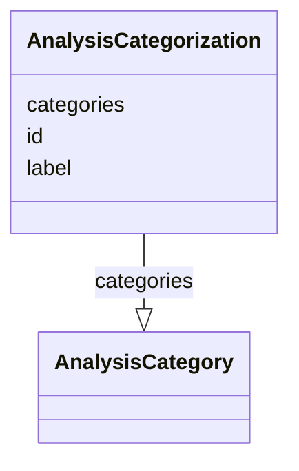

# Class: AnalysisCategorization


_A set of related implementer-defined categories that can be used to categorize analyses or outputs._


URI: [ars:AnalysisCategorization](https://www.cdisc.org/ars/1-0/AnalysisCategorization)





<!-- no inheritance hierarchy -->


## Slots

| Name | Cardinality and Range | Description | Inheritance |
| ---  | --- | --- | --- |
| [id](id.md) | 1..1 <br/> [String](String.md) |  | direct |
| [label](label.md) | 0..1 <br/> [String](String.md) |  | direct |
| [categories](categories.md) | 1..* <br/> [AnalysisCategory](AnalysisCategory.md) |  | direct |


## Usages

| used by | used in | type | used |
| ---  | --- | --- | --- |
| [ReportingEvent](ReportingEvent.md) | [analysisCategorizations](analysisCategorizations.md) | range | [AnalysisCategorization](AnalysisCategorization.md) |
| [AnalysisCategory](AnalysisCategory.md) | [subCategorizations](subCategorizations.md) | range | [AnalysisCategorization](AnalysisCategorization.md) |


## Identifier and Mapping Information


### Schema Source


* from schema: https://www.cdisc.org/ars/1-0


## Mappings

| Mapping Type | Mapped Value |
| ---  | ---  |
| self | ars:AnalysisCategorization |
| native | ars:AnalysisCategorization |


## LinkML Source

<!-- TODO: investigate https://stackoverflow.com/questions/37606292/how-to-create-tabbed-code-blocks-in-mkdocs-or-sphinx -->

### Direct

<details>
```yaml
name: AnalysisCategorization
description: A set of related implementer-defined categories that can be used to categorize
  analyses or outputs.
from_schema: https://www.cdisc.org/ars/1-0
rank: 1000
slots:
- id
- label
- categories

```
</details>

### Induced

<details>
```yaml
name: AnalysisCategorization
description: A set of related implementer-defined categories that can be used to categorize
  analyses or outputs.
from_schema: https://www.cdisc.org/ars/1-0
rank: 1000
attributes:
  id:
    name: id
    from_schema: https://www.cdisc.org/ars/1-0
    rank: 1000
    identifier: true
    alias: id
    owner: AnalysisCategorization
    domain_of:
    - AnalysisCategorization
    - AnalysisCategory
    - Analysis
    - AnalysisMethod
    - Operation
    - ReferencedOperationRelationship
    - Output
    - OutputDisplay
    - DisplaySubSection
    - AnalysisSet
    - GroupingFactor
    - Group
    - DataSubset
    - ReferenceDocument
    - SponsorTerm
    range: string
    required: true
  label:
    name: label
    from_schema: https://www.cdisc.org/ars/1-0
    rank: 1000
    alias: label
    owner: AnalysisCategorization
    domain_of:
    - AnalysisCategorization
    - AnalysisCategory
    - AnalysisMethod
    - Operation
    - AnalysisSet
    - GroupingFactor
    - Group
    - DataSubset
    - PageRef
    range: string
  categories:
    name: categories
    from_schema: https://www.cdisc.org/ars/1-0
    rank: 1000
    multivalued: true
    alias: categories
    owner: AnalysisCategorization
    domain_of:
    - AnalysisCategorization
    range: AnalysisCategory
    required: true
    inlined: true
    inlined_as_list: true

```
</details>