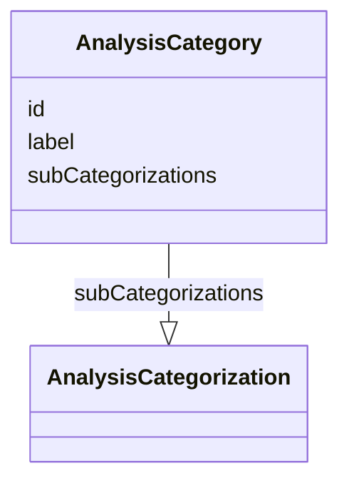

# Class: AnalysisCategory


_An implementer-defined category of analyses/outputs, which may include one or more sub-categorization._


URI: [ars:AnalysisCategory](https://www.cdisc.org/ars/1-0/AnalysisCategory)





<!-- no inheritance hierarchy -->


## Slots

| Name | Cardinality and Range | Description | Inheritance |
| ---  | --- | --- | --- |
| [id](id.md) | 1..1 <br/> [String](String.md) | The assigned identifying value for the instance of the class | direct |
| [label](label.md) | 0..1 <br/> [String](String.md) | A short informative description that may be used for display | direct |
| [subCategorizations](subCategorizations.md) | 0..* <br/> [AnalysisCategorization](AnalysisCategorization.md) | Sets of related implementer-defined sub-categories that can be used to catego... | direct |


## Usages

| used by | used in | type | used |
| ---  | --- | --- | --- |
| [AnalysisCategorization](AnalysisCategorization.md) | [categories](categories.md) | range | [AnalysisCategory](AnalysisCategory.md) |
| [Analysis](Analysis.md) | [categoryIds](categoryIds.md) | range | [AnalysisCategory](AnalysisCategory.md) |
| [Output](Output.md) | [categoryIds](categoryIds.md) | range | [AnalysisCategory](AnalysisCategory.md) |


## Identifier and Mapping Information


### Schema Source


* from schema: https://www.cdisc.org/ars/1-0


## Mappings

| Mapping Type | Mapped Value |
| ---  | ---  |
| self | ars:AnalysisCategory |
| native | ars:AnalysisCategory |


## LinkML Source

<!-- TODO: investigate https://stackoverflow.com/questions/37606292/how-to-create-tabbed-code-blocks-in-mkdocs-or-sphinx -->

### Direct

<details>
```yaml
name: AnalysisCategory
description: An implementer-defined category of analyses/outputs, which may include
  one or more sub-categorization.
from_schema: https://www.cdisc.org/ars/1-0
rank: 1000
slots:
- id
- label
- subCategorizations

```
</details>

### Induced

<details>
```yaml
name: AnalysisCategory
description: An implementer-defined category of analyses/outputs, which may include
  one or more sub-categorization.
from_schema: https://www.cdisc.org/ars/1-0
rank: 1000
attributes:
  id:
    name: id
    description: The assigned identifying value for the instance of the class.
    from_schema: https://www.cdisc.org/ars/1-0
    rank: 1000
    identifier: true
    alias: id
    owner: AnalysisCategory
    domain_of:
    - ReportingEvent
    - AnalysisCategorization
    - AnalysisCategory
    - Analysis
    - AnalysisMethod
    - Operation
    - ReferencedOperationRelationship
    - Output
    - OutputDisplay
    - DisplaySubSection
    - AnalysisSet
    - GroupingFactor
    - Group
    - DataSubset
    - ReferenceDocument
    - TerminologyExtension
    - SponsorTerm
    range: string
    required: true
  label:
    name: label
    description: A short informative description that may be used for display.
    from_schema: https://www.cdisc.org/ars/1-0
    rank: 1000
    alias: label
    owner: AnalysisCategory
    domain_of:
    - AnalysisCategorization
    - AnalysisCategory
    - AnalysisMethod
    - Operation
    - AnalysisSet
    - GroupingFactor
    - Group
    - DataSubset
    - PageRef
    range: string
  subCategorizations:
    name: subCategorizations
    description: Sets of related implementer-defined sub-categories that can be used
      to categorize analyses or outputs.
    from_schema: https://www.cdisc.org/ars/1-0
    rank: 1000
    multivalued: true
    alias: subCategorizations
    owner: AnalysisCategory
    domain_of:
    - AnalysisCategory
    range: AnalysisCategorization
    inlined: true
    inlined_as_list: true

```
</details>