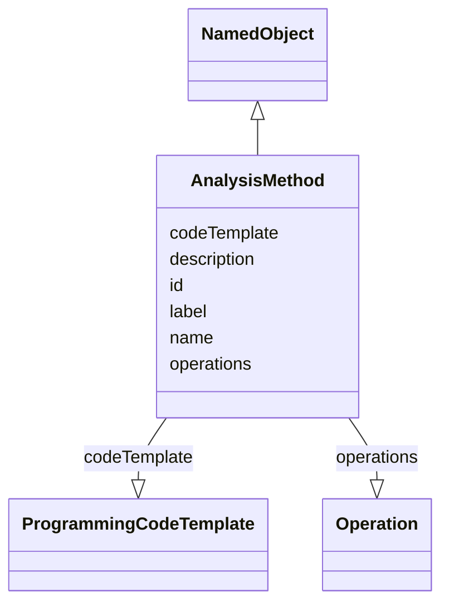

# Class: AnalysisMethod


_A set of one or more statistical operations._


URI: [ars:AnalysisMethod](https://www.cdisc.org/ars/1-0AnalysisMethod)





## Inheritance
* [NamedObject](NamedObject.md)
    * **AnalysisMethod**


## Slots

| Name | Cardinality and Range | Description | Inheritance |
| ---  | --- | --- | --- |
| [id](id.md) | 1..1 <br/> [String](String.md) |  | direct |
| [label](label.md) | 0..1 <br/> [String](String.md) |  | direct |
| [description](description.md) | 0..1 <br/> [String](String.md) |  | direct |
| [operations](operations.md) | 1..* <br/> [Operation](Operation.md) |  | direct |
| [codeTemplate](codeTemplate.md) | 0..1 <br/> [ProgrammingCodeTemplate](ProgrammingCodeTemplate.md) | Template programming statements and/or a reference to the template program us... | direct |
| [name](name.md) | 1..1 <br/> [String](String.md) |  | [NamedObject](NamedObject.md) |


## Usages

| used by | used in | type | used |
| ---  | --- | --- | --- |
| [ReportingEvent](ReportingEvent.md) | [methods](methods.md) | range | [AnalysisMethod](AnalysisMethod.md) |
| [Analysis](Analysis.md) | [methodId](methodId.md) | range | [AnalysisMethod](AnalysisMethod.md) |


## Identifier and Mapping Information


### Schema Source


* from schema: https://www.cdisc.org/ars/1-0


## Mappings

| Mapping Type | Mapped Value |
| ---  | ---  |
| self | ars:AnalysisMethod |
| native | ars:AnalysisMethod |


## LinkML Source

<!-- TODO: investigate https://stackoverflow.com/questions/37606292/how-to-create-tabbed-code-blocks-in-mkdocs-or-sphinx -->

### Direct

<details>
```yaml
name: AnalysisMethod
description: A set of one or more statistical operations.
from_schema: https://www.cdisc.org/ars/1-0
rank: 1000
is_a: NamedObject
slots:
- id
- label
- description
- operations
- codeTemplate

```
</details>

### Induced

<details>
```yaml
name: AnalysisMethod
description: A set of one or more statistical operations.
from_schema: https://www.cdisc.org/ars/1-0
rank: 1000
is_a: NamedObject
attributes:
  id:
    name: id
    from_schema: https://www.cdisc.org/ars/1-0
    rank: 1000
    identifier: true
    alias: id
    owner: AnalysisMethod
    domain_of:
    - AnalysisCategorization
    - AnalysisCategory
    - Analysis
    - AnalysisMethod
    - Operation
    - ReferencedOperationRelationship
    - Output
    - OutputDisplay
    - DisplaySubSection
    - AnalysisSet
    - GroupingFactor
    - Group
    - DataSubset
    - ReferenceDocument
    - SponsorTerm
    range: string
    required: true
  label:
    name: label
    from_schema: https://www.cdisc.org/ars/1-0
    rank: 1000
    alias: label
    owner: AnalysisMethod
    domain_of:
    - AnalysisCategorization
    - AnalysisCategory
    - AnalysisMethod
    - Operation
    - AnalysisSet
    - GroupingFactor
    - Group
    - DataSubset
    - PageRef
    range: string
  description:
    name: description
    from_schema: https://www.cdisc.org/ars/1-0
    rank: 1000
    alias: description
    owner: AnalysisMethod
    domain_of:
    - Analysis
    - AnalysisMethod
    - ReferencedOperationRelationship
    - CodeParameter
    - SponsorTerm
    range: string
  operations:
    name: operations
    from_schema: https://www.cdisc.org/ars/1-0
    rank: 1000
    multivalued: true
    alias: operations
    owner: AnalysisMethod
    domain_of:
    - AnalysisMethod
    range: Operation
    required: true
    inlined: true
    inlined_as_list: true
  codeTemplate:
    name: codeTemplate
    description: Template programming statements and/or a reference to the template
      program used to perform the specific analysis.
    from_schema: https://www.cdisc.org/ars/1-0
    rank: 1000
    alias: codeTemplate
    owner: AnalysisMethod
    domain_of:
    - AnalysisMethod
    range: ProgrammingCodeTemplate
  name:
    name: name
    from_schema: https://www.cdisc.org/ars/1-0
    rank: 1000
    alias: name
    owner: AnalysisMethod
    domain_of:
    - NamedObject
    range: string
    required: true

```
</details>