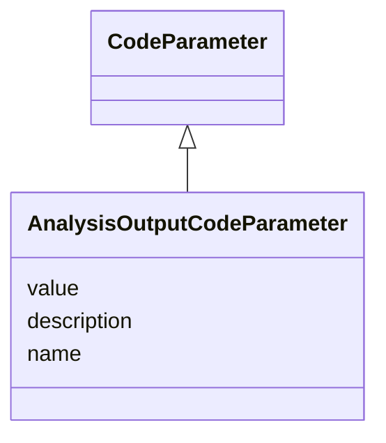

# Class: AnalysisOutputCodeParameter

_A parameter whose value is used in programming code for a specific analysis or output._


URI: [ars:AnalysisOutputCodeParameter](https://www.cdisc.org/ars/1-0/AnalysisOutputCodeParameter)





## Inheritance
* [NamedObject](NamedObject.md)
    * [CodeParameter](CodeParameter.md)
        * **AnalysisOutputCodeParameter**


## Slots

| Name | Cardinality* and Range | Description | Inheritance |
| ---  | --- | --- | --- |
| [value](value.md) | 1..* <br/> [String](String.md) | The value of the parameter | direct |
| [description](description.md) | 0..1 <br/> [String](String.md) | A textual description of the instance of the class | [CodeParameter](CodeParameter.md) |
| [name](name.md) | 1..1 <br/> [String](String.md) | The name for the instance of the class | [NamedObject](NamedObject.md) |

_* See [LinkML documentation](https://linkml.io/linkml/schemas/slots.html#slot-cardinality) for cardinality definitions._


## Usages

| used by | used in | type | used |
| ---  | --- | --- | --- |
| [AnalysisOutputProgrammingCode](AnalysisOutputProgrammingCode.md) | [parameters](parameters.md) | range | [AnalysisOutputCodeParameter](AnalysisOutputCodeParameter.md) |


## Identifier and Mapping Information


### Schema Source


* from schema: https://www.cdisc.org/ars/1-0


## Mappings

| Mapping Type | Mapped Value |
| ---  | ---  |
| self | ars:AnalysisOutputCodeParameter |
| native | ars:AnalysisOutputCodeParameter |


## LinkML Source

<!-- TODO: investigate https://stackoverflow.com/questions/37606292/how-to-create-tabbed-code-blocks-in-mkdocs-or-sphinx -->

### Direct

<details>
```yaml
name: AnalysisOutputCodeParameter
description: A parameter whose value is used in programming code for a specific analysis
  or output.
from_schema: https://www.cdisc.org/ars/1-0
rank: 1000
is_a: CodeParameter
slots:
- value
slot_usage:
  value:
    name: value
    description: The value of the parameter.
    domain_of:
    - WhereClauseCondition
    - TemplateCodeParameter
    - AnalysisOutputCodeParameter
    required: true
    maximum_cardinality: 1

```
</details>

### Induced

<details>
```yaml
name: AnalysisOutputCodeParameter
description: A parameter whose value is used in programming code for a specific analysis
  or output.
from_schema: https://www.cdisc.org/ars/1-0
rank: 1000
is_a: CodeParameter
slot_usage:
  value:
    name: value
    description: The value of the parameter.
    domain_of:
    - WhereClauseCondition
    - TemplateCodeParameter
    - AnalysisOutputCodeParameter
    required: true
    maximum_cardinality: 1
attributes:
  value:
    name: value
    description: The value of the parameter.
    from_schema: https://www.cdisc.org/ars/1-0
    rank: 1000
    multivalued: true
    alias: value
    owner: AnalysisOutputCodeParameter
    domain_of:
    - WhereClauseCondition
    - TemplateCodeParameter
    - AnalysisOutputCodeParameter
    range: string
    required: true
    maximum_cardinality: 1
  description:
    name: description
    description: A textual description of the instance of the class.
    from_schema: https://www.cdisc.org/ars/1-0
    rank: 1000
    alias: description
    owner: AnalysisOutputCodeParameter
    domain_of:
    - SponsorTerm
    - AnalysisMethod
    - ReferencedOperationRelationship
    - CodeParameter
    - Analysis
    range: string
  name:
    name: name
    description: The name for the instance of the class.
    from_schema: https://www.cdisc.org/ars/1-0
    rank: 1000
    alias: name
    owner: AnalysisOutputCodeParameter
    domain_of:
    - NamedObject
    range: string
    required: true

```
</details>