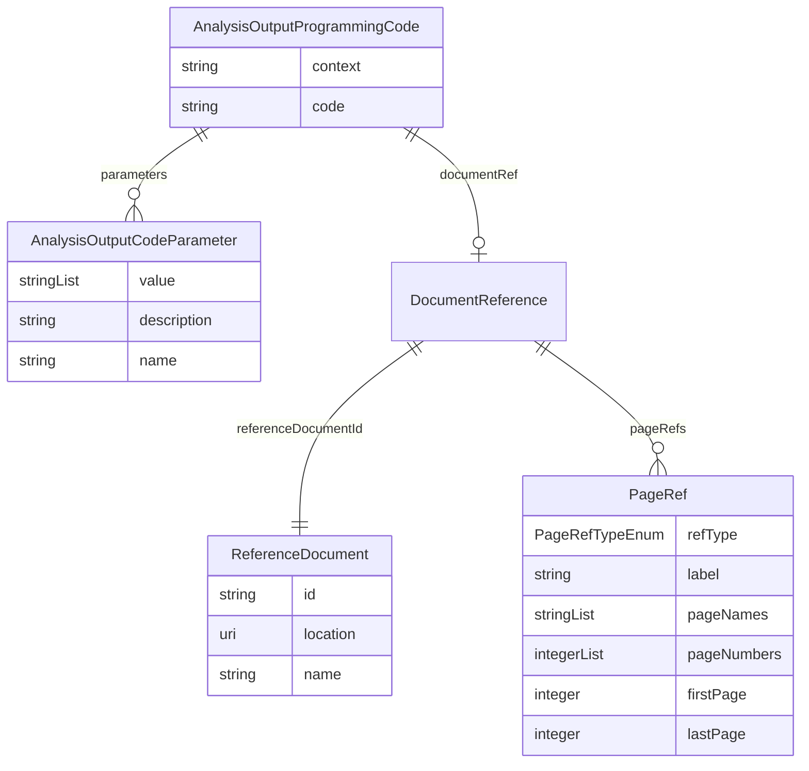

# Class: AnalysisOutputProgrammingCode


_Programming statements and/or a reference to the program used to perform a specific analysis or create a specific output._


URI: [ars:AnalysisOutputProgrammingCode](https://www.cdisc.org/ars/1-0/AnalysisOutputProgrammingCode)





<!-- no inheritance hierarchy -->


## Slots

| Name | Cardinality and Range | Description | Inheritance |
| ---  | --- | --- | --- |
| [context](context.md) | 1..1 <br/> [String](String.md) | The name and version of the computer language used for the actual programming... | direct |
| [code](code.md) | 0..1 <br/> [String](String.md) | Programming statements used to perform the specific analysis | direct |
| [documentRef](documentRef.md) | 0..1 <br/> [DocumentReference](DocumentReference.md) | A reference to the document containing programming code | direct |
| [parameters](parameters.md) | 0..* <br/> [AnalysisOutputCodeParameter](AnalysisOutputCodeParameter.md) | Parameter values used to generate or execute the programming code | direct |


## Usages

| used by | used in | type | used |
| ---  | --- | --- | --- |
| [Analysis](Analysis.md) | [programmingCode](programmingCode.md) | range | [AnalysisOutputProgrammingCode](AnalysisOutputProgrammingCode.md) |
| [Output](Output.md) | [programmingCode](programmingCode.md) | range | [AnalysisOutputProgrammingCode](AnalysisOutputProgrammingCode.md) |


## Identifier and Mapping Information


### Schema Source


* from schema: https://www.cdisc.org/ars/1-0


## Mappings

| Mapping Type | Mapped Value |
| ---  | ---  |
| self | ars:AnalysisOutputProgrammingCode |
| native | ars:AnalysisOutputProgrammingCode |


## LinkML Source

<!-- TODO: investigate https://stackoverflow.com/questions/37606292/how-to-create-tabbed-code-blocks-in-mkdocs-or-sphinx -->

### Direct

<details>
```yaml
name: AnalysisOutputProgrammingCode
description: Programming statements and/or a reference to the program used to perform
  a specific analysis or create a specific output.
from_schema: https://www.cdisc.org/ars/1-0
rank: 1000
slots:
- context
- code
- documentRef
- parameters
slot_usage:
  parameters:
    name: parameters
    description: Parameter values used to generate or execute the programming code.
    domain_of:
    - AnalysisOutputProgrammingCode
    - AnalysisProgrammingCodeTemplate
    range: AnalysisOutputCodeParameter

```
</details>

### Induced

<details>
```yaml
name: AnalysisOutputProgrammingCode
description: Programming statements and/or a reference to the program used to perform
  a specific analysis or create a specific output.
from_schema: https://www.cdisc.org/ars/1-0
rank: 1000
slot_usage:
  parameters:
    name: parameters
    description: Parameter values used to generate or execute the programming code.
    domain_of:
    - AnalysisOutputProgrammingCode
    - AnalysisProgrammingCodeTemplate
    range: AnalysisOutputCodeParameter
attributes:
  context:
    name: context
    description: The name and version of the computer language used for the actual
      programming statements provided.
    examples:
    - value: SAS Version 9.4
    from_schema: https://www.cdisc.org/ars/1-0
    rank: 1000
    alias: context
    owner: AnalysisOutputProgrammingCode
    domain_of:
    - AnalysisOutputProgrammingCode
    - AnalysisProgrammingCodeTemplate
    range: string
    required: true
  code:
    name: code
    description: Programming statements used to perform the specific analysis.
    from_schema: https://www.cdisc.org/ars/1-0
    rank: 1000
    alias: code
    owner: AnalysisOutputProgrammingCode
    domain_of:
    - AnalysisOutputProgrammingCode
    - AnalysisProgrammingCodeTemplate
    range: string
  documentRef:
    name: documentRef
    description: A reference to the document containing programming code.
    from_schema: https://www.cdisc.org/ars/1-0
    rank: 1000
    multivalued: false
    alias: documentRef
    owner: AnalysisOutputProgrammingCode
    domain_of:
    - AnalysisOutputProgrammingCode
    - AnalysisProgrammingCodeTemplate
    range: DocumentReference
    inlined: true
    inlined_as_list: true
  parameters:
    name: parameters
    description: Parameter values used to generate or execute the programming code.
    from_schema: https://www.cdisc.org/ars/1-0
    rank: 1000
    multivalued: true
    alias: parameters
    owner: AnalysisOutputProgrammingCode
    domain_of:
    - AnalysisOutputProgrammingCode
    - AnalysisProgrammingCodeTemplate
    range: AnalysisOutputCodeParameter
    inlined: true
    inlined_as_list: true

```
</details>