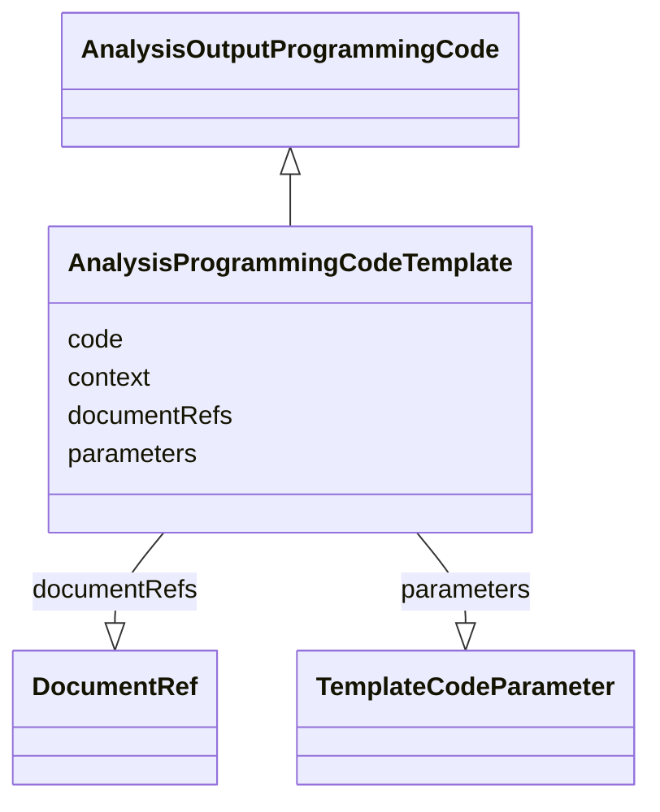

# Class: AnalysisProgrammingCodeTemplate


_Programming statements and/or a reference to a used as a template for creation of a program to perform method operations for a specific analysis._


URI: [ars:AnalysisProgrammingCodeTemplate](https://www.cdisc.org/ars/1-0/AnalysisProgrammingCodeTemplate)





## Inheritance
* [AnalysisOutputProgrammingCode](AnalysisOutputProgrammingCode.md)
    * **AnalysisProgrammingCodeTemplate**


## Slots

| Name | Cardinality and Range | Description | Inheritance |
| ---  | --- | --- | --- |
| [context](context.md) | 1..1 <br/> [String](String.md) | The name and version of the computer language used for the actual programming... | [AnalysisOutputProgrammingCode](AnalysisOutputProgrammingCode.md) |
| [code](code.md) | 0..1 <br/> [String](String.md) | Programming statements used to perform the specific analysis | [AnalysisOutputProgrammingCode](AnalysisOutputProgrammingCode.md) |
| [documentRefs](documentRefs.md) | 0..* <br/> [DocumentRef](DocumentRef.md) |  | [AnalysisOutputProgrammingCode](AnalysisOutputProgrammingCode.md) |
| [parameters](parameters.md) | 0..* <br/> [TemplateCodeParameter](TemplateCodeParameter.md) | Parameters whose values will be used to generate or execute the programming c... | [AnalysisOutputProgrammingCode](AnalysisOutputProgrammingCode.md) |


## Usages

| used by | used in | type | used |
| ---  | --- | --- | --- |
| [AnalysisMethod](AnalysisMethod.md) | [codeTemplate](codeTemplate.md) | range | [AnalysisProgrammingCodeTemplate](AnalysisProgrammingCodeTemplate.md) |


## Identifier and Mapping Information


### Schema Source


* from schema: https://www.cdisc.org/ars/1-0


## Mappings

| Mapping Type | Mapped Value |
| ---  | ---  |
| self | ars:AnalysisProgrammingCodeTemplate |
| native | ars:AnalysisProgrammingCodeTemplate |


## LinkML Source

<!-- TODO: investigate https://stackoverflow.com/questions/37606292/how-to-create-tabbed-code-blocks-in-mkdocs-or-sphinx -->

### Direct

<details>
```yaml
name: AnalysisProgrammingCodeTemplate
description: Programming statements and/or a reference to a used as a template for
  creation of a program to perform method operations for a specific analysis.
from_schema: https://www.cdisc.org/ars/1-0
rank: 1000
is_a: AnalysisOutputProgrammingCode
slot_usage:
  parameters:
    name: parameters
    description: Parameters whose values will be used to generate or execute the programming
      code for a specific analysis.
    domain_of:
    - AnalysisOutputProgrammingCode
    range: TemplateCodeParameter

```
</details>

### Induced

<details>
```yaml
name: AnalysisProgrammingCodeTemplate
description: Programming statements and/or a reference to a used as a template for
  creation of a program to perform method operations for a specific analysis.
from_schema: https://www.cdisc.org/ars/1-0
rank: 1000
is_a: AnalysisOutputProgrammingCode
slot_usage:
  parameters:
    name: parameters
    description: Parameters whose values will be used to generate or execute the programming
      code for a specific analysis.
    domain_of:
    - AnalysisOutputProgrammingCode
    range: TemplateCodeParameter
attributes:
  context:
    name: context
    description: The name and version of the computer language used for the actual
      programming statements provided.
    examples:
    - value: SAS Version 9.2
    from_schema: https://www.cdisc.org/ars/1-0
    rank: 1000
    alias: context
    owner: AnalysisProgrammingCodeTemplate
    domain_of:
    - AnalysisOutputProgrammingCode
    range: string
    required: true
  code:
    name: code
    description: Programming statements used to perform the specific analysis.
    from_schema: https://www.cdisc.org/ars/1-0
    rank: 1000
    alias: code
    owner: AnalysisProgrammingCodeTemplate
    domain_of:
    - AnalysisOutputProgrammingCode
    range: string
  documentRefs:
    name: documentRefs
    from_schema: https://www.cdisc.org/ars/1-0
    rank: 1000
    multivalued: true
    alias: documentRefs
    owner: AnalysisProgrammingCodeTemplate
    domain_of:
    - Analysis
    - AnalysisMethod
    - AnalysisOutputProgrammingCode
    - Output
    range: DocumentRef
    inlined: true
    inlined_as_list: true
  parameters:
    name: parameters
    description: Parameters whose values will be used to generate or execute the programming
      code for a specific analysis.
    from_schema: https://www.cdisc.org/ars/1-0
    rank: 1000
    multivalued: true
    alias: parameters
    owner: AnalysisProgrammingCodeTemplate
    domain_of:
    - AnalysisOutputProgrammingCode
    range: TemplateCodeParameter
    inlined: true
    inlined_as_list: true

```
</details>