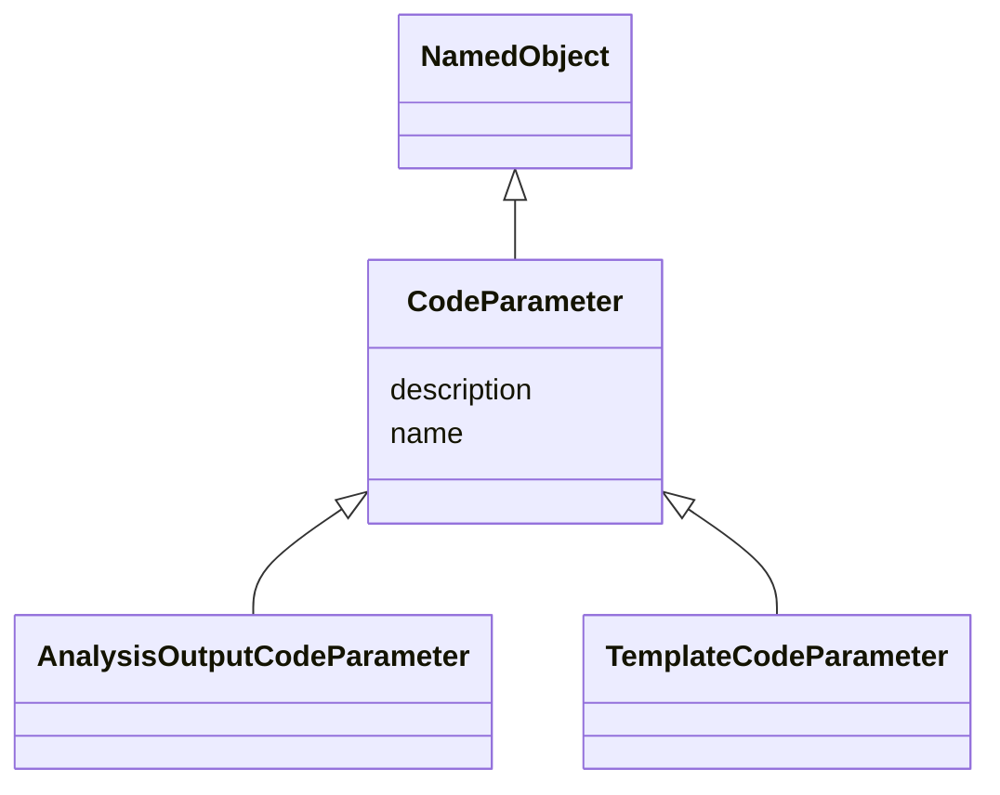

# Class: CodeParameter


_A replacement parameter whose value is substituted in template programming code to create statements required for a specific analysis._


* __NOTE__: this is an abstract class and should not be instantiated directly


URI: [ars:CodeParameter](https://www.cdisc.org/ars/1-0/CodeParameter)





## Inheritance
* [NamedObject](NamedObject.md)
    * **CodeParameter**
        * [AnalysisOutputCodeParameter](AnalysisOutputCodeParameter.md)
        * [TemplateCodeParameter](TemplateCodeParameter.md)


## Slots

| Name | Cardinality and Range | Description | Inheritance |
| ---  | --- | --- | --- |
| [description](description.md) | 0..1 <br/> [String](String.md) | A textual description of the instance of the class | direct |
| [name](name.md) | 1..1 <br/> [String](String.md) | The name for the instance of the class | [NamedObject](NamedObject.md) |


## Identifier and Mapping Information


### Schema Source


* from schema: https://www.cdisc.org/ars/1-0


## Mappings

| Mapping Type | Mapped Value |
| ---  | ---  |
| self | ars:CodeParameter |
| native | ars:CodeParameter |


## LinkML Source

<!-- TODO: investigate https://stackoverflow.com/questions/37606292/how-to-create-tabbed-code-blocks-in-mkdocs-or-sphinx -->

### Direct

<details>
```yaml
name: CodeParameter
description: A replacement parameter whose value is substituted in template programming
  code to create statements required for a specific analysis.
from_schema: https://www.cdisc.org/ars/1-0
rank: 1000
is_a: NamedObject
abstract: true
slots:
- description

```
</details>

### Induced

<details>
```yaml
name: CodeParameter
description: A replacement parameter whose value is substituted in template programming
  code to create statements required for a specific analysis.
from_schema: https://www.cdisc.org/ars/1-0
rank: 1000
is_a: NamedObject
abstract: true
attributes:
  description:
    name: description
    description: A textual description of the instance of the class.
    from_schema: https://www.cdisc.org/ars/1-0
    rank: 1000
    alias: description
    owner: CodeParameter
    domain_of:
    - Analysis
    - AnalysisMethod
    - ReferencedOperationRelationship
    - CodeParameter
    - SponsorTerm
    range: string
  name:
    name: name
    description: The name for the instance of the class.
    from_schema: https://www.cdisc.org/ars/1-0
    rank: 1000
    alias: name
    owner: CodeParameter
    domain_of:
    - NamedObject
    range: string
    required: true

```
</details>