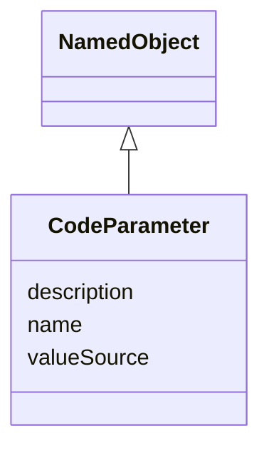

# Class: CodeParameter


URI: [ars:CodeParameter](https://www.cdisc.org/ars/1-0CodeParameter)





## Inheritance
* [NamedObject](NamedObject.md)
    * **CodeParameter**


## Slots

| Name | Cardinality and Range | Description | Inheritance |
| ---  | --- | --- | --- |
| [description](description.md) | 0..1 <br/> [String](String.md) |  | direct |
| [valueSource](valueSource.md) | 0..1 <br/> [String](String.md) | A reference to the prespecified source of the value for the parameter | direct |
| [name](name.md) | 1..1 <br/> [String](String.md) |  | [NamedObject](NamedObject.md) |


## Usages

| used by | used in | type | used |
| ---  | --- | --- | --- |
| [ProgrammingCodeTemplate](ProgrammingCodeTemplate.md) | [parameters](parameters.md) | range | [CodeParameter](CodeParameter.md) |


## Identifier and Mapping Information


### Schema Source


* from schema: https://www.cdisc.org/ars/1-0


## Mappings

| Mapping Type | Mapped Value |
| ---  | ---  |
| self | ars:CodeParameter |
| native | ars:CodeParameter |


## LinkML Source

<!-- TODO: investigate https://stackoverflow.com/questions/37606292/how-to-create-tabbed-code-blocks-in-mkdocs-or-sphinx -->

### Direct

<details>
```yaml
name: CodeParameter
from_schema: https://www.cdisc.org/ars/1-0
rank: 1000
is_a: NamedObject
slots:
- description
- valueSource

```
</details>

### Induced

<details>
```yaml
name: CodeParameter
from_schema: https://www.cdisc.org/ars/1-0
rank: 1000
is_a: NamedObject
attributes:
  description:
    name: description
    from_schema: https://www.cdisc.org/ars/1-0
    rank: 1000
    alias: description
    owner: CodeParameter
    domain_of:
    - Analysis
    - AnalysisMethod
    - ReferencedOperationRelationship
    - CodeParameter
    - SponsorTerm
    range: string
  valueSource:
    name: valueSource
    description: A reference to the prespecified source of the value for the parameter.
    from_schema: https://www.cdisc.org/ars/1-0
    rank: 1000
    alias: valueSource
    owner: CodeParameter
    domain_of:
    - CodeParameter
    range: string
  name:
    name: name
    from_schema: https://www.cdisc.org/ars/1-0
    rank: 1000
    alias: name
    owner: CodeParameter
    domain_of:
    - NamedObject
    range: string
    required: true

```
</details>