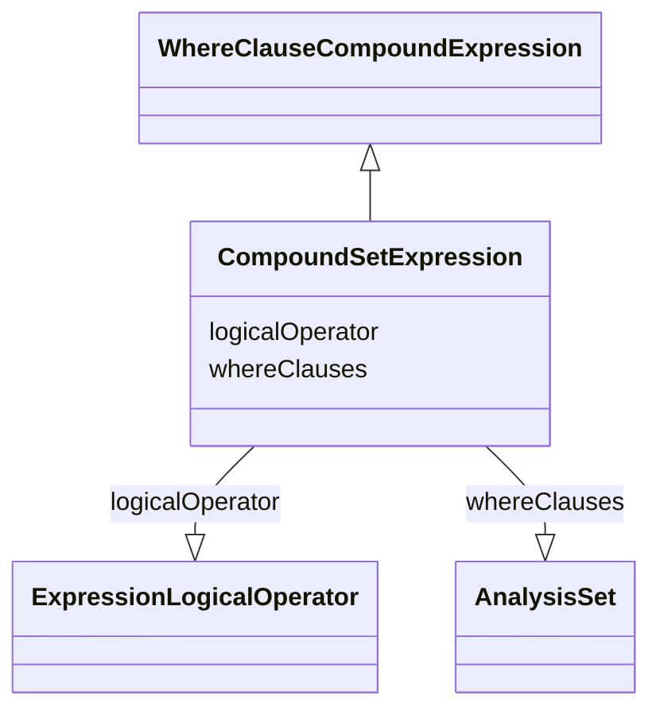

# Class: CompoundSetExpression


URI: [ars:CompoundSetExpression](https://www.cdisc.org/ars/1-0CompoundSetExpression)





## Inheritance
* [WhereClauseCompoundExpression](WhereClauseCompoundExpression.md)
    * **CompoundSetExpression**


## Slots

| Name | Cardinality and Range | Description | Inheritance |
| ---  | --- | --- | --- |
| [logicalOperator](logicalOperator.md) | 1..1 <br/> [ExpressionLogicalOperator](ExpressionLogicalOperator.md) |  | [WhereClauseCompoundExpression](WhereClauseCompoundExpression.md) |
| [whereClauses](whereClauses.md) | 0..* <br/> [AnalysisSet](AnalysisSet.md) |  | [WhereClauseCompoundExpression](WhereClauseCompoundExpression.md) |


## Usages

| used by | used in | type | used |
| ---  | --- | --- | --- |
| [AnalysisSet](AnalysisSet.md) | [compoundExpression](compoundExpression.md) | range | [CompoundSetExpression](CompoundSetExpression.md) |


## Identifier and Mapping Information


### Schema Source


* from schema: https://www.cdisc.org/ars/1-0


## Mappings

| Mapping Type | Mapped Value |
| ---  | ---  |
| self | ars:CompoundSetExpression |
| native | ars:CompoundSetExpression |


## LinkML Source

<!-- TODO: investigate https://stackoverflow.com/questions/37606292/how-to-create-tabbed-code-blocks-in-mkdocs-or-sphinx -->

### Direct

<details>
```yaml
name: CompoundSetExpression
from_schema: https://www.cdisc.org/ars/1-0
rank: 1000
is_a: WhereClauseCompoundExpression
slot_usage:
  whereClauses:
    name: whereClauses
    domain_of:
    - WhereClauseCompoundExpression
    range: AnalysisSet
    inlined: false

```
</details>

### Induced

<details>
```yaml
name: CompoundSetExpression
from_schema: https://www.cdisc.org/ars/1-0
rank: 1000
is_a: WhereClauseCompoundExpression
slot_usage:
  whereClauses:
    name: whereClauses
    domain_of:
    - WhereClauseCompoundExpression
    range: AnalysisSet
    inlined: false
attributes:
  logicalOperator:
    name: logicalOperator
    from_schema: https://www.cdisc.org/ars/1-0
    rank: 1000
    alias: logicalOperator
    owner: CompoundSetExpression
    domain_of:
    - WhereClauseCompoundExpression
    range: ExpressionLogicalOperator
    required: true
  whereClauses:
    name: whereClauses
    from_schema: https://www.cdisc.org/ars/1-0
    rank: 1000
    multivalued: true
    list_elements_ordered: true
    alias: whereClauses
    owner: CompoundSetExpression
    domain_of:
    - WhereClauseCompoundExpression
    range: AnalysisSet
    inlined: false

```
</details>