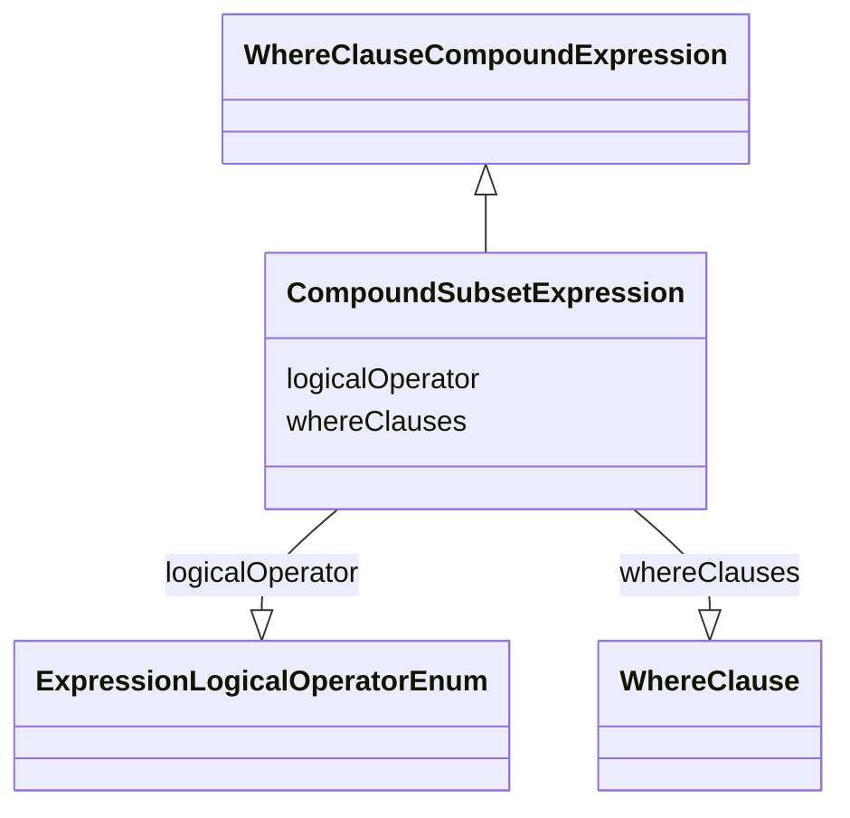

# Class: CompoundSubsetExpression

_A compound expression consisting of either two or more where clauses combined with the `AND` or `OR` logical operator, or a single where clause negated with the `NOT` logical operator._


URI: [ars:CompoundSubsetExpression](https://www.cdisc.org/ars/1-0/CompoundSubsetExpression)





## Inheritance
* [WhereClauseCompoundExpression](WhereClauseCompoundExpression.md)
    * **CompoundSubsetExpression**


## Slots

| Name | Cardinality* and Range | Description | Inheritance |
| ---  | --- | --- | --- |
| [logicalOperator](logicalOperator.md) | 1..1 <br/> [ExpressionLogicalOperatorEnum](ExpressionLogicalOperatorEnum.md) | The boolean operator that is used to combine (AND, OR) or negate (NOT) the wh... | [WhereClauseCompoundExpression](WhereClauseCompoundExpression.md) |
| [whereClauses](whereClauses.md) | 0..* <br/> [WhereClause](WhereClause.md) | A list of one or more where clauses (selection criteria) to be combined or ne... | [WhereClauseCompoundExpression](WhereClauseCompoundExpression.md) |

_* See [LinkML documentation](https://linkml.io/linkml/schemas/slots.html#slot-cardinality) for cardinality definitions._


## Usages

| used by | used in | type | used |
| ---  | --- | --- | --- |
| [DataSubset](DataSubset.md) | [compoundExpression](compoundExpression.md) | range | [CompoundSubsetExpression](CompoundSubsetExpression.md) |


## Identifier and Mapping Information


### Schema Source


* from schema: https://www.cdisc.org/ars/1-0


## Mappings

| Mapping Type | Mapped Value |
| ---  | ---  |
| self | ars:CompoundSubsetExpression |
| native | ars:CompoundSubsetExpression |


## LinkML Source

<!-- TODO: investigate https://stackoverflow.com/questions/37606292/how-to-create-tabbed-code-blocks-in-mkdocs-or-sphinx -->

### Direct

<details>
```yaml
name: CompoundSubsetExpression
description: A compound expression consisting of either two or more where clauses
  combined with the `AND` or `OR` logical operator, or a single where clause negated
  with the `NOT` logical operator.
from_schema: https://www.cdisc.org/ars/1-0
rank: 1000
is_a: WhereClauseCompoundExpression
slot_usage:
  whereClauses:
    name: whereClauses
    domain_of:
    - WhereClauseCompoundExpression
    inlined: true
    inlined_as_list: true

```
</details>

### Induced

<details>
```yaml
name: CompoundSubsetExpression
description: A compound expression consisting of either two or more where clauses
  combined with the `AND` or `OR` logical operator, or a single where clause negated
  with the `NOT` logical operator.
from_schema: https://www.cdisc.org/ars/1-0
rank: 1000
is_a: WhereClauseCompoundExpression
slot_usage:
  whereClauses:
    name: whereClauses
    domain_of:
    - WhereClauseCompoundExpression
    inlined: true
    inlined_as_list: true
attributes:
  logicalOperator:
    name: logicalOperator
    description: The boolean operator that is used to combine (AND, OR) or negate
      (NOT) the where claus(s) in the compound expression.
    from_schema: https://www.cdisc.org/ars/1-0
    rank: 1000
    alias: logicalOperator
    owner: CompoundSubsetExpression
    domain_of:
    - WhereClauseCompoundExpression
    range: ExpressionLogicalOperatorEnum
    required: true
  whereClauses:
    name: whereClauses
    description: A list of one or more where clauses (selection criteria) to be combined
      or negated.
    from_schema: https://www.cdisc.org/ars/1-0
    rank: 1000
    multivalued: true
    list_elements_ordered: true
    alias: whereClauses
    owner: CompoundSubsetExpression
    domain_of:
    - WhereClauseCompoundExpression
    range: WhereClause
    inlined: true
    inlined_as_list: true

```
</details>