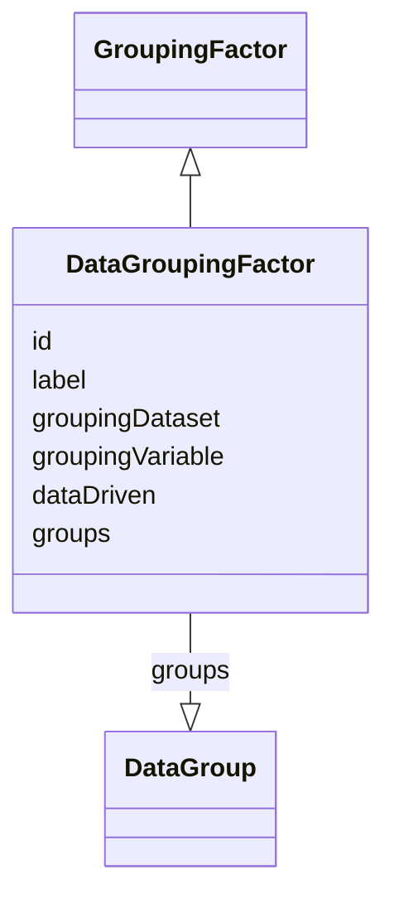

# Class: DataGroupingFactor

_A factor used to subdivide data records in an analysis dataset for analysis._


URI: [ars:DataGroupingFactor](https://www.cdisc.org/ars/1-0/DataGroupingFactor)





## Inheritance
* [GroupingFactor](GroupingFactor.md)
    * **DataGroupingFactor**


## Slots

| Name | Cardinality* and Range | Description | Inheritance |
| ---  | --- | --- | --- |
| [id](id.md) | 1..1 <br/> [String](String.md) | The assigned identifying value for the instance of the class | [GroupingFactor](GroupingFactor.md) |
| [label](label.md) | 0..1 <br/> [String](String.md) | A short informative description that may be used for display | [GroupingFactor](GroupingFactor.md) |
| [groupingDataset](groupingDataset.md) | 0..1 <br/> [String](String.md) | For groupings based on a single variable, a reference to the dataset containi... | [GroupingFactor](GroupingFactor.md) |
| [groupingVariable](groupingVariable.md) | 0..1 <br/> [String](String.md) | For groupings based on a single variable, a reference to the dataset variable... | [GroupingFactor](GroupingFactor.md) |
| [dataDriven](dataDriven.md) | 1..1 <br/> [Boolean](Boolean.md) | Indicates whether the groups defined by the grouping are prespecified (false)... | [GroupingFactor](GroupingFactor.md) |
| [groups](groups.md) | 0..* <br/> [DataGroup](DataGroup.md) | The pre-specified groups within the grouping | [GroupingFactor](GroupingFactor.md) |

_* See [LinkML documentation](https://linkml.io/linkml/schemas/slots.html#slot-cardinality) for cardinality definitions._


## Usages

| used by | used in | type | used |
| ---  | --- | --- | --- |
| [ReportingEvent](ReportingEvent.md) | [dataGroupings](dataGroupings.md) | range | [DataGroupingFactor](DataGroupingFactor.md) |


## Identifier and Mapping Information


### Schema Source


* from schema: https://www.cdisc.org/ars/1-0


## Mappings

| Mapping Type | Mapped Value |
| ---  | ---  |
| self | ars:DataGroupingFactor |
| native | ars:DataGroupingFactor |


## LinkML Source

<!-- TODO: investigate https://stackoverflow.com/questions/37606292/how-to-create-tabbed-code-blocks-in-mkdocs-or-sphinx -->

### Direct

<details>
```yaml
name: DataGroupingFactor
description: A factor used to subdivide data records in an analysis dataset for analysis.
from_schema: https://www.cdisc.org/ars/1-0
rank: 1000
is_a: GroupingFactor
slot_usage:
  groups:
    name: groups
    domain_of:
    - GroupingFactor
    range: DataGroup

```
</details>

### Induced

<details>
```yaml
name: DataGroupingFactor
description: A factor used to subdivide data records in an analysis dataset for analysis.
from_schema: https://www.cdisc.org/ars/1-0
rank: 1000
is_a: GroupingFactor
slot_usage:
  groups:
    name: groups
    domain_of:
    - GroupingFactor
    range: DataGroup
attributes:
  id:
    name: id
    description: The assigned identifying value for the instance of the class.
    from_schema: https://www.cdisc.org/ars/1-0
    rank: 1000
    identifier: true
    alias: id
    owner: DataGroupingFactor
    domain_of:
    - ReportingEvent
    - ReferenceDocument
    - TerminologyExtension
    - SponsorTerm
    - AnalysisOutputCategorization
    - AnalysisOutputCategory
    - AnalysisSet
    - DataSubset
    - GroupingFactor
    - Group
    - AnalysisMethod
    - Operation
    - ReferencedOperationRelationship
    - Analysis
    - DisplaySubSection
    - Output
    - OutputDisplay
    range: string
    required: true
  label:
    name: label
    description: A short informative description that may be used for display.
    from_schema: https://www.cdisc.org/ars/1-0
    rank: 1000
    alias: label
    owner: DataGroupingFactor
    domain_of:
    - NamedObject
    - AnalysisOutputCategorization
    - AnalysisOutputCategory
    - AnalysisSet
    - DataSubset
    - GroupingFactor
    - Group
    - PageRef
    range: string
  groupingDataset:
    name: groupingDataset
    description: For groupings based on a single variable, a reference to the dataset
      containing the variable upon which grouping is based.
    from_schema: https://www.cdisc.org/ars/1-0
    rank: 1000
    alias: groupingDataset
    owner: DataGroupingFactor
    domain_of:
    - GroupingFactor
    range: string
  groupingVariable:
    name: groupingVariable
    description: For groupings based on a single variable, a reference to the dataset
      variable upon which grouping is based.
    from_schema: https://www.cdisc.org/ars/1-0
    rank: 1000
    alias: groupingVariable
    owner: DataGroupingFactor
    domain_of:
    - GroupingFactor
    range: string
  dataDriven:
    name: dataDriven
    description: Indicates whether the groups defined by the grouping are prespecified
      (false) or obtained from distinct data values of the groupingVariable (true).
    from_schema: https://www.cdisc.org/ars/1-0
    rank: 1000
    alias: dataDriven
    owner: DataGroupingFactor
    domain_of:
    - GroupingFactor
    range: boolean
    required: true
  groups:
    name: groups
    description: The pre-specified groups within the grouping.
    from_schema: https://www.cdisc.org/ars/1-0
    rank: 1000
    multivalued: true
    list_elements_ordered: true
    alias: groups
    owner: DataGroupingFactor
    domain_of:
    - GroupingFactor
    range: DataGroup
    inlined: true
    inlined_as_list: true

```
</details>