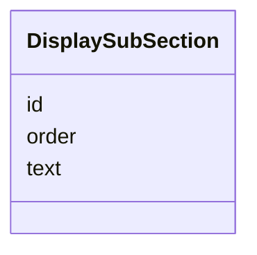

# Class: DisplaySubSection


URI: [ars:DisplaySubSection](https://www.cdisc.org/ars/1-0DisplaySubSection)





<!-- no inheritance hierarchy -->


## Slots

| Name | Cardinality and Range | Description | Inheritance |
| ---  | --- | --- | --- |
| [id](id.md) | 1..1 <br/> [String](String.md) |  | direct |
| [order](order.md) | 1..1 <br/> [Integer](Integer.md) |  | direct |
| [text](text.md) | 0..1 <br/> [String](String.md) |  | direct |


## Usages

| used by | used in | type | used |
| ---  | --- | --- | --- |
| [DisplaySection](DisplaySection.md) | [subSections](subSections.md) | range | [DisplaySubSection](DisplaySubSection.md) |


## Identifier and Mapping Information


### Schema Source


* from schema: https://www.cdisc.org/ars/1-0


## Mappings

| Mapping Type | Mapped Value |
| ---  | ---  |
| self | ars:DisplaySubSection |
| native | ars:DisplaySubSection |


## LinkML Source

<!-- TODO: investigate https://stackoverflow.com/questions/37606292/how-to-create-tabbed-code-blocks-in-mkdocs-or-sphinx -->

### Direct

<details>
```yaml
name: DisplaySubSection
from_schema: https://www.cdisc.org/ars/1-0
rank: 1000
slots:
- id
- order
- text
slot_usage:
  order:
    name: order
    domain_of:
    - OrderedListItem
    - OrderedGroupingFactor
    - OrderedDisplay
    - DisplaySubSection
    - WhereClause
    required: true

```
</details>

### Induced

<details>
```yaml
name: DisplaySubSection
from_schema: https://www.cdisc.org/ars/1-0
rank: 1000
slot_usage:
  order:
    name: order
    domain_of:
    - OrderedListItem
    - OrderedGroupingFactor
    - OrderedDisplay
    - DisplaySubSection
    - WhereClause
    required: true
attributes:
  id:
    name: id
    from_schema: https://www.cdisc.org/ars/1-0
    rank: 1000
    identifier: true
    alias: id
    owner: DisplaySubSection
    domain_of:
    - AnalysisCategorization
    - AnalysisCategory
    - Analysis
    - AnalysisMethod
    - Operation
    - ReferencedOperationRelationship
    - Output
    - OutputDisplay
    - DisplaySubSection
    - AnalysisSet
    - GroupingFactor
    - Group
    - DataSubset
    - ReferenceDocument
    - SponsorTerm
    range: string
    required: true
  order:
    name: order
    from_schema: https://www.cdisc.org/ars/1-0
    rank: 1000
    alias: order
    owner: DisplaySubSection
    domain_of:
    - OrderedListItem
    - OrderedGroupingFactor
    - OrderedDisplay
    - DisplaySubSection
    - WhereClause
    range: integer
    required: true
  text:
    name: text
    from_schema: https://www.cdisc.org/ars/1-0
    rank: 1000
    alias: text
    owner: DisplaySubSection
    domain_of:
    - DisplaySubSection
    range: string

```
</details>