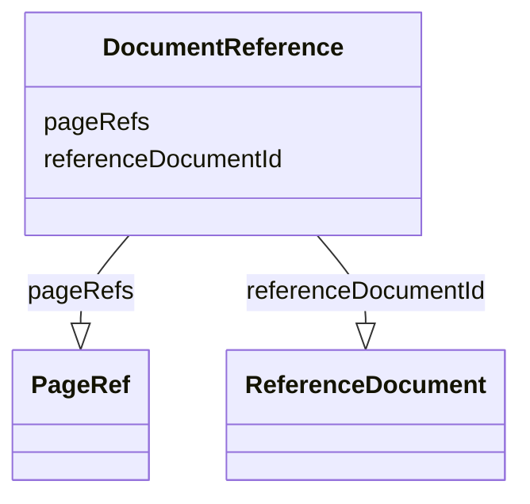

# Class: DocumentReference


URI: [ars:DocumentReference](https://www.cdisc.org/ars/1-0/DocumentReference)





<!-- no inheritance hierarchy -->


## Slots

| Name | Cardinality and Range | Description | Inheritance |
| ---  | --- | --- | --- |
| [referenceDocumentId](referenceDocumentId.md) | 1..1 <br/> [ReferenceDocument](ReferenceDocument.md) |  | direct |
| [pageRefs](pageRefs.md) | 0..* <br/> [PageRef](PageRef.md) |  | direct |


## Usages

| used by | used in | type | used |
| ---  | --- | --- | --- |
| [Analysis](Analysis.md) | [documentRefs](documentRefs.md) | range | [DocumentReference](DocumentReference.md) |
| [AnalysisMethod](AnalysisMethod.md) | [documentRefs](documentRefs.md) | range | [DocumentReference](DocumentReference.md) |
| [AnalysisOutputProgrammingCode](AnalysisOutputProgrammingCode.md) | [documentRef](documentRef.md) | range | [DocumentReference](DocumentReference.md) |
| [AnalysisProgrammingCodeTemplate](AnalysisProgrammingCodeTemplate.md) | [documentRef](documentRef.md) | range | [DocumentReference](DocumentReference.md) |
| [Output](Output.md) | [documentRefs](documentRefs.md) | range | [DocumentReference](DocumentReference.md) |


## Identifier and Mapping Information


### Schema Source


* from schema: https://www.cdisc.org/ars/1-0


## Mappings

| Mapping Type | Mapped Value |
| ---  | ---  |
| self | ars:DocumentReference |
| native | ars:DocumentReference |


## LinkML Source

<!-- TODO: investigate https://stackoverflow.com/questions/37606292/how-to-create-tabbed-code-blocks-in-mkdocs-or-sphinx -->

### Direct

<details>
```yaml
name: DocumentReference
from_schema: https://www.cdisc.org/ars/1-0
rank: 1000
slots:
- referenceDocumentId
- pageRefs

```
</details>

### Induced

<details>
```yaml
name: DocumentReference
from_schema: https://www.cdisc.org/ars/1-0
rank: 1000
attributes:
  referenceDocumentId:
    name: referenceDocumentId
    from_schema: https://www.cdisc.org/ars/1-0
    rank: 1000
    alias: referenceDocumentId
    owner: DocumentReference
    domain_of:
    - DocumentReference
    range: ReferenceDocument
    required: true
    inlined: false
  pageRefs:
    name: pageRefs
    from_schema: https://www.cdisc.org/ars/1-0
    rank: 1000
    multivalued: true
    alias: pageRefs
    owner: DocumentReference
    domain_of:
    - DocumentReference
    range: PageRef
    inlined: true
    inlined_as_list: true
    any_of:
    - range: PageNumberListRef
    - range: PageNumberRangeRef
    - range: PageNameRef

```
</details>