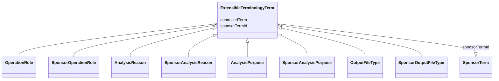

# Class: ExtensibleTerminologyTerm

_The term used for an attribute whose terminology is extensible._


* __NOTE__: this is an abstract class and should not be instantiated directly

URI: [ars:ExtensibleTerminologyTerm](https://www.cdisc.org/ars/1-0/ExtensibleTerminologyTerm)





## Inheritance
* **ExtensibleTerminologyTerm**
    * [OperationRole](OperationRole.md)
    * [SponsorOperationRole](SponsorOperationRole.md)
    * [AnalysisReason](AnalysisReason.md)
    * [SponsorAnalysisReason](SponsorAnalysisReason.md)
    * [AnalysisPurpose](AnalysisPurpose.md)
    * [SponsorAnalysisPurpose](SponsorAnalysisPurpose.md)
    * [OutputFileType](OutputFileType.md)
    * [SponsorOutputFileType](SponsorOutputFileType.md)


## Slots

| Name | Cardinality* and Range | Description | Inheritance |
| ---  | --- | --- | --- |
| [controlledTerm](controlledTerm.md) | 0..1 <br/> [String](String.md) | One of the permissible values from the referenced enumeration | direct |
| [sponsorTermId](sponsorTermId.md) | 0..1 <br/> [SponsorTerm](SponsorTerm.md) | The identifier of the referenced sponsor term | direct |

_* See [LinkML documentation](https://linkml.io/linkml/schemas/slots.html#slot-cardinality) for cardinality definitions._


## Usages

| used by | used in | type | used |
| ---  | --- | --- | --- |
| [ReferencedOperationRelationship](ReferencedOperationRelationship.md) | [referencedOperationRole](referencedOperationRole.md) | range | [ExtensibleTerminologyTerm](ExtensibleTerminologyTerm.md) |
| [Analysis](Analysis.md) | [reason](reason.md) | range | [ExtensibleTerminologyTerm](ExtensibleTerminologyTerm.md) |
| [Analysis](Analysis.md) | [purpose](purpose.md) | range | [ExtensibleTerminologyTerm](ExtensibleTerminologyTerm.md) |
| [OutputFile](OutputFile.md) | [fileType](fileType.md) | range | [ExtensibleTerminologyTerm](ExtensibleTerminologyTerm.md) |


## Comments

* Each instance of this class should contain either a controlled term or a sponsor term id, not both.

## Identifier and Mapping Information


### Schema Source


* from schema: https://www.cdisc.org/ars/1-0


## Mappings

| Mapping Type | Mapped Value |
| ---  | ---  |
| self | ars:ExtensibleTerminologyTerm |
| native | ars:ExtensibleTerminologyTerm |


## LinkML Source

<!-- TODO: investigate https://stackoverflow.com/questions/37606292/how-to-create-tabbed-code-blocks-in-mkdocs-or-sphinx -->

### Direct

<details>
```yaml
name: ExtensibleTerminologyTerm
description: The term used for an attribute whose terminology is extensible.
comments:
- Each instance of this class should contain either a controlled term or a sponsor
  term id, not both.
from_schema: https://www.cdisc.org/ars/1-0
rank: 1000
abstract: true
slots:
- controlledTerm
- sponsorTermId

```
</details>

### Induced

<details>
```yaml
name: ExtensibleTerminologyTerm
description: The term used for an attribute whose terminology is extensible.
comments:
- Each instance of this class should contain either a controlled term or a sponsor
  term id, not both.
from_schema: https://www.cdisc.org/ars/1-0
rank: 1000
abstract: true
attributes:
  controlledTerm:
    name: controlledTerm
    description: One of the permissible values from the referenced enumeration.
    from_schema: https://www.cdisc.org/ars/1-0
    rank: 1000
    alias: controlledTerm
    owner: ExtensibleTerminologyTerm
    domain_of:
    - ExtensibleTerminologyTerm
    range: string
    any_of:
    - range: AnalysisReasonEnum
    - range: AnalysisPurposeEnum
    - range: OperationRoleEnum
    - range: OutputFileTypeEnum
  sponsorTermId:
    name: sponsorTermId
    description: The identifier of the referenced sponsor term.
    from_schema: https://www.cdisc.org/ars/1-0
    rank: 1000
    alias: sponsorTermId
    owner: ExtensibleTerminologyTerm
    domain_of:
    - ExtensibleTerminologyTerm
    range: SponsorTerm
    inlined: false

```
</details>