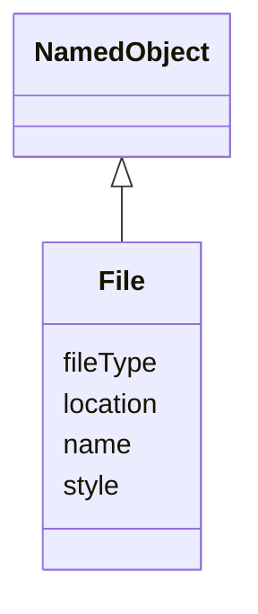

# Class: File


URI: [ars:File](https://www.cdisc.org/ars/1-0File)





## Inheritance
* [NamedObject](NamedObject.md)
    * **File**


## Slots

| Name | Cardinality and Range | Description | Inheritance |
| ---  | --- | --- | --- |
| [fileType](fileType.md) | 0..1 <br/> [String](String.md) |  | direct |
| [location](location.md) | 0..1 <br/> [Uri](Uri.md) |  | direct |
| [style](style.md) | 0..1 <br/> [String](String.md) |  | direct |
| [name](name.md) | 1..1 <br/> [String](String.md) |  | [NamedObject](NamedObject.md) |


## Usages

| used by | used in | type | used |
| ---  | --- | --- | --- |
| [Output](Output.md) | [fileSpecifications](fileSpecifications.md) | range | [File](File.md) |


## Identifier and Mapping Information


### Schema Source


* from schema: https://www.cdisc.org/ars/1-0


## Mappings

| Mapping Type | Mapped Value |
| ---  | ---  |
| self | ars:File |
| native | ars:File |


## LinkML Source

<!-- TODO: investigate https://stackoverflow.com/questions/37606292/how-to-create-tabbed-code-blocks-in-mkdocs-or-sphinx -->

### Direct

<details>
```yaml
name: File
from_schema: https://www.cdisc.org/ars/1-0
rank: 1000
is_a: NamedObject
slots:
- fileType
- location
- style

```
</details>

### Induced

<details>
```yaml
name: File
from_schema: https://www.cdisc.org/ars/1-0
rank: 1000
is_a: NamedObject
attributes:
  fileType:
    name: fileType
    from_schema: https://www.cdisc.org/ars/1-0
    rank: 1000
    alias: fileType
    owner: File
    domain_of:
    - File
    range: string
    inlined: false
    any_of:
    - range: OutputFileType
    - range: SponsorTerm
  location:
    name: location
    from_schema: https://www.cdisc.org/ars/1-0
    rank: 1000
    alias: location
    owner: File
    domain_of:
    - File
    - ReferenceDocument
    range: uri
  style:
    name: style
    from_schema: https://www.cdisc.org/ars/1-0
    rank: 1000
    alias: style
    owner: File
    domain_of:
    - File
    range: string
  name:
    name: name
    from_schema: https://www.cdisc.org/ars/1-0
    rank: 1000
    alias: name
    owner: File
    domain_of:
    - NamedObject
    range: string
    required: true

```
</details>