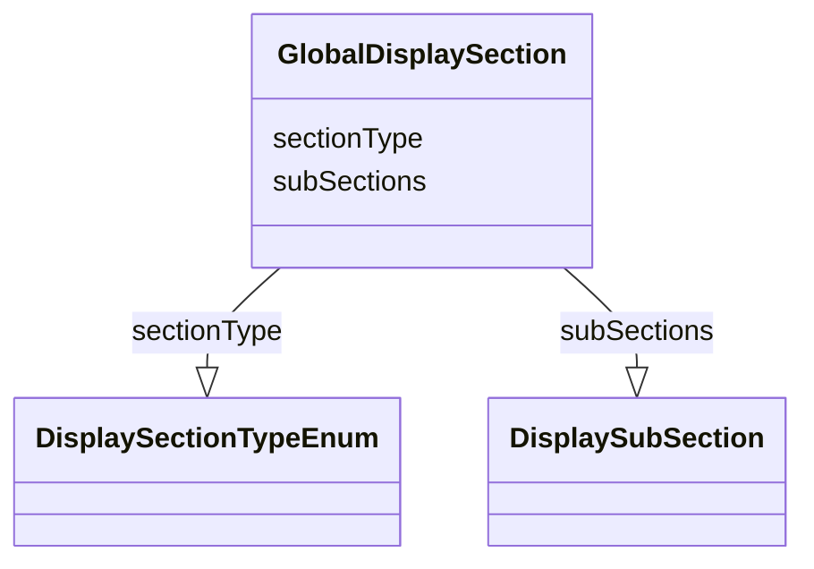

# Class: GlobalDisplaySection


_A global definition for part of a tabular display containing one or more pieces of informational text that may be used in multiple displays._


URI: [ars:GlobalDisplaySection](https://www.cdisc.org/ars/1-0/GlobalDisplaySection)





<!-- no inheritance hierarchy -->


## Slots

| Name | Cardinality and Range | Description | Inheritance |
| ---  | --- | --- | --- |
| [sectionType](sectionType.md) | 0..1 <br/> [DisplaySectionTypeEnum](DisplaySectionTypeEnum.md) |  | direct |
| [subSections](subSections.md) | 0..* <br/> [DisplaySubSection](DisplaySubSection.md) |  | direct |


## Usages

| used by | used in | type | used |
| ---  | --- | --- | --- |
| [ReportingEvent](ReportingEvent.md) | [globalDisplaySections](globalDisplaySections.md) | range | [GlobalDisplaySection](GlobalDisplaySection.md) |


## Identifier and Mapping Information


### Schema Source


* from schema: https://www.cdisc.org/ars/1-0


## Mappings

| Mapping Type | Mapped Value |
| ---  | ---  |
| self | ars:GlobalDisplaySection |
| native | ars:GlobalDisplaySection |


## LinkML Source

<!-- TODO: investigate https://stackoverflow.com/questions/37606292/how-to-create-tabbed-code-blocks-in-mkdocs-or-sphinx -->

### Direct

<details>
```yaml
name: GlobalDisplaySection
description: A global definition for part of a tabular display containing one or more
  pieces of informational text that may be used in multiple displays.
from_schema: https://www.cdisc.org/ars/1-0
rank: 1000
slots:
- sectionType
- subSections

```
</details>

### Induced

<details>
```yaml
name: GlobalDisplaySection
description: A global definition for part of a tabular display containing one or more
  pieces of informational text that may be used in multiple displays.
from_schema: https://www.cdisc.org/ars/1-0
rank: 1000
attributes:
  sectionType:
    name: sectionType
    from_schema: https://www.cdisc.org/ars/1-0
    rank: 1000
    alias: sectionType
    owner: GlobalDisplaySection
    domain_of:
    - DisplaySection
    - GlobalDisplaySection
    range: DisplaySectionTypeEnum
  subSections:
    name: subSections
    from_schema: https://www.cdisc.org/ars/1-0
    rank: 1000
    multivalued: true
    alias: subSections
    owner: GlobalDisplaySection
    domain_of:
    - GlobalDisplaySection
    range: DisplaySubSection
    inlined: true
    inlined_as_list: true

```
</details>