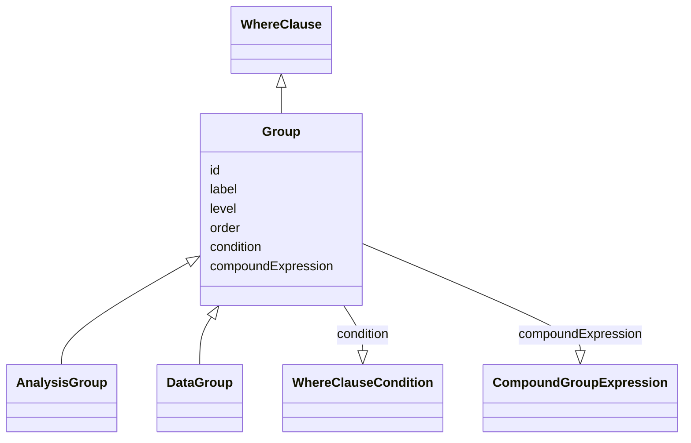

# Class: Group

_A subdivision of the subject population or analysis dataset record set based on a defined factor._


URI: [ars:Group](https://www.cdisc.org/ars/1-0/Group)





## Inheritance
* [WhereClause](WhereClause.md)
    * **Group**
        * [AnalysisGroup](AnalysisGroup.md)
        * [DataGroup](DataGroup.md)


## Slots

| Name | Cardinality* and Range | Description | Inheritance |
| ---  | --- | --- | --- |
| [id](id.md) | 1..1 <br/> [String](String.md) | The assigned identifying value for the instance of the class | direct |
| [label](label.md) | 0..1 <br/> [String](String.md) | A short informative description that may be used for display | direct |
| [level](level.md) | 0..1 <br/> [Integer](Integer.md) | The level of the entry within a hierarchical structure | [WhereClause](WhereClause.md) |
| [order](order.md) | 0..1 <br/> [Integer](Integer.md) | The ordinal of the instance with respect to other instances | [WhereClause](WhereClause.md) |
| [condition](condition.md) | 0..1 <br/> [WhereClauseCondition](WhereClauseCondition.md) | A simple selection criterion exressed as [dataset] | [WhereClause](WhereClause.md) |
| [compoundExpression](compoundExpression.md) | 0..1 <br/> [CompoundGroupExpression](CompoundGroupExpression.md) | A compound expression that combines or negates where clauses | [WhereClause](WhereClause.md) |

_* See [LinkML documentation](https://linkml.io/linkml/schemas/slots.html#slot-cardinality) for cardinality definitions._


## Usages

| used by | used in | type | used |
| ---  | --- | --- | --- |
| [GroupingFactor](GroupingFactor.md) | [groups](groups.md) | range | [Group](Group.md) |
| [CompoundGroupExpression](CompoundGroupExpression.md) | [whereClauses](whereClauses.md) | range | [Group](Group.md) |
| [ResultGroup](ResultGroup.md) | [groupId](groupId.md) | range | [Group](Group.md) |


## Identifier and Mapping Information


### Schema Source


* from schema: https://www.cdisc.org/ars/1-0


## Mappings

| Mapping Type | Mapped Value |
| ---  | ---  |
| self | ars:Group |
| native | ars:Group |


## LinkML Source

<!-- TODO: investigate https://stackoverflow.com/questions/37606292/how-to-create-tabbed-code-blocks-in-mkdocs-or-sphinx -->

### Direct

<details>
```yaml
name: Group
description: A subdivision of the subject population or analysis dataset record set
  based on a defined factor.
from_schema: https://www.cdisc.org/ars/1-0
rank: 1000
is_a: WhereClause
slots:
- id
- label
slot_usage:
  compoundExpression:
    name: compoundExpression
    domain_of:
    - WhereClause
    range: CompoundGroupExpression

```
</details>

### Induced

<details>
```yaml
name: Group
description: A subdivision of the subject population or analysis dataset record set
  based on a defined factor.
from_schema: https://www.cdisc.org/ars/1-0
rank: 1000
is_a: WhereClause
slot_usage:
  compoundExpression:
    name: compoundExpression
    domain_of:
    - WhereClause
    range: CompoundGroupExpression
attributes:
  id:
    name: id
    description: The assigned identifying value for the instance of the class.
    from_schema: https://www.cdisc.org/ars/1-0
    rank: 1000
    identifier: true
    alias: id
    owner: Group
    domain_of:
    - ReportingEvent
    - ReferenceDocument
    - TerminologyExtension
    - SponsorTerm
    - AnalysisOutputCategorization
    - AnalysisOutputCategory
    - AnalysisSet
    - DataSubset
    - GroupingFactor
    - Group
    - AnalysisMethod
    - Operation
    - ReferencedOperationRelationship
    - Analysis
    - DisplaySubSection
    - Output
    - OutputDisplay
    range: string
    required: true
  label:
    name: label
    description: A short informative description that may be used for display.
    from_schema: https://www.cdisc.org/ars/1-0
    rank: 1000
    alias: label
    owner: Group
    domain_of:
    - AnalysisOutputCategorization
    - AnalysisOutputCategory
    - AnalysisSet
    - DataSubset
    - GroupingFactor
    - Group
    - AnalysisMethod
    - PageRef
    - Operation
    range: string
  level:
    name: level
    description: The level of the entry within a hierarchical structure.
    comments:
    - 1 is the top level.
    from_schema: https://www.cdisc.org/ars/1-0
    rank: 1000
    alias: level
    owner: Group
    domain_of:
    - OrderedListItem
    - WhereClause
    range: integer
  order:
    name: order
    description: The ordinal of the instance with respect to other instances.
    from_schema: https://www.cdisc.org/ars/1-0
    rank: 1000
    alias: order
    owner: Group
    domain_of:
    - OrderedListItem
    - WhereClause
    - OrderedGroupingFactor
    - OrderedDisplay
    - OrderedDisplaySubSection
    range: integer
  condition:
    name: condition
    description: A simple selection criterion exressed as [dataset].[variable] [comparator]
      [value(s)]
    from_schema: https://www.cdisc.org/ars/1-0
    rank: 1000
    alias: condition
    owner: Group
    domain_of:
    - WhereClause
    range: WhereClauseCondition
  compoundExpression:
    name: compoundExpression
    description: A compound expression that combines or negates where clauses.
    from_schema: https://www.cdisc.org/ars/1-0
    rank: 1000
    alias: compoundExpression
    owner: Group
    domain_of:
    - WhereClause
    range: CompoundGroupExpression

```
</details>