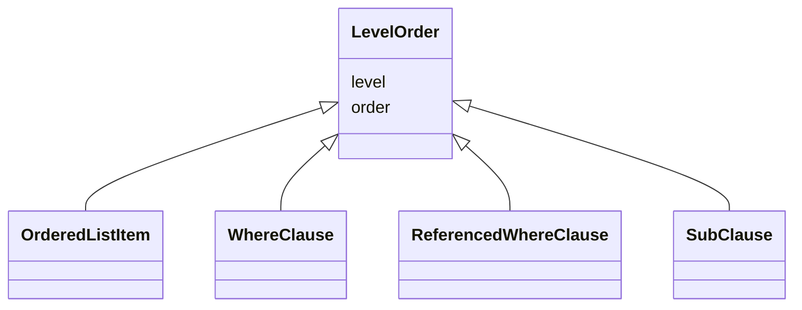

# Class: LevelOrder

_An abstract class containing attributes used to position class instances within a hierarchical tree._


URI: [ars:LevelOrder](https://www.cdisc.org/ars/1-0/LevelOrder)





<!-- no inheritance hierarchy -->


## Slots

| Name | Cardinality* and Range | Description | Inheritance |
| ---  | --- | --- | --- |
| [level](level.md) | 1..1 <br/> [Integer](Integer.md) | The level of the entry within a hierarchical structure | direct |
| [order](order.md) | 1..1 <br/> [Integer](Integer.md) | The ordinal of the instance with respect to other instances | direct |

_* See [LinkML documentation](https://linkml.io/linkml/schemas/slots.html#slot-cardinality) for cardinality definitions._


## Mixin Usage

| mixed into | description |
| --- | --- |
| [OrderedListItem](OrderedListItem.md) | An item (analysis, output or sub-list) ordered relative to other items within... |
| [WhereClause](WhereClause.md) | Selection criteria defined as either a simple condition ([variable] [comparat... |
| [ReferencedWhereClause](ReferencedWhereClause.md) | An abstract class indicating an identified where clause (i |
| [SubClause](SubClause.md) | An abstract class containing all attributes that may be specified for a sub-c... |


## Identifier and Mapping Information


### Schema Source


* from schema: https://www.cdisc.org/ars/1-0


## Mappings

| Mapping Type | Mapped Value |
| ---  | ---  |
| self | ars:LevelOrder |
| native | ars:LevelOrder |


## LinkML Source

<!-- TODO: investigate https://stackoverflow.com/questions/37606292/how-to-create-tabbed-code-blocks-in-mkdocs-or-sphinx -->

### Direct

<details>
```yaml
name: LevelOrder
description: An abstract class containing attributes used to position class instances
  within a hierarchical tree.
from_schema: https://www.cdisc.org/ars/1-0
rank: 1000
mixin: true
slots:
- level
- order

```
</details>

### Induced

<details>
```yaml
name: LevelOrder
description: An abstract class containing attributes used to position class instances
  within a hierarchical tree.
from_schema: https://www.cdisc.org/ars/1-0
rank: 1000
mixin: true
attributes:
  level:
    name: level
    description: The level of the entry within a hierarchical structure.
    comments:
    - 1 is the top level.
    from_schema: https://www.cdisc.org/ars/1-0
    rank: 1000
    alias: level
    owner: LevelOrder
    domain_of:
    - LevelOrder
    range: integer
    required: true
  order:
    name: order
    description: The ordinal of the instance with respect to other instances.
    from_schema: https://www.cdisc.org/ars/1-0
    rank: 1000
    alias: order
    owner: LevelOrder
    domain_of:
    - LevelOrder
    - Operation
    - OrderedGroupingFactor
    - OrderedDisplay
    - OrderedDisplaySubSection
    range: integer
    required: true

```
</details>