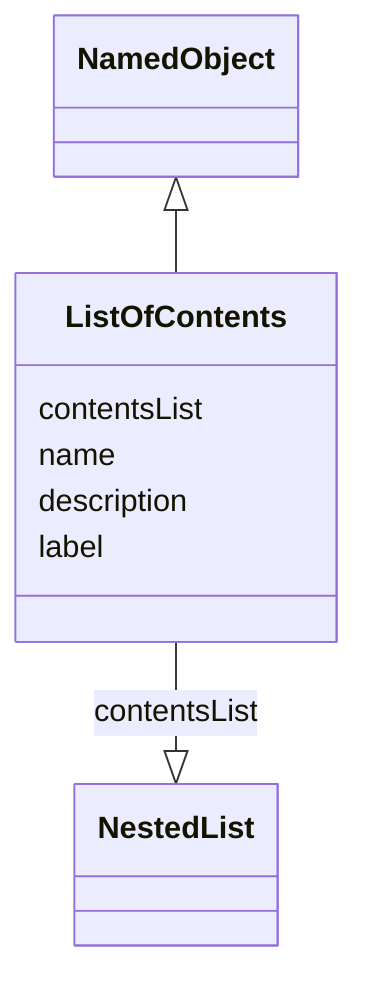

# Class: ListOfContents

_A structured list of analyses and outputs included in the reporting event._


URI: [ars:ListOfContents](https://www.cdisc.org/ars/1-0/ListOfContents)





## Inheritance
* [NamedObject](NamedObject.md)
    * **ListOfContents**


## Slots

| Name | Cardinality* and Range | Description | Inheritance |
| ---  | --- | --- | --- |
| [contentsList](contentsList.md) | 1..1 <br/> [NestedList](NestedList.md) | A structured list of the analyses and outputs defined for the reporting event | direct |
| [name](name.md) | 1..1 <br/> [String](String.md) | The name for the instance of the class | [NamedObject](NamedObject.md) |
| [description](description.md) | 0..1 <br/> [String](String.md) | A textual description of the instance of the class | [NamedObject](NamedObject.md) |
| [label](label.md) | 0..1 <br/> [String](String.md) | A short informative description that may be used for display | [NamedObject](NamedObject.md) |

_* See [LinkML documentation](https://linkml.io/linkml/schemas/slots.html#slot-cardinality) for cardinality definitions._


## Usages

| used by | used in | type | used |
| ---  | --- | --- | --- |
| [ReportingEvent](ReportingEvent.md) | [mainListOfContents](mainListOfContents.md) | range | [ListOfContents](ListOfContents.md) |
| [ReportingEvent](ReportingEvent.md) | [otherListsOfContents](otherListsOfContents.md) | range | [ListOfContents](ListOfContents.md) |


## Identifier and Mapping Information


### Schema Source


* from schema: https://www.cdisc.org/ars/1-0


## Mappings

| Mapping Type | Mapped Value |
| ---  | ---  |
| self | ars:ListOfContents |
| native | ars:ListOfContents |


## LinkML Source

<!-- TODO: investigate https://stackoverflow.com/questions/37606292/how-to-create-tabbed-code-blocks-in-mkdocs-or-sphinx -->

### Direct

<details>
```yaml
name: ListOfContents
description: A structured list of analyses and outputs included in the reporting event.
from_schema: https://www.cdisc.org/ars/1-0
rank: 1000
is_a: NamedObject
slots:
- contentsList

```
</details>

### Induced

<details>
```yaml
name: ListOfContents
description: A structured list of analyses and outputs included in the reporting event.
from_schema: https://www.cdisc.org/ars/1-0
rank: 1000
is_a: NamedObject
attributes:
  contentsList:
    name: contentsList
    description: A structured list of the analyses and outputs defined for the reporting
      event.
    from_schema: https://www.cdisc.org/ars/1-0
    rank: 1000
    alias: contentsList
    owner: ListOfContents
    domain_of:
    - ListOfContents
    range: NestedList
    required: true
  name:
    name: name
    description: The name for the instance of the class.
    from_schema: https://www.cdisc.org/ars/1-0
    rank: 1000
    alias: name
    owner: ListOfContents
    domain_of:
    - NamedObject
    range: string
    required: true
  description:
    name: description
    description: A textual description of the instance of the class.
    from_schema: https://www.cdisc.org/ars/1-0
    rank: 1000
    alias: description
    owner: ListOfContents
    domain_of:
    - NamedObject
    - SponsorTerm
    - ReferencedOperationRelationship
    range: string
  label:
    name: label
    description: A short informative description that may be used for display.
    from_schema: https://www.cdisc.org/ars/1-0
    rank: 1000
    alias: label
    owner: ListOfContents
    domain_of:
    - NamedObject
    - AnalysisOutputCategorization
    - AnalysisOutputCategory
    - PageRef
    range: string

```
</details>