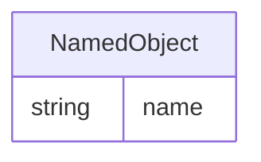

# Class: NamedObject


_An object with a name._


* __NOTE__: this is an abstract class and should not be instantiated directly


URI: [ars:NamedObject](https://www.cdisc.org/ars/1-0/NamedObject)





## Inheritance
* **NamedObject**
    * [ReportingEvent](ReportingEvent.md)
    * [OrderedListItem](OrderedListItem.md)
    * [Analysis](Analysis.md)
    * [AnalysisMethod](AnalysisMethod.md)
    * [Operation](Operation.md)
    * [CodeParameter](CodeParameter.md)
    * [Output](Output.md)
    * [OutputFile](OutputFile.md)
    * [OutputDisplay](OutputDisplay.md)
    * [ReferenceDocument](ReferenceDocument.md)


## Slots

| Name | Cardinality and Range | Description | Inheritance |
| ---  | --- | --- | --- |
| [name](name.md) | 1..1 <br/> [String](String.md) | The name for the instance of the class | direct |


## Identifier and Mapping Information


### Schema Source


* from schema: https://www.cdisc.org/ars/1-0


## Mappings

| Mapping Type | Mapped Value |
| ---  | ---  |
| self | ars:NamedObject |
| native | ars:NamedObject |


## LinkML Source

<!-- TODO: investigate https://stackoverflow.com/questions/37606292/how-to-create-tabbed-code-blocks-in-mkdocs-or-sphinx -->

### Direct

<details>
```yaml
name: NamedObject
description: An object with a name.
from_schema: https://www.cdisc.org/ars/1-0
rank: 1000
abstract: true
slots:
- name

```
</details>

### Induced

<details>
```yaml
name: NamedObject
description: An object with a name.
from_schema: https://www.cdisc.org/ars/1-0
rank: 1000
abstract: true
attributes:
  name:
    name: name
    description: The name for the instance of the class.
    from_schema: https://www.cdisc.org/ars/1-0
    rank: 1000
    alias: name
    owner: NamedObject
    domain_of:
    - NamedObject
    range: string
    required: true

```
</details>