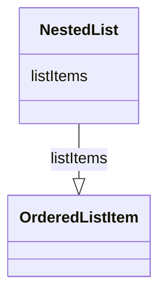

# Class: NestedList


_A list of items (analyses or outputs) that may be organized within sub-lists._


URI: [ars:NestedList](https://www.cdisc.org/ars/1-0/NestedList)





<!-- no inheritance hierarchy -->


## Slots

| Name | Cardinality and Range | Description | Inheritance |
| ---  | --- | --- | --- |
| [listItems](listItems.md) | 0..* <br/> [OrderedListItem](OrderedListItem.md) |  | direct |


## Usages

| used by | used in | type | used |
| ---  | --- | --- | --- |
| [ReportingEvent](ReportingEvent.md) | [listOfPlannedAnalyses](listOfPlannedAnalyses.md) | range | [NestedList](NestedList.md) |
| [ReportingEvent](ReportingEvent.md) | [listOfPlannedOutputs](listOfPlannedOutputs.md) | range | [NestedList](NestedList.md) |
| [OrderedListItem](OrderedListItem.md) | [sublist](sublist.md) | range | [NestedList](NestedList.md) |


## Identifier and Mapping Information


### Schema Source


* from schema: https://www.cdisc.org/ars/1-0


## Mappings

| Mapping Type | Mapped Value |
| ---  | ---  |
| self | ars:NestedList |
| native | ars:NestedList |


## LinkML Source

<!-- TODO: investigate https://stackoverflow.com/questions/37606292/how-to-create-tabbed-code-blocks-in-mkdocs-or-sphinx -->

### Direct

<details>
```yaml
name: NestedList
description: A list of items (analyses or outputs) that may be organized within sub-lists.
from_schema: https://www.cdisc.org/ars/1-0
rank: 1000
slots:
- listItems

```
</details>

### Induced

<details>
```yaml
name: NestedList
description: A list of items (analyses or outputs) that may be organized within sub-lists.
from_schema: https://www.cdisc.org/ars/1-0
rank: 1000
attributes:
  listItems:
    name: listItems
    from_schema: https://www.cdisc.org/ars/1-0
    rank: 1000
    multivalued: true
    list_elements_ordered: true
    alias: listItems
    owner: NestedList
    domain_of:
    - NestedList
    range: OrderedListItem
    inlined: true
    inlined_as_list: true

```
</details>