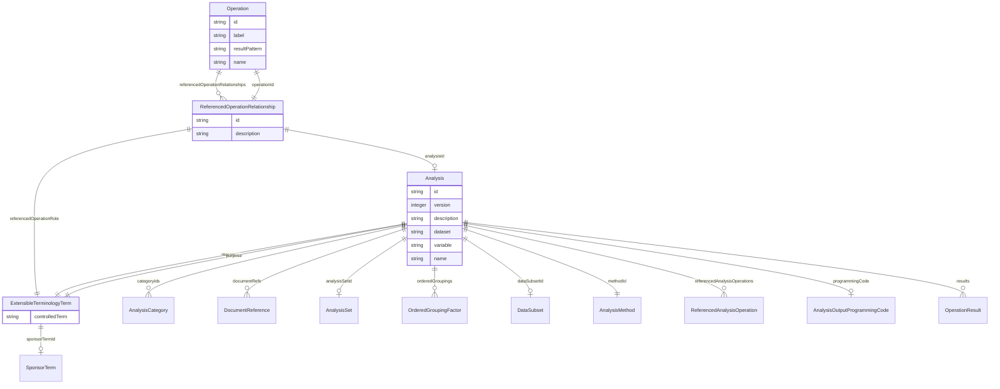

# Class: Operation


_A statistical operation that produces a single analysis result value as part of an analysis method._


URI: [ars:Operation](https://www.cdisc.org/ars/1-0/Operation)





## Inheritance
* [NamedObject](NamedObject.md)
    * **Operation**


## Slots

| Name | Cardinality and Range | Description | Inheritance |
| ---  | --- | --- | --- |
| [id](id.md) | 1..1 <br/> [String](String.md) | The assigned identifying value for the instance of the class | direct |
| [label](label.md) | 0..1 <br/> [String](String.md) | A short informative description that may be used for display | direct |
| [referencedOperationRelationships](referencedOperationRelationships.md) | 0..* <br/> [ReferencedOperationRelationship](ReferencedOperationRelationship.md) | Relationships to other operations indicating how the result of the referenced... | direct |
| [resultPattern](resultPattern.md) | 0..1 <br/> [String](String.md) | The default pattern or format to apply to the result for display | direct |
| [name](name.md) | 1..1 <br/> [String](String.md) | The name for the instance of the class | [NamedObject](NamedObject.md) |


## Usages

| used by | used in | type | used |
| ---  | --- | --- | --- |
| [OperationResult](OperationResult.md) | [operationId](operationId.md) | range | [Operation](Operation.md) |
| [AnalysisMethod](AnalysisMethod.md) | [operations](operations.md) | range | [Operation](Operation.md) |
| [ReferencedOperationRelationship](ReferencedOperationRelationship.md) | [operationId](operationId.md) | range | [Operation](Operation.md) |


## Identifier and Mapping Information


### Schema Source


* from schema: https://www.cdisc.org/ars/1-0


## Mappings

| Mapping Type | Mapped Value |
| ---  | ---  |
| self | ars:Operation |
| native | ars:Operation |


## LinkML Source

<!-- TODO: investigate https://stackoverflow.com/questions/37606292/how-to-create-tabbed-code-blocks-in-mkdocs-or-sphinx -->

### Direct

<details>
```yaml
name: Operation
description: A statistical operation that produces a single analysis result value
  as part of an analysis method.
from_schema: https://www.cdisc.org/ars/1-0
rank: 1000
is_a: NamedObject
slots:
- id
- label
- referencedOperationRelationships
- resultPattern

```
</details>

### Induced

<details>
```yaml
name: Operation
description: A statistical operation that produces a single analysis result value
  as part of an analysis method.
from_schema: https://www.cdisc.org/ars/1-0
rank: 1000
is_a: NamedObject
attributes:
  id:
    name: id
    description: The assigned identifying value for the instance of the class.
    from_schema: https://www.cdisc.org/ars/1-0
    rank: 1000
    identifier: true
    alias: id
    owner: Operation
    domain_of:
    - ReportingEvent
    - AnalysisCategorization
    - AnalysisCategory
    - Analysis
    - AnalysisMethod
    - Operation
    - ReferencedOperationRelationship
    - Output
    - OutputDisplay
    - DisplaySubSection
    - AnalysisSet
    - GroupingFactor
    - Group
    - DataSubset
    - ReferenceDocument
    - TerminologyExtension
    - SponsorTerm
    range: string
    required: true
  label:
    name: label
    description: A short informative description that may be used for display.
    from_schema: https://www.cdisc.org/ars/1-0
    rank: 1000
    alias: label
    owner: Operation
    domain_of:
    - AnalysisCategorization
    - AnalysisCategory
    - AnalysisMethod
    - Operation
    - AnalysisSet
    - GroupingFactor
    - Group
    - DataSubset
    - PageRef
    range: string
  referencedOperationRelationships:
    name: referencedOperationRelationships
    description: Relationships to other operations indicating how the result of the
      referenced operation are used in the calculation of the result for this operation.
    from_schema: https://www.cdisc.org/ars/1-0
    rank: 1000
    multivalued: true
    alias: referencedOperationRelationships
    owner: Operation
    domain_of:
    - Operation
    range: ReferencedOperationRelationship
    inlined: true
    inlined_as_list: true
  resultPattern:
    name: resultPattern
    description: The default pattern or format to apply to the result for display.
    comments:
    - May be a textual representation of a generic result to be displayed in a table
      shell (e.g. XX.X) or a machine readable formatting instruction.
    from_schema: https://www.cdisc.org/ars/1-0
    rank: 1000
    alias: resultPattern
    owner: Operation
    domain_of:
    - Operation
    range: string
  name:
    name: name
    description: The name for the instance of the class.
    from_schema: https://www.cdisc.org/ars/1-0
    rank: 1000
    alias: name
    owner: Operation
    domain_of:
    - NamedObject
    range: string
    required: true

```
</details>