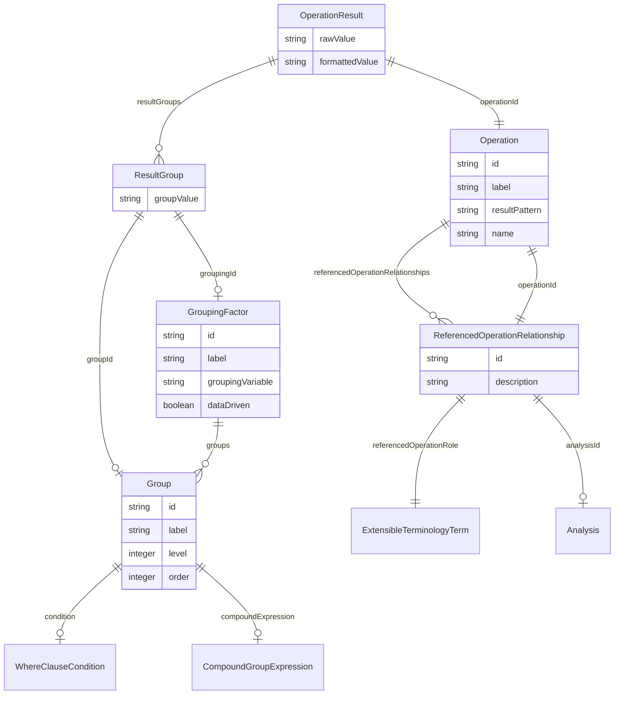

# Class: OperationResult


_The result of an analysis method operation performed on a subdivision of subjects or data records._


URI: [ars:OperationResult](https://www.cdisc.org/ars/1-0/OperationResult)





<!-- no inheritance hierarchy -->


## Slots

| Name | Cardinality and Range | Description | Inheritance |
| ---  | --- | --- | --- |
| [operationId](operationId.md) | 1..1 <br/> [Operation](Operation.md) | The identifier of the referenced operation | direct |
| [resultGroups](resultGroups.md) | 0..* <br/> [ResultGroup](ResultGroup.md) | The group values associated with the result | direct |
| [rawValue](rawValue.md) | 0..1 <br/> [String](String.md) | The raw result value (e | direct |
| [formattedValue](formattedValue.md) | 0..1 <br/> [String](String.md) | The result value formatted for display according to the resultPattern | direct |


## Usages

| used by | used in | type | used |
| ---  | --- | --- | --- |
| [Analysis](Analysis.md) | [results](results.md) | range | [OperationResult](OperationResult.md) |


## Identifier and Mapping Information


### Schema Source


* from schema: https://www.cdisc.org/ars/1-0


## Mappings

| Mapping Type | Mapped Value |
| ---  | ---  |
| self | ars:OperationResult |
| native | ars:OperationResult |


## LinkML Source

<!-- TODO: investigate https://stackoverflow.com/questions/37606292/how-to-create-tabbed-code-blocks-in-mkdocs-or-sphinx -->

### Direct

<details>
```yaml
name: OperationResult
description: The result of an analysis method operation performed on a subdivision
  of subjects or data records.
from_schema: https://www.cdisc.org/ars/1-0
rank: 1000
slots:
- operationId
- resultGroups
- rawValue
- formattedValue

```
</details>

### Induced

<details>
```yaml
name: OperationResult
description: The result of an analysis method operation performed on a subdivision
  of subjects or data records.
from_schema: https://www.cdisc.org/ars/1-0
rank: 1000
attributes:
  operationId:
    name: operationId
    description: The identifier of the referenced operation.
    from_schema: https://www.cdisc.org/ars/1-0
    rank: 1000
    alias: operationId
    owner: OperationResult
    domain_of:
    - OperationResult
    - ReferencedOperationRelationship
    range: Operation
    required: true
    inlined: false
  resultGroups:
    name: resultGroups
    description: The group values associated with the result.
    comments:
    - There should be a result group value for each grouping that is indicated as
      being associated with a separate result (resultsByGroup = True)
    from_schema: https://www.cdisc.org/ars/1-0
    rank: 1000
    multivalued: true
    alias: resultGroups
    owner: OperationResult
    domain_of:
    - OperationResult
    range: ResultGroup
    inlined: true
    inlined_as_list: true
  rawValue:
    name: rawValue
    description: The raw result value (e.g., with no rounding applied).
    from_schema: https://www.cdisc.org/ars/1-0
    rank: 1000
    alias: rawValue
    owner: OperationResult
    domain_of:
    - OperationResult
    range: string
  formattedValue:
    name: formattedValue
    description: The result value formatted for display according to the resultPattern.
    from_schema: https://www.cdisc.org/ars/1-0
    rank: 1000
    alias: formattedValue
    owner: OperationResult
    domain_of:
    - OperationResult
    range: string

```
</details>