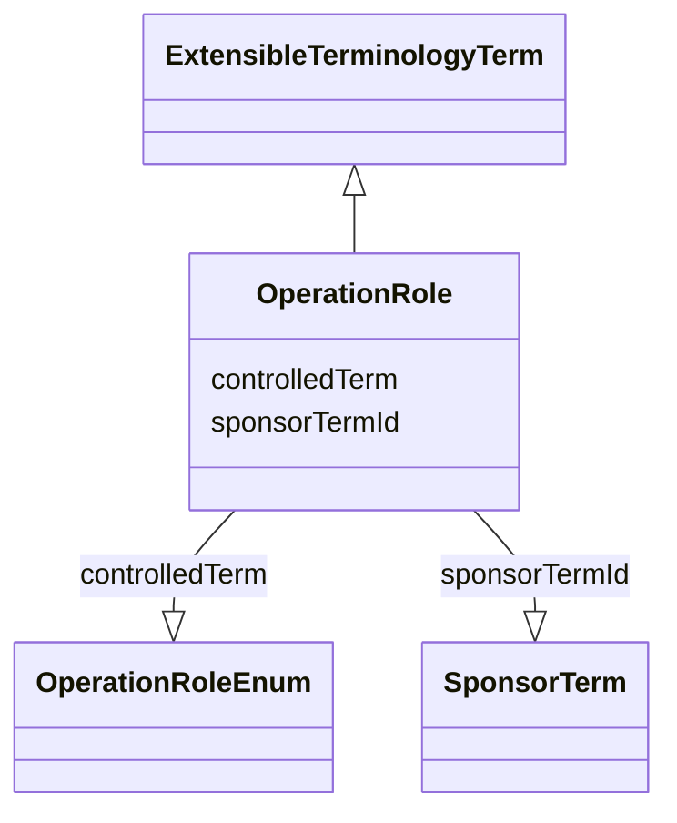

# Class: OperationRole

_The role that the referenced operation's result plays in the calculation of the result of this operation._


URI: [ars:OperationRole](https://www.cdisc.org/ars/1-0/OperationRole)





## Inheritance
* [ExtensibleTerminologyTerm](ExtensibleTerminologyTerm.md)
    * **OperationRole**


## Slots

| Name | Cardinality* and Range | Description | Inheritance |
| ---  | --- | --- | --- |
| [controlledTerm](controlledTerm.md) | 1..1 <br/> [OperationRoleEnum](OperationRoleEnum.md) | One of the permissible values from the referenced enumeration | [ExtensibleTerminologyTerm](ExtensibleTerminologyTerm.md) |
| [sponsorTermId](sponsorTermId.md) | 0..1 <br/> [SponsorTerm](SponsorTerm.md) | NOT USED | [ExtensibleTerminologyTerm](ExtensibleTerminologyTerm.md) |

_* See [LinkML documentation](https://linkml.io/linkml/schemas/slots.html#slot-cardinality) for cardinality definitions._


## Identifier and Mapping Information


### Schema Source


* from schema: https://www.cdisc.org/ars/1-0


## Mappings

| Mapping Type | Mapped Value |
| ---  | ---  |
| self | ars:OperationRole |
| native | ars:OperationRole |


## LinkML Source

<!-- TODO: investigate https://stackoverflow.com/questions/37606292/how-to-create-tabbed-code-blocks-in-mkdocs-or-sphinx -->

### Direct

<details>
```yaml
name: OperationRole
description: The role that the referenced operation's result plays in the calculation
  of the result of this operation.
from_schema: https://www.cdisc.org/ars/1-0
rank: 1000
is_a: ExtensibleTerminologyTerm
slot_usage:
  controlledTerm:
    name: controlledTerm
    domain_of:
    - ExtensibleTerminologyTerm
    range: OperationRoleEnum
    required: true
    value_presence: PRESENT
  sponsorTermId:
    name: sponsorTermId
    description: NOT USED
    domain_of:
    - ExtensibleTerminologyTerm
    value_presence: ABSENT

```
</details>

### Induced

<details>
```yaml
name: OperationRole
description: The role that the referenced operation's result plays in the calculation
  of the result of this operation.
from_schema: https://www.cdisc.org/ars/1-0
rank: 1000
is_a: ExtensibleTerminologyTerm
slot_usage:
  controlledTerm:
    name: controlledTerm
    domain_of:
    - ExtensibleTerminologyTerm
    range: OperationRoleEnum
    required: true
    value_presence: PRESENT
  sponsorTermId:
    name: sponsorTermId
    description: NOT USED
    domain_of:
    - ExtensibleTerminologyTerm
    value_presence: ABSENT
attributes:
  controlledTerm:
    name: controlledTerm
    description: One of the permissible values from the referenced enumeration.
    from_schema: https://www.cdisc.org/ars/1-0
    rank: 1000
    alias: controlledTerm
    owner: OperationRole
    domain_of:
    - ExtensibleTerminologyTerm
    range: OperationRoleEnum
    required: true
    value_presence: PRESENT
  sponsorTermId:
    name: sponsorTermId
    description: NOT USED
    from_schema: https://www.cdisc.org/ars/1-0
    rank: 1000
    alias: sponsorTermId
    owner: OperationRole
    domain_of:
    - ExtensibleTerminologyTerm
    range: SponsorTerm
    inlined: false
    value_presence: ABSENT

```
</details>