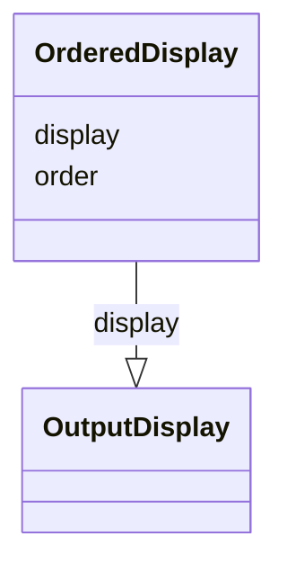

# Class: OrderedDisplay


URI: [ars:OrderedDisplay](https://www.cdisc.org/ars/1-0OrderedDisplay)





<!-- no inheritance hierarchy -->


## Slots

| Name | Cardinality and Range | Description | Inheritance |
| ---  | --- | --- | --- |
| [order](order.md) | 1..1 <br/> [Integer](Integer.md) |  | direct |
| [display](display.md) | 0..1 <br/> [OutputDisplay](OutputDisplay.md) |  | direct |


## Usages

| used by | used in | type | used |
| ---  | --- | --- | --- |
| [Output](Output.md) | [displays](displays.md) | range | [OrderedDisplay](OrderedDisplay.md) |


## Identifier and Mapping Information


### Schema Source


* from schema: https://www.cdisc.org/ars/1-0


## Mappings

| Mapping Type | Mapped Value |
| ---  | ---  |
| self | ars:OrderedDisplay |
| native | ars:OrderedDisplay |


## LinkML Source

<!-- TODO: investigate https://stackoverflow.com/questions/37606292/how-to-create-tabbed-code-blocks-in-mkdocs-or-sphinx -->

### Direct

<details>
```yaml
name: OrderedDisplay
from_schema: https://www.cdisc.org/ars/1-0
rank: 1000
slots:
- order
- display
slot_usage:
  order:
    name: order
    domain_of:
    - OrderedListItem
    - OrderedGroupingFactor
    - OrderedDisplay
    - DisplaySubSection
    - WhereClause
    required: true

```
</details>

### Induced

<details>
```yaml
name: OrderedDisplay
from_schema: https://www.cdisc.org/ars/1-0
rank: 1000
slot_usage:
  order:
    name: order
    domain_of:
    - OrderedListItem
    - OrderedGroupingFactor
    - OrderedDisplay
    - DisplaySubSection
    - WhereClause
    required: true
attributes:
  order:
    name: order
    from_schema: https://www.cdisc.org/ars/1-0
    rank: 1000
    alias: order
    owner: OrderedDisplay
    domain_of:
    - OrderedListItem
    - OrderedGroupingFactor
    - OrderedDisplay
    - DisplaySubSection
    - WhereClause
    range: integer
    required: true
  display:
    name: display
    from_schema: https://www.cdisc.org/ars/1-0
    rank: 1000
    alias: display
    owner: OrderedDisplay
    domain_of:
    - OrderedDisplay
    range: OutputDisplay
    inlined: true

```
</details>