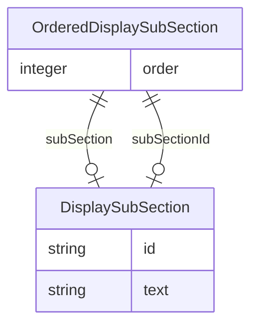

# Class: OrderedDisplaySubSection


_A single subsection ordered with respect to other subsections in the same section of a display._


* __NOTE__: this is an abstract class and should not be instantiated directly


URI: [ars:OrderedDisplaySubSection](https://www.cdisc.org/ars/1-0/OrderedDisplaySubSection)





## Inheritance
* **OrderedDisplaySubSection**
    * [OrderedSubSection](OrderedSubSection.md)
    * [OrderedSubSectionRef](OrderedSubSectionRef.md)


## Slots

| Name | Cardinality and Range | Description | Inheritance |
| ---  | --- | --- | --- |
| [order](order.md) | 1..1 <br/> [Integer](Integer.md) | The ordinal of the instance with respect to other instances | direct |
| [subSection](subSection.md) | 0..1 <br/> [DisplaySubSection](DisplaySubSection.md) | A defined piece of information text to display in a display section | direct |
| [subSectionId](subSectionId.md) | 0..1 <br/> [DisplaySubSection](DisplaySubSection.md) | The identifier of the referenced subsection | direct |


## Usages

| used by | used in | type | used |
| ---  | --- | --- | --- |
| [DisplaySection](DisplaySection.md) | [orderedSubSections](orderedSubSections.md) | range | [OrderedDisplaySubSection](OrderedDisplaySubSection.md) |


## Comments

* A single subsection should be either defined using subSection or referenced using subSectionId (not both).

## Identifier and Mapping Information


### Schema Source


* from schema: https://www.cdisc.org/ars/1-0


## Mappings

| Mapping Type | Mapped Value |
| ---  | ---  |
| self | ars:OrderedDisplaySubSection |
| native | ars:OrderedDisplaySubSection |


## LinkML Source

<!-- TODO: investigate https://stackoverflow.com/questions/37606292/how-to-create-tabbed-code-blocks-in-mkdocs-or-sphinx -->

### Direct

<details>
```yaml
name: OrderedDisplaySubSection
description: A single subsection ordered with respect to other subsections in the
  same section of a display.
comments:
- A single subsection should be either defined using subSection or referenced using
  subSectionId (not both).
from_schema: https://www.cdisc.org/ars/1-0
rank: 1000
abstract: true
slots:
- order
- subSection
- subSectionId
slot_usage:
  order:
    name: order
    domain_of:
    - OrderedListItem
    - OrderedGroupingFactor
    - OrderedDisplay
    - OrderedDisplaySubSection
    - WhereClause
    required: true

```
</details>

### Induced

<details>
```yaml
name: OrderedDisplaySubSection
description: A single subsection ordered with respect to other subsections in the
  same section of a display.
comments:
- A single subsection should be either defined using subSection or referenced using
  subSectionId (not both).
from_schema: https://www.cdisc.org/ars/1-0
rank: 1000
abstract: true
slot_usage:
  order:
    name: order
    domain_of:
    - OrderedListItem
    - OrderedGroupingFactor
    - OrderedDisplay
    - OrderedDisplaySubSection
    - WhereClause
    required: true
attributes:
  order:
    name: order
    description: The ordinal of the instance with respect to other instances.
    from_schema: https://www.cdisc.org/ars/1-0
    rank: 1000
    alias: order
    owner: OrderedDisplaySubSection
    domain_of:
    - OrderedListItem
    - OrderedGroupingFactor
    - OrderedDisplay
    - OrderedDisplaySubSection
    - WhereClause
    range: integer
    required: true
  subSection:
    name: subSection
    description: A defined piece of information text to display in a display section.
    from_schema: https://www.cdisc.org/ars/1-0
    rank: 1000
    alias: subSection
    owner: OrderedDisplaySubSection
    domain_of:
    - OrderedDisplaySubSection
    range: DisplaySubSection
    inlined: true
  subSectionId:
    name: subSectionId
    description: The identifier of the referenced subsection.
    from_schema: https://www.cdisc.org/ars/1-0
    rank: 1000
    alias: subSectionId
    owner: OrderedDisplaySubSection
    domain_of:
    - OrderedDisplaySubSection
    range: DisplaySubSection
    inlined: false

```
</details>