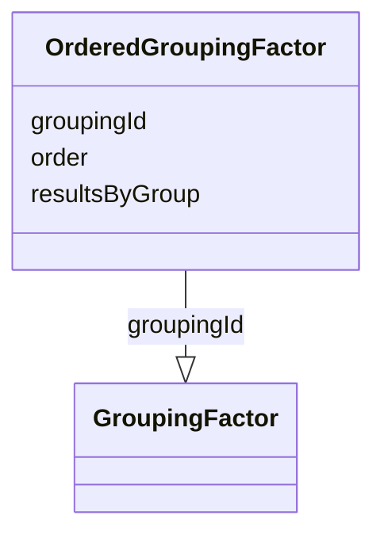

# Class: OrderedGroupingFactor


_A reference to a defined factor by which subjects or data records are grouped for the analysis, ordered with respect to other grouping factors._


URI: [ars:OrderedGroupingFactor](https://www.cdisc.org/ars/1-0/OrderedGroupingFactor)





<!-- no inheritance hierarchy -->


## Slots

| Name | Cardinality and Range | Description | Inheritance |
| ---  | --- | --- | --- |
| [order](order.md) | 1..1 <br/> [Integer](Integer.md) |  | direct |
| [groupingId](groupingId.md) | 0..1 <br/> [GroupingFactor](GroupingFactor.md) |  | direct |
| [resultsByGroup](resultsByGroup.md) | 1..1 <br/> [Boolean](Boolean.md) | Indicates whether a result is expected for each group in the grouping | direct |


## Usages

| used by | used in | type | used |
| ---  | --- | --- | --- |
| [Analysis](Analysis.md) | [orderedGroupings](orderedGroupings.md) | range | [OrderedGroupingFactor](OrderedGroupingFactor.md) |


## Identifier and Mapping Information


### Schema Source


* from schema: https://www.cdisc.org/ars/1-0


## Mappings

| Mapping Type | Mapped Value |
| ---  | ---  |
| self | ars:OrderedGroupingFactor |
| native | ars:OrderedGroupingFactor |


## LinkML Source

<!-- TODO: investigate https://stackoverflow.com/questions/37606292/how-to-create-tabbed-code-blocks-in-mkdocs-or-sphinx -->

### Direct

<details>
```yaml
name: OrderedGroupingFactor
description: A reference to a defined factor by which subjects or data records are
  grouped for the analysis, ordered with respect to other grouping factors.
from_schema: https://www.cdisc.org/ars/1-0
rank: 1000
slots:
- order
- groupingId
- resultsByGroup
slot_usage:
  order:
    name: order
    domain_of:
    - OrderedListItem
    - OrderedGroupingFactor
    - OrderedDisplay
    - DisplaySubSection
    - WhereClause
    required: true

```
</details>

### Induced

<details>
```yaml
name: OrderedGroupingFactor
description: A reference to a defined factor by which subjects or data records are
  grouped for the analysis, ordered with respect to other grouping factors.
from_schema: https://www.cdisc.org/ars/1-0
rank: 1000
slot_usage:
  order:
    name: order
    domain_of:
    - OrderedListItem
    - OrderedGroupingFactor
    - OrderedDisplay
    - DisplaySubSection
    - WhereClause
    required: true
attributes:
  order:
    name: order
    from_schema: https://www.cdisc.org/ars/1-0
    rank: 1000
    alias: order
    owner: OrderedGroupingFactor
    domain_of:
    - OrderedListItem
    - OrderedGroupingFactor
    - OrderedDisplay
    - DisplaySubSection
    - WhereClause
    range: integer
    required: true
  groupingId:
    name: groupingId
    from_schema: https://www.cdisc.org/ars/1-0
    rank: 1000
    alias: groupingId
    owner: OrderedGroupingFactor
    domain_of:
    - OrderedGroupingFactor
    - ResultGroup
    range: GroupingFactor
    inlined: false
  resultsByGroup:
    name: resultsByGroup
    description: Indicates whether a result is expected for each group in the grouping.
    from_schema: https://www.cdisc.org/ars/1-0
    rank: 1000
    alias: resultsByGroup
    owner: OrderedGroupingFactor
    domain_of:
    - OrderedGroupingFactor
    range: boolean
    required: true

```
</details>