# Class: OrderedListItem


_An item (analysis, output or sub-list) ordered relative to other items within a list or sub-list._


URI: [ars:OrderedListItem](https://www.cdisc.org/ars/1-0/OrderedListItem)

```mermaid
erDiagram
OrderedListItem {
    integer level  
    integer order  
    string name  
}
Output {
    string id  
    integer version  
    string name  
}
AnalysisOutputProgrammingCode {
    string context  
    string code  
}
DocumentReference {

}
AnalysisCategory {
    string id  
    string label  
}
OrderedDisplay {
    integer order  
}
OutputFile {
    uri location  
    string style  
    string name  
}
Analysis {
    string id  
    integer version  
    string description  
    string dataset  
    string variable  
    string name  
}
OperationResult {
    string rawValue  
    string formattedValue  
}
ReferencedAnalysisOperation {

}
AnalysisMethod {
    string id  
    string label  
    string description  
    string name  
}
DataSubset {
    string id  
    string label  
    integer level  
    integer order  
}
OrderedGroupingFactor {
    integer order  
    boolean resultsByGroup  
}
AnalysisSet {
    string id  
    string label  
    integer level  
    integer order  
}
ExtensibleTerminologyTerm {
    string controlledTerm  
}
NestedList {

}

OrderedListItem ||--|o NestedList : "sublist"
OrderedListItem ||--|o Analysis : "analysisId"
OrderedListItem ||--|o Output : "outputId"
Output ||--}o OutputFile : "fileSpecifications"
Output ||--}o OrderedDisplay : "displays"
Output ||--}o AnalysisCategory : "categoryIds"
Output ||--}o DocumentReference : "documentRefs"
Output ||--|o AnalysisOutputProgrammingCode : "programmingCode"
AnalysisOutputProgrammingCode ||--|o DocumentReference : "documentRef"
AnalysisOutputProgrammingCode ||--}o AnalysisOutputCodeParameter : "parameters"
DocumentReference ||--|| ReferenceDocument : "referenceDocumentId"
DocumentReference ||--}o PageRef : "pageRefs"
AnalysisCategory ||--}o AnalysisCategorization : "subCategorizations"
OrderedDisplay ||--|o OutputDisplay : "display"
OutputFile ||--|o ExtensibleTerminologyTerm : "fileType"
Analysis ||--}o AnalysisCategory : "categoryIds"
Analysis ||--|| ExtensibleTerminologyTerm : "reason"
Analysis ||--|| ExtensibleTerminologyTerm : "purpose"
Analysis ||--}o DocumentReference : "documentRefs"
Analysis ||--|o AnalysisSet : "analysisSetId"
Analysis ||--}o OrderedGroupingFactor : "orderedGroupings"
Analysis ||--|o DataSubset : "dataSubsetId"
Analysis ||--|| AnalysisMethod : "methodId"
Analysis ||--}o ReferencedAnalysisOperation : "referencedAnalysisOperations"
Analysis ||--|o AnalysisOutputProgrammingCode : "programmingCode"
Analysis ||--}o OperationResult : "results"
OperationResult ||--|| Operation : "operationId"
OperationResult ||--}o ResultGroup : "resultGroups"
ReferencedAnalysisOperation ||--|| ReferencedOperationRelationship : "referencedOperationRelationshipId"
ReferencedAnalysisOperation ||--|| Analysis : "analysisId"
AnalysisMethod ||--}| Operation : "operations"
AnalysisMethod ||--}o DocumentReference : "documentRefs"
AnalysisMethod ||--|o AnalysisProgrammingCodeTemplate : "codeTemplate"
DataSubset ||--|o WhereClauseCondition : "condition"
DataSubset ||--|o CompoundSubsetExpression : "compoundExpression"
OrderedGroupingFactor ||--|o GroupingFactor : "groupingId"
AnalysisSet ||--|o WhereClauseCondition : "condition"
AnalysisSet ||--|o CompoundSetExpression : "compoundExpression"
ExtensibleTerminologyTerm ||--|o SponsorTerm : "sponsorTermId"
NestedList ||--}o OrderedListItem : "listItems"

```





## Inheritance
* [NamedObject](NamedObject.md)
    * **OrderedListItem**


## Slots

| Name | Cardinality and Range | Description | Inheritance |
| ---  | --- | --- | --- |
| [level](level.md) | 1..1 <br/> [Integer](Integer.md) | The level of the entry within a hierarchical structure | direct |
| [order](order.md) | 1..1 <br/> [Integer](Integer.md) | The ordinal of the instance with respect to other instances | direct |
| [sublist](sublist.md) | 0..1 <br/> [NestedList](NestedList.md) | A sub-list of items (analyses or outputs) that may be further organized withi... | direct |
| [analysisId](analysisId.md) | 0..1 <br/> [Analysis](Analysis.md) | The identifier of the referenced analysis | direct |
| [outputId](outputId.md) | 0..1 <br/> [Output](Output.md) | The identifier of the referenced output | direct |
| [name](name.md) | 1..1 <br/> [String](String.md) | The name for the instance of the class | [NamedObject](NamedObject.md) |


## Usages

| used by | used in | type | used |
| ---  | --- | --- | --- |
| [NestedList](NestedList.md) | [listItems](listItems.md) | range | [OrderedListItem](OrderedListItem.md) |


## Identifier and Mapping Information


### Schema Source


* from schema: https://www.cdisc.org/ars/1-0


## Mappings

| Mapping Type | Mapped Value |
| ---  | ---  |
| self | ars:OrderedListItem |
| native | ars:OrderedListItem |


## LinkML Source

<!-- TODO: investigate https://stackoverflow.com/questions/37606292/how-to-create-tabbed-code-blocks-in-mkdocs-or-sphinx -->

### Direct

<details>
```yaml
name: OrderedListItem
description: An item (analysis, output or sub-list) ordered relative to other items
  within a list or sub-list.
from_schema: https://www.cdisc.org/ars/1-0
rank: 1000
is_a: NamedObject
slots:
- level
- order
- sublist
- analysisId
- outputId
slot_usage:
  level:
    name: level
    domain_of:
    - OrderedListItem
    - WhereClause
    required: true
  order:
    name: order
    domain_of:
    - OrderedListItem
    - OrderedGroupingFactor
    - OrderedDisplay
    - OrderedDisplaySubSection
    - WhereClause
    required: true

```
</details>

### Induced

<details>
```yaml
name: OrderedListItem
description: An item (analysis, output or sub-list) ordered relative to other items
  within a list or sub-list.
from_schema: https://www.cdisc.org/ars/1-0
rank: 1000
is_a: NamedObject
slot_usage:
  level:
    name: level
    domain_of:
    - OrderedListItem
    - WhereClause
    required: true
  order:
    name: order
    domain_of:
    - OrderedListItem
    - OrderedGroupingFactor
    - OrderedDisplay
    - OrderedDisplaySubSection
    - WhereClause
    required: true
attributes:
  level:
    name: level
    description: The level of the entry within a hierarchical structure.
    from_schema: https://www.cdisc.org/ars/1-0
    rank: 1000
    alias: level
    owner: OrderedListItem
    domain_of:
    - OrderedListItem
    - WhereClause
    range: integer
    required: true
  order:
    name: order
    description: The ordinal of the instance with respect to other instances.
    from_schema: https://www.cdisc.org/ars/1-0
    rank: 1000
    alias: order
    owner: OrderedListItem
    domain_of:
    - OrderedListItem
    - OrderedGroupingFactor
    - OrderedDisplay
    - OrderedDisplaySubSection
    - WhereClause
    range: integer
    required: true
  sublist:
    name: sublist
    description: A sub-list of items (analyses or outputs) that may be further organized
      within sub-lists.
    from_schema: https://www.cdisc.org/ars/1-0
    rank: 1000
    multivalued: false
    alias: sublist
    owner: OrderedListItem
    domain_of:
    - OrderedListItem
    range: NestedList
    inlined: true
  analysisId:
    name: analysisId
    description: The identifier of the referenced analysis.
    from_schema: https://www.cdisc.org/ars/1-0
    rank: 1000
    multivalued: false
    alias: analysisId
    owner: OrderedListItem
    domain_of:
    - OrderedListItem
    - ReferencedAnalysisOperation
    - ReferencedOperationRelationship
    range: Analysis
    inlined: false
  outputId:
    name: outputId
    description: The identifier of the referenced output.
    from_schema: https://www.cdisc.org/ars/1-0
    rank: 1000
    multivalued: false
    alias: outputId
    owner: OrderedListItem
    domain_of:
    - OrderedListItem
    range: Output
    inlined: false
  name:
    name: name
    description: The name for the instance of the class.
    from_schema: https://www.cdisc.org/ars/1-0
    rank: 1000
    alias: name
    owner: OrderedListItem
    domain_of:
    - NamedObject
    range: string
    required: true

```
</details>