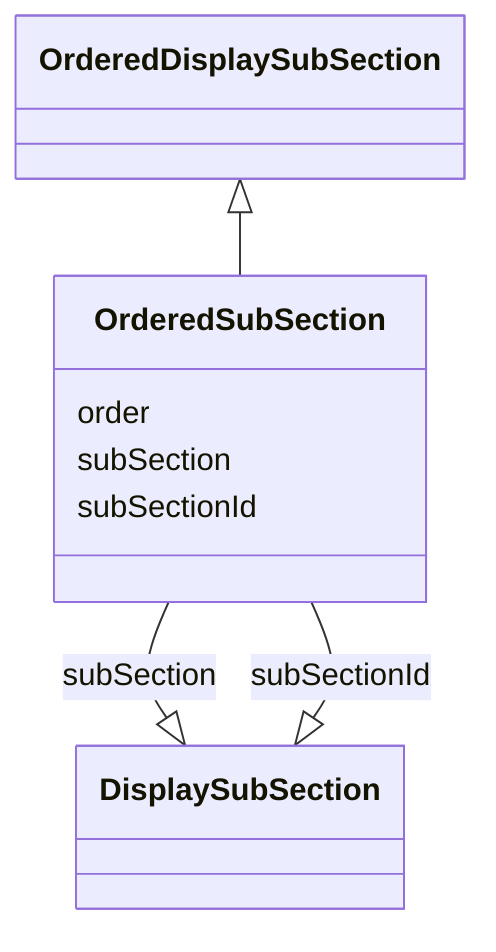

# Class: OrderedSubSection


_A subsection ordered with respect to other subsections of the same type._


URI: [ars:OrderedSubSection](https://www.cdisc.org/ars/1-0/OrderedSubSection)





## Inheritance
* [OrderedDisplaySubSection](OrderedDisplaySubSection.md)
    * **OrderedSubSection**


## Slots

| Name | Cardinality and Range | Description | Inheritance |
| ---  | --- | --- | --- |
| [order](order.md) | 1..1 <br/> [Integer](Integer.md) |  | [OrderedDisplaySubSection](OrderedDisplaySubSection.md) |
| [subSection](subSection.md) | 1..1 <br/> [DisplaySubSection](DisplaySubSection.md) |  | [OrderedDisplaySubSection](OrderedDisplaySubSection.md) |
| [subSectionId](subSectionId.md) | 0..1 <br/> [DisplaySubSection](DisplaySubSection.md) |  | [OrderedDisplaySubSection](OrderedDisplaySubSection.md) |


## Identifier and Mapping Information


### Schema Source


* from schema: https://www.cdisc.org/ars/1-0


## Mappings

| Mapping Type | Mapped Value |
| ---  | ---  |
| self | ars:OrderedSubSection |
| native | ars:OrderedSubSection |


## LinkML Source

<!-- TODO: investigate https://stackoverflow.com/questions/37606292/how-to-create-tabbed-code-blocks-in-mkdocs-or-sphinx -->

### Direct

<details>
```yaml
name: OrderedSubSection
description: A subsection ordered with respect to other subsections of the same type.
from_schema: https://www.cdisc.org/ars/1-0
rank: 1000
is_a: OrderedDisplaySubSection
slot_usage:
  subSection:
    name: subSection
    domain_of:
    - OrderedDisplaySubSection
    required: true
    value_presence: PRESENT
  subSectionId:
    name: subSectionId
    domain_of:
    - OrderedDisplaySubSection
    value_presence: ABSENT
defining_slots:
- subSection

```
</details>

### Induced

<details>
```yaml
name: OrderedSubSection
description: A subsection ordered with respect to other subsections of the same type.
from_schema: https://www.cdisc.org/ars/1-0
rank: 1000
is_a: OrderedDisplaySubSection
slot_usage:
  subSection:
    name: subSection
    domain_of:
    - OrderedDisplaySubSection
    required: true
    value_presence: PRESENT
  subSectionId:
    name: subSectionId
    domain_of:
    - OrderedDisplaySubSection
    value_presence: ABSENT
attributes:
  order:
    name: order
    from_schema: https://www.cdisc.org/ars/1-0
    rank: 1000
    alias: order
    owner: OrderedSubSection
    domain_of:
    - OrderedListItem
    - OrderedGroupingFactor
    - OrderedDisplay
    - OrderedDisplaySubSection
    - WhereClause
    range: integer
    required: true
  subSection:
    name: subSection
    from_schema: https://www.cdisc.org/ars/1-0
    rank: 1000
    alias: subSection
    owner: OrderedSubSection
    domain_of:
    - OrderedDisplaySubSection
    range: DisplaySubSection
    required: true
    inlined: true
    value_presence: PRESENT
  subSectionId:
    name: subSectionId
    from_schema: https://www.cdisc.org/ars/1-0
    rank: 1000
    alias: subSectionId
    owner: OrderedSubSection
    domain_of:
    - OrderedDisplaySubSection
    range: DisplaySubSection
    inlined: false
    value_presence: ABSENT
defining_slots:
- subSection

```
</details>