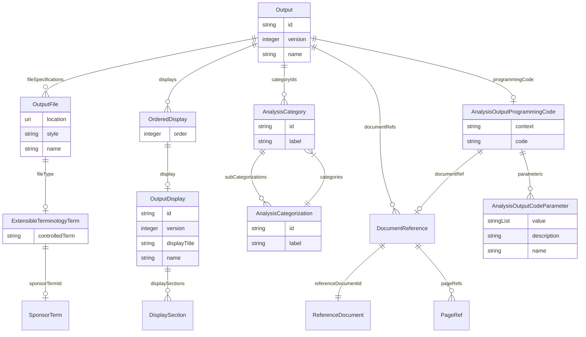

# Class: Output


_A report of results and their evaluation based on planned analyses performed during the course of a trial._


URI: [ars:Output](https://www.cdisc.org/ars/1-0/Output)





## Inheritance
* [NamedObject](NamedObject.md)
    * **Output**


## Slots

| Name | Cardinality and Range | Description | Inheritance |
| ---  | --- | --- | --- |
| [id](id.md) | 1..1 <br/> [String](String.md) | The assigned identifying value for the instance of the class | direct |
| [version](version.md) | 0..1 <br/> [Integer](Integer.md) | An ordinal indicating the version of the identified instance of the class | direct |
| [fileSpecifications](fileSpecifications.md) | 0..* <br/> [OutputFile](OutputFile.md) | Specifications of output files | direct |
| [displays](displays.md) | 0..* <br/> [OrderedDisplay](OrderedDisplay.md) | An ordered list of the displays included in the output | direct |
| [categoryIds](categoryIds.md) | 0..* <br/> [AnalysisCategory](AnalysisCategory.md) | References to any implementer-defined categories that apply to the output | direct |
| [documentRefs](documentRefs.md) | 0..* <br/> [DocumentReference](DocumentReference.md) | References to external documents containing additional information | direct |
| [programmingCode](programmingCode.md) | 0..1 <br/> [AnalysisOutputProgrammingCode](AnalysisOutputProgrammingCode.md) | Programming statements and/or a reference to the program used to perform the ... | direct |
| [name](name.md) | 1..1 <br/> [String](String.md) | The name for the instance of the class | [NamedObject](NamedObject.md) |


## Usages

| used by | used in | type | used |
| ---  | --- | --- | --- |
| [ReportingEvent](ReportingEvent.md) | [outputs](outputs.md) | range | [Output](Output.md) |
| [OrderedListItem](OrderedListItem.md) | [outputId](outputId.md) | range | [Output](Output.md) |


## Identifier and Mapping Information


### Schema Source


* from schema: https://www.cdisc.org/ars/1-0


## Mappings

| Mapping Type | Mapped Value |
| ---  | ---  |
| self | ars:Output |
| native | ars:Output |


## LinkML Source

<!-- TODO: investigate https://stackoverflow.com/questions/37606292/how-to-create-tabbed-code-blocks-in-mkdocs-or-sphinx -->

### Direct

<details>
```yaml
name: Output
description: A report of results and their evaluation based on planned analyses performed
  during the course of a trial.
from_schema: https://www.cdisc.org/ars/1-0
rank: 1000
is_a: NamedObject
slots:
- id
- version
- fileSpecifications
- displays
- categoryIds
- documentRefs
- programmingCode
slot_usage:
  categoryIds:
    name: categoryIds
    description: References to any implementer-defined categories that apply to the
      output.
    domain_of:
    - Analysis
    - Output
  programmingCode:
    name: programmingCode
    description: Programming statements and/or a reference to the program used to
      perform the specific output.
    domain_of:
    - Analysis
    - Output

```
</details>

### Induced

<details>
```yaml
name: Output
description: A report of results and their evaluation based on planned analyses performed
  during the course of a trial.
from_schema: https://www.cdisc.org/ars/1-0
rank: 1000
is_a: NamedObject
slot_usage:
  categoryIds:
    name: categoryIds
    description: References to any implementer-defined categories that apply to the
      output.
    domain_of:
    - Analysis
    - Output
  programmingCode:
    name: programmingCode
    description: Programming statements and/or a reference to the program used to
      perform the specific output.
    domain_of:
    - Analysis
    - Output
attributes:
  id:
    name: id
    description: The assigned identifying value for the instance of the class.
    from_schema: https://www.cdisc.org/ars/1-0
    rank: 1000
    identifier: true
    alias: id
    owner: Output
    domain_of:
    - ReportingEvent
    - AnalysisCategorization
    - AnalysisCategory
    - Analysis
    - AnalysisMethod
    - Operation
    - ReferencedOperationRelationship
    - Output
    - OutputDisplay
    - DisplaySubSection
    - AnalysisSet
    - GroupingFactor
    - Group
    - DataSubset
    - ReferenceDocument
    - TerminologyExtension
    - SponsorTerm
    range: string
    required: true
  version:
    name: version
    description: An ordinal indicating the version of the identified instance of the
      class.
    from_schema: https://www.cdisc.org/ars/1-0
    rank: 1000
    alias: version
    owner: Output
    domain_of:
    - ReportingEvent
    - Analysis
    - Output
    - OutputDisplay
    range: integer
  fileSpecifications:
    name: fileSpecifications
    description: Specifications of output files.
    from_schema: https://www.cdisc.org/ars/1-0
    rank: 1000
    multivalued: true
    alias: fileSpecifications
    owner: Output
    domain_of:
    - Output
    range: OutputFile
    inlined: true
    inlined_as_list: true
  displays:
    name: displays
    description: An ordered list of the displays included in the output.
    from_schema: https://www.cdisc.org/ars/1-0
    rank: 1000
    multivalued: true
    list_elements_ordered: true
    alias: displays
    owner: Output
    domain_of:
    - Output
    range: OrderedDisplay
    inlined: true
    inlined_as_list: true
  categoryIds:
    name: categoryIds
    description: References to any implementer-defined categories that apply to the
      output.
    from_schema: https://www.cdisc.org/ars/1-0
    rank: 1000
    multivalued: true
    alias: categoryIds
    owner: Output
    domain_of:
    - Analysis
    - Output
    range: AnalysisCategory
    required: false
    inlined: false
  documentRefs:
    name: documentRefs
    description: References to external documents containing additional information.
    from_schema: https://www.cdisc.org/ars/1-0
    rank: 1000
    multivalued: true
    alias: documentRefs
    owner: Output
    domain_of:
    - Analysis
    - AnalysisMethod
    - Output
    range: DocumentReference
    inlined: true
    inlined_as_list: true
  programmingCode:
    name: programmingCode
    description: Programming statements and/or a reference to the program used to
      perform the specific output.
    from_schema: https://www.cdisc.org/ars/1-0
    rank: 1000
    alias: programmingCode
    owner: Output
    domain_of:
    - Analysis
    - Output
    range: AnalysisOutputProgrammingCode
  name:
    name: name
    description: The name for the instance of the class.
    from_schema: https://www.cdisc.org/ars/1-0
    rank: 1000
    alias: name
    owner: Output
    domain_of:
    - NamedObject
    range: string
    required: true

```
</details>