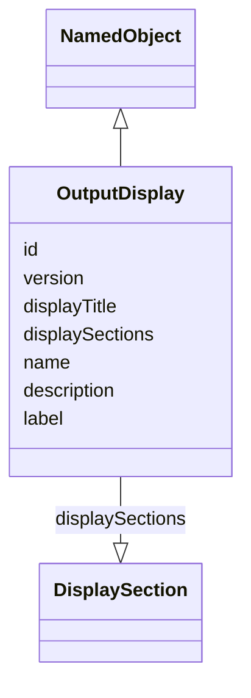

# Class: OutputDisplay

_A tabular representation of the results of one or more analyses._


URI: [ars:OutputDisplay](https://www.cdisc.org/ars/1-0/OutputDisplay)





## Inheritance
* [NamedObject](NamedObject.md)
    * **OutputDisplay**


## Slots

| Name | Cardinality* and Range | Description | Inheritance |
| ---  | --- | --- | --- |
| [id](id.md) | 1..1 <br/> [String](String.md) | The assigned identifying value for the instance of the class | direct |
| [version](version.md) | 0..1 <br/> [Integer](Integer.md) | An ordinal indicating the version of the identified instance of the class | direct |
| [displayTitle](displayTitle.md) | 0..1 <br/> [String](String.md) | Display description which uniquely identifies the display in the report | direct |
| [displaySections](displaySections.md) | 0..* <br/> [DisplaySection](DisplaySection.md) | The parts of the display containing one or more pieces of informational text ... | direct |
| [name](name.md) | 1..1 <br/> [String](String.md) | The name for the instance of the class | [NamedObject](NamedObject.md) |
| [description](description.md) | 0..1 <br/> [String](String.md) | A textual description of the instance of the class | [NamedObject](NamedObject.md) |
| [label](label.md) | 0..1 <br/> [String](String.md) | A short informative description that may be used for display | [NamedObject](NamedObject.md) |

_* See [LinkML documentation](https://linkml.io/linkml/schemas/slots.html#slot-cardinality) for cardinality definitions._


## Usages

| used by | used in | type | used |
| ---  | --- | --- | --- |
| [OrderedDisplay](OrderedDisplay.md) | [display](display.md) | range | [OutputDisplay](OutputDisplay.md) |


## Identifier and Mapping Information


### Schema Source


* from schema: https://www.cdisc.org/ars/1-0


## Mappings

| Mapping Type | Mapped Value |
| ---  | ---  |
| self | ars:OutputDisplay |
| native | ars:OutputDisplay |


## LinkML Source

<!-- TODO: investigate https://stackoverflow.com/questions/37606292/how-to-create-tabbed-code-blocks-in-mkdocs-or-sphinx -->

### Direct

<details>
```yaml
name: OutputDisplay
description: A tabular representation of the results of one or more analyses.
from_schema: https://www.cdisc.org/ars/1-0
rank: 1000
is_a: NamedObject
slots:
- id
- version
- displayTitle
- displaySections

```
</details>

### Induced

<details>
```yaml
name: OutputDisplay
description: A tabular representation of the results of one or more analyses.
from_schema: https://www.cdisc.org/ars/1-0
rank: 1000
is_a: NamedObject
attributes:
  id:
    name: id
    description: The assigned identifying value for the instance of the class.
    from_schema: https://www.cdisc.org/ars/1-0
    rank: 1000
    identifier: true
    alias: id
    owner: OutputDisplay
    domain_of:
    - ReportingEvent
    - ReferenceDocument
    - TerminologyExtension
    - SponsorTerm
    - AnalysisOutputCategorization
    - AnalysisOutputCategory
    - AnalysisSet
    - DataSubset
    - GroupingFactor
    - Group
    - AnalysisMethod
    - Operation
    - ReferencedOperationRelationship
    - Analysis
    - DisplaySubSection
    - Output
    - OutputDisplay
    range: string
    required: true
  version:
    name: version
    description: An ordinal indicating the version of the identified instance of the
      class.
    from_schema: https://www.cdisc.org/ars/1-0
    rank: 1000
    alias: version
    owner: OutputDisplay
    domain_of:
    - ReportingEvent
    - Analysis
    - Output
    - OutputDisplay
    range: integer
  displayTitle:
    name: displayTitle
    description: Display description which uniquely identifies the display in the
      report.
    from_schema: https://www.cdisc.org/ars/1-0
    rank: 1000
    alias: displayTitle
    owner: OutputDisplay
    domain_of:
    - OutputDisplay
    range: string
  displaySections:
    name: displaySections
    description: The parts of the display containing one or more pieces of informational
      text (e.g. title, footnote).
    from_schema: https://www.cdisc.org/ars/1-0
    rank: 1000
    multivalued: true
    alias: displaySections
    owner: OutputDisplay
    domain_of:
    - OutputDisplay
    range: DisplaySection
    inlined: true
    inlined_as_list: true
  name:
    name: name
    description: The name for the instance of the class.
    from_schema: https://www.cdisc.org/ars/1-0
    rank: 1000
    alias: name
    owner: OutputDisplay
    domain_of:
    - NamedObject
    range: string
    required: true
  description:
    name: description
    description: A textual description of the instance of the class.
    from_schema: https://www.cdisc.org/ars/1-0
    rank: 1000
    alias: description
    owner: OutputDisplay
    domain_of:
    - NamedObject
    - SponsorTerm
    - ReferencedOperationRelationship
    range: string
  label:
    name: label
    description: A short informative description that may be used for display.
    from_schema: https://www.cdisc.org/ars/1-0
    rank: 1000
    alias: label
    owner: OutputDisplay
    domain_of:
    - NamedObject
    - AnalysisOutputCategorization
    - AnalysisOutputCategory
    - PageRef
    range: string

```
</details>