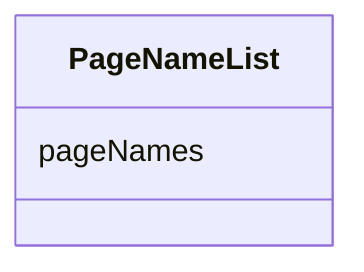

# Class: PageNameList


_A list of one or more named document references, each of which corresponds with a page._


URI: [ars:PageNameList](https://www.cdisc.org/ars/1-0/PageNameList)





<!-- no inheritance hierarchy -->


## Slots

| Name | Cardinality and Range | Description | Inheritance |
| ---  | --- | --- | --- |
| [pageNames](pageNames.md) | 1..* <br/> [Integer](Integer.md) | One or more named document references which each correspond with a page | direct |


## Usages

| used by | used in | type | used |
| ---  | --- | --- | --- |
| [PageNameRef](PageNameRef.md) | [pages](pages.md) | range | [PageNameList](PageNameList.md) |


## Identifier and Mapping Information


### Schema Source


* from schema: https://www.cdisc.org/ars/1-0


## Mappings

| Mapping Type | Mapped Value |
| ---  | ---  |
| self | ars:PageNameList |
| native | ars:PageNameList |


## LinkML Source

<!-- TODO: investigate https://stackoverflow.com/questions/37606292/how-to-create-tabbed-code-blocks-in-mkdocs-or-sphinx -->

### Direct

<details>
```yaml
name: PageNameList
description: A list of one or more named document references, each of which corresponds
  with a page.
from_schema: https://www.cdisc.org/ars/1-0
rank: 1000
slots:
- pageNames

```
</details>

### Induced

<details>
```yaml
name: PageNameList
description: A list of one or more named document references, each of which corresponds
  with a page.
from_schema: https://www.cdisc.org/ars/1-0
rank: 1000
attributes:
  pageNames:
    name: pageNames
    description: One or more named document references which each correspond with
      a page.
    from_schema: https://www.cdisc.org/ars/1-0
    rank: 1000
    multivalued: true
    alias: pageNames
    owner: PageNameList
    domain_of:
    - PageNameList
    range: integer
    required: true

```
</details>