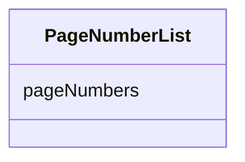

# Class: PageNumberList


_A list of one or more page numbers._


URI: [ars:PageNumberList](https://www.cdisc.org/ars/1-0/PageNumberList)





<!-- no inheritance hierarchy -->


## Slots

| Name | Cardinality and Range | Description | Inheritance |
| ---  | --- | --- | --- |
| [pageNumbers](pageNumbers.md) | 1..* <br/> [Integer](Integer.md) | One or more page numbers | direct |


## Usages

| used by | used in | type | used |
| ---  | --- | --- | --- |
| [PageNumberListRef](PageNumberListRef.md) | [pages](pages.md) | range | [PageNumberList](PageNumberList.md) |


## Identifier and Mapping Information


### Schema Source


* from schema: https://www.cdisc.org/ars/1-0


## Mappings

| Mapping Type | Mapped Value |
| ---  | ---  |
| self | ars:PageNumberList |
| native | ars:PageNumberList |


## LinkML Source

<!-- TODO: investigate https://stackoverflow.com/questions/37606292/how-to-create-tabbed-code-blocks-in-mkdocs-or-sphinx -->

### Direct

<details>
```yaml
name: PageNumberList
description: A list of one or more page numbers.
from_schema: https://www.cdisc.org/ars/1-0
rank: 1000
slots:
- pageNumbers

```
</details>

### Induced

<details>
```yaml
name: PageNumberList
description: A list of one or more page numbers.
from_schema: https://www.cdisc.org/ars/1-0
rank: 1000
attributes:
  pageNumbers:
    name: pageNumbers
    description: One or more page numbers.
    from_schema: https://www.cdisc.org/ars/1-0
    rank: 1000
    multivalued: true
    alias: pageNumbers
    owner: PageNumberList
    domain_of:
    - PageNumberList
    range: integer
    required: true

```
</details>