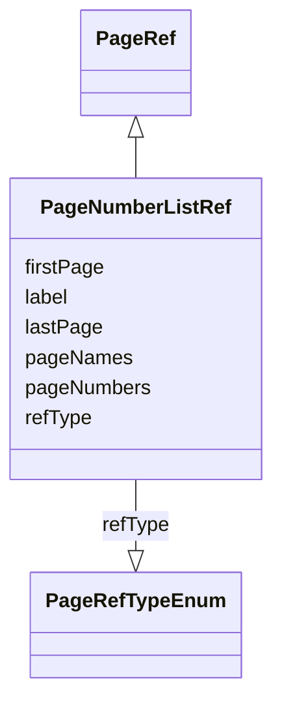

# Class: PageNumberListRef


_One or more individual pages in the reference document, referenced by page number._


URI: [ars:PageNumberListRef](https://www.cdisc.org/ars/1-0/PageNumberListRef)





## Inheritance
* [PageRef](PageRef.md)
    * **PageNumberListRef**


## Slots

| Name | Cardinality and Range | Description | Inheritance |
| ---  | --- | --- | --- |
| [refType](refType.md) | 1..1 <br/> [PageRefTypeEnum](PageRefTypeEnum.md) |  | [PageRef](PageRef.md) |
| [label](label.md) | 0..1 <br/> [String](String.md) | Alternative label to provide a more specific and description to a page link | [PageRef](PageRef.md) |
| [pageNames](pageNames.md) | 0..* <br/> [String](String.md) | One or more named document references which each correspond with a page | [PageRef](PageRef.md) |
| [pageNumbers](pageNumbers.md) | 1..* <br/> [Integer](Integer.md) | One or more page numbers | [PageRef](PageRef.md) |
| [firstPage](firstPage.md) | 0..1 <br/> [Integer](Integer.md) | The page number of the first page in a range of pages | [PageRef](PageRef.md) |
| [lastPage](lastPage.md) | 0..1 <br/> [Integer](Integer.md) | The page number of the last page in a range of pages | [PageRef](PageRef.md) |


## Identifier and Mapping Information


### Schema Source


* from schema: https://www.cdisc.org/ars/1-0


## Mappings

| Mapping Type | Mapped Value |
| ---  | ---  |
| self | ars:PageNumberListRef |
| native | ars:PageNumberListRef |


## LinkML Source

<!-- TODO: investigate https://stackoverflow.com/questions/37606292/how-to-create-tabbed-code-blocks-in-mkdocs-or-sphinx -->

### Direct

<details>
```yaml
name: PageNumberListRef
description: One or more individual pages in the reference document, referenced by
  page number.
from_schema: https://www.cdisc.org/ars/1-0
rank: 1000
is_a: PageRef
slot_usage:
  refType:
    name: refType
    domain_of:
    - PageRef
    equals_string: PhysicalRef
  pageNumbers:
    name: pageNumbers
    domain_of:
    - PageRef
    required: true
    value_presence: PRESENT
  pageNames:
    name: pageNames
    domain_of:
    - PageRef
    value_presence: ABSENT
  firstPage:
    name: firstPage
    domain_of:
    - PageRef
    value_presence: ABSENT
  lastPage:
    name: lastPage
    domain_of:
    - PageRef
    value_presence: ABSENT
defining_slots:
- pageNumbers

```
</details>

### Induced

<details>
```yaml
name: PageNumberListRef
description: One or more individual pages in the reference document, referenced by
  page number.
from_schema: https://www.cdisc.org/ars/1-0
rank: 1000
is_a: PageRef
slot_usage:
  refType:
    name: refType
    domain_of:
    - PageRef
    equals_string: PhysicalRef
  pageNumbers:
    name: pageNumbers
    domain_of:
    - PageRef
    required: true
    value_presence: PRESENT
  pageNames:
    name: pageNames
    domain_of:
    - PageRef
    value_presence: ABSENT
  firstPage:
    name: firstPage
    domain_of:
    - PageRef
    value_presence: ABSENT
  lastPage:
    name: lastPage
    domain_of:
    - PageRef
    value_presence: ABSENT
attributes:
  refType:
    name: refType
    from_schema: https://www.cdisc.org/ars/1-0
    rank: 1000
    alias: refType
    owner: PageNumberListRef
    domain_of:
    - PageRef
    range: PageRefTypeEnum
    required: true
    equals_string: PhysicalRef
  label:
    name: label
    description: Alternative label to provide a more specific and description to a
      page link.
    from_schema: https://www.cdisc.org/ars/1-0
    rank: 1000
    alias: label
    owner: PageNumberListRef
    domain_of:
    - AnalysisCategorization
    - AnalysisCategory
    - AnalysisMethod
    - Operation
    - AnalysisSet
    - GroupingFactor
    - Group
    - DataSubset
    - PageRef
    range: string
  pageNames:
    name: pageNames
    description: One or more named document references which each correspond with
      a page.
    from_schema: https://www.cdisc.org/ars/1-0
    rank: 1000
    multivalued: true
    alias: pageNames
    owner: PageNumberListRef
    domain_of:
    - PageRef
    range: string
    value_presence: ABSENT
  pageNumbers:
    name: pageNumbers
    description: One or more page numbers.
    from_schema: https://www.cdisc.org/ars/1-0
    rank: 1000
    multivalued: true
    alias: pageNumbers
    owner: PageNumberListRef
    domain_of:
    - PageRef
    range: integer
    required: true
    value_presence: PRESENT
  firstPage:
    name: firstPage
    description: The page number of the first page in a range of pages.
    from_schema: https://www.cdisc.org/ars/1-0
    rank: 1000
    alias: firstPage
    owner: PageNumberListRef
    domain_of:
    - PageRef
    range: integer
    value_presence: ABSENT
  lastPage:
    name: lastPage
    description: The page number of the last page in a range of pages.
    from_schema: https://www.cdisc.org/ars/1-0
    rank: 1000
    alias: lastPage
    owner: PageNumberListRef
    domain_of:
    - PageRef
    range: integer
    value_presence: ABSENT
defining_slots:
- pageNumbers

```
</details>