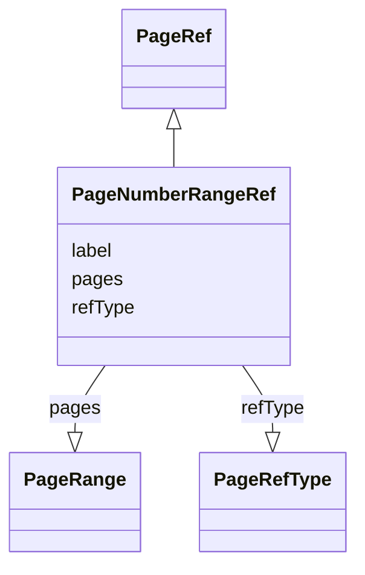

# Class: PageNumberRangeRef


_A range of pages in the reference document, indicated by the first and last page number in the range._


URI: [ars:PageNumberRangeRef](https://www.cdisc.org/ars/1-0PageNumberRangeRef)





## Inheritance
* [PageRef](PageRef.md)
    * **PageNumberRangeRef**


## Slots

| Name | Cardinality and Range | Description | Inheritance |
| ---  | --- | --- | --- |
| [refType](refType.md) | 1..1 <br/> [PageRefType](PageRefType.md) |  | [PageRef](PageRef.md) |
| [label](label.md) | 0..1 <br/> [String](String.md) |  | [PageRef](PageRef.md) |
| [pages](pages.md) | 0..1 <br/> [PageRange](PageRange.md) |  | [PageRef](PageRef.md) |


## Identifier and Mapping Information


### Schema Source


* from schema: https://www.cdisc.org/ars/1-0


## Mappings

| Mapping Type | Mapped Value |
| ---  | ---  |
| self | ars:PageNumberRangeRef |
| native | ars:PageNumberRangeRef |


## LinkML Source

<!-- TODO: investigate https://stackoverflow.com/questions/37606292/how-to-create-tabbed-code-blocks-in-mkdocs-or-sphinx -->

### Direct

<details>
```yaml
name: PageNumberRangeRef
description: A range of pages in the reference document, indicated by the first and
  last page number in the range.
from_schema: https://www.cdisc.org/ars/1-0
rank: 1000
is_a: PageRef
slot_usage:
  refType:
    name: refType
    domain_of:
    - PageRef
    equals_string: PhysicalRef
  pages:
    name: pages
    domain_of:
    - PageRef
    range: PageRange

```
</details>

### Induced

<details>
```yaml
name: PageNumberRangeRef
description: A range of pages in the reference document, indicated by the first and
  last page number in the range.
from_schema: https://www.cdisc.org/ars/1-0
rank: 1000
is_a: PageRef
slot_usage:
  refType:
    name: refType
    domain_of:
    - PageRef
    equals_string: PhysicalRef
  pages:
    name: pages
    domain_of:
    - PageRef
    range: PageRange
attributes:
  refType:
    name: refType
    from_schema: https://www.cdisc.org/ars/1-0
    rank: 1000
    alias: refType
    owner: PageNumberRangeRef
    domain_of:
    - PageRef
    range: PageRefType
    required: true
    equals_string: PhysicalRef
  label:
    name: label
    from_schema: https://www.cdisc.org/ars/1-0
    rank: 1000
    alias: label
    owner: PageNumberRangeRef
    domain_of:
    - AnalysisCategorization
    - AnalysisCategory
    - AnalysisMethod
    - Operation
    - AnalysisSet
    - GroupingFactor
    - Group
    - DataSubset
    - PageRef
    range: string
  pages:
    name: pages
    from_schema: https://www.cdisc.org/ars/1-0
    rank: 1000
    alias: pages
    owner: PageNumberRangeRef
    domain_of:
    - PageRef
    range: PageRange

```
</details>