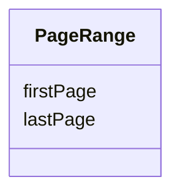

# Class: PageRange


_A set of pages in a document that includes the specified first and last page, and all pages in between._


URI: [ars:PageRange](https://www.cdisc.org/ars/1-0PageRange)





<!-- no inheritance hierarchy -->


## Slots

| Name | Cardinality and Range | Description | Inheritance |
| ---  | --- | --- | --- |
| [firstPage](firstPage.md) | 1..1 <br/> [Integer](Integer.md) | The page number of the first page in a range of pages | direct |
| [lastPage](lastPage.md) | 1..1 <br/> [Integer](Integer.md) | The page number of the last page in a range of pages | direct |


## Usages

| used by | used in | type | used |
| ---  | --- | --- | --- |
| [PageNumberRangeRef](PageNumberRangeRef.md) | [pages](pages.md) | range | [PageRange](PageRange.md) |


## Identifier and Mapping Information


### Schema Source


* from schema: https://www.cdisc.org/ars/1-0


## Mappings

| Mapping Type | Mapped Value |
| ---  | ---  |
| self | ars:PageRange |
| native | ars:PageRange |


## LinkML Source

<!-- TODO: investigate https://stackoverflow.com/questions/37606292/how-to-create-tabbed-code-blocks-in-mkdocs-or-sphinx -->

### Direct

<details>
```yaml
name: PageRange
description: A set of pages in a document that includes the specified first and last
  page, and all pages in between.
from_schema: https://www.cdisc.org/ars/1-0
rank: 1000
slots:
- firstPage
- lastPage

```
</details>

### Induced

<details>
```yaml
name: PageRange
description: A set of pages in a document that includes the specified first and last
  page, and all pages in between.
from_schema: https://www.cdisc.org/ars/1-0
rank: 1000
attributes:
  firstPage:
    name: firstPage
    description: The page number of the first page in a range of pages.
    from_schema: https://www.cdisc.org/ars/1-0
    rank: 1000
    alias: firstPage
    owner: PageRange
    domain_of:
    - PageRange
    range: integer
    required: true
  lastPage:
    name: lastPage
    description: The page number of the last page in a range of pages.
    from_schema: https://www.cdisc.org/ars/1-0
    rank: 1000
    alias: lastPage
    owner: PageRange
    domain_of:
    - PageRange
    range: integer
    required: true

```
</details>