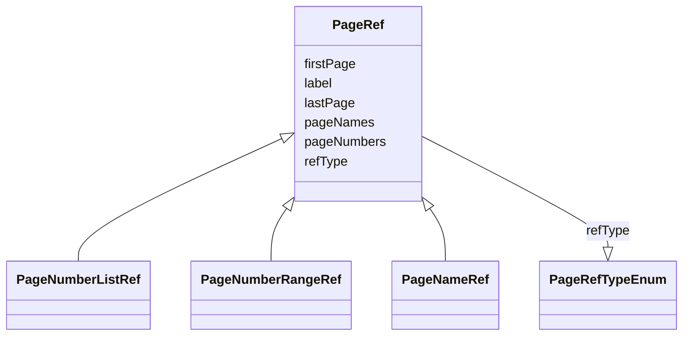

# Class: PageRef


_A reference to a specific part of a document as indicated by a list of one or more page numbers, a range of page numbers, or a list of named destinations in the document (e.g. bookmarks)._


* __NOTE__: this is an abstract class and should not be instantiated directly


URI: [ars:PageRef](https://www.cdisc.org/ars/1-0/PageRef)





## Inheritance
* **PageRef**
    * [PageNumberListRef](PageNumberListRef.md)
    * [PageNumberRangeRef](PageNumberRangeRef.md)
    * [PageNameRef](PageNameRef.md)


## Slots

| Name | Cardinality and Range | Description | Inheritance |
| ---  | --- | --- | --- |
| [refType](refType.md) | 1..1 <br/> [PageRefTypeEnum](PageRefTypeEnum.md) | The type of reference for page references | direct |
| [label](label.md) | 0..1 <br/> [String](String.md) | Alternative label to provide a more specific and description to a page link | direct |
| [pageNames](pageNames.md) | 0..* <br/> [String](String.md) | One or more named document references which each correspond with a page | direct |
| [pageNumbers](pageNumbers.md) | 0..* <br/> [Integer](Integer.md) | One or more page numbers | direct |
| [firstPage](firstPage.md) | 0..1 <br/> [Integer](Integer.md) | The page number of the first page in a range of pages | direct |
| [lastPage](lastPage.md) | 0..1 <br/> [Integer](Integer.md) | The page number of the last page in a range of pages | direct |


## Usages

| used by | used in | type | used |
| ---  | --- | --- | --- |
| [DocumentReference](DocumentReference.md) | [pageRefs](pageRefs.md) | range | [PageRef](PageRef.md) |


## Comments

* Each instance of this class should contain only one of the following page specifications:
    * pageNumbers
    * pageNames
    * firstPage AND lastPage


## Identifier and Mapping Information


### Schema Source


* from schema: https://www.cdisc.org/ars/1-0


## Mappings

| Mapping Type | Mapped Value |
| ---  | ---  |
| self | ars:PageRef |
| native | ars:PageRef |


## LinkML Source

<!-- TODO: investigate https://stackoverflow.com/questions/37606292/how-to-create-tabbed-code-blocks-in-mkdocs-or-sphinx -->

### Direct

<details>
```yaml
name: PageRef
description: A reference to a specific part of a document as indicated by a list of
  one or more page numbers, a range of page numbers, or a list of named destinations
  in the document (e.g. bookmarks).
comments:
- "Each instance of this class should contain only one of the following page specifications:\n\
  \    * pageNumbers\n    * pageNames\n    * firstPage AND lastPage\n"
from_schema: https://www.cdisc.org/ars/1-0
rank: 1000
abstract: true
slots:
- refType
- label
- pageNames
- pageNumbers
- firstPage
- lastPage
slot_usage:
  label:
    name: label
    description: Alternative label to provide a more specific and description to a
      page link.
    domain_of:
    - AnalysisCategorization
    - AnalysisCategory
    - AnalysisMethod
    - Operation
    - AnalysisSet
    - GroupingFactor
    - Group
    - DataSubset
    - PageRef

```
</details>

### Induced

<details>
```yaml
name: PageRef
description: A reference to a specific part of a document as indicated by a list of
  one or more page numbers, a range of page numbers, or a list of named destinations
  in the document (e.g. bookmarks).
comments:
- "Each instance of this class should contain only one of the following page specifications:\n\
  \    * pageNumbers\n    * pageNames\n    * firstPage AND lastPage\n"
from_schema: https://www.cdisc.org/ars/1-0
rank: 1000
abstract: true
slot_usage:
  label:
    name: label
    description: Alternative label to provide a more specific and description to a
      page link.
    domain_of:
    - AnalysisCategorization
    - AnalysisCategory
    - AnalysisMethod
    - Operation
    - AnalysisSet
    - GroupingFactor
    - Group
    - DataSubset
    - PageRef
attributes:
  refType:
    name: refType
    description: The type of reference for page references.
    from_schema: https://www.cdisc.org/ars/1-0
    rank: 1000
    alias: refType
    owner: PageRef
    domain_of:
    - PageRef
    range: PageRefTypeEnum
    required: true
  label:
    name: label
    description: Alternative label to provide a more specific and description to a
      page link.
    from_schema: https://www.cdisc.org/ars/1-0
    rank: 1000
    alias: label
    owner: PageRef
    domain_of:
    - AnalysisCategorization
    - AnalysisCategory
    - AnalysisMethod
    - Operation
    - AnalysisSet
    - GroupingFactor
    - Group
    - DataSubset
    - PageRef
    range: string
  pageNames:
    name: pageNames
    description: One or more named document references which each correspond with
      a page.
    from_schema: https://www.cdisc.org/ars/1-0
    rank: 1000
    multivalued: true
    alias: pageNames
    owner: PageRef
    domain_of:
    - PageRef
    range: string
  pageNumbers:
    name: pageNumbers
    description: One or more page numbers.
    from_schema: https://www.cdisc.org/ars/1-0
    rank: 1000
    multivalued: true
    alias: pageNumbers
    owner: PageRef
    domain_of:
    - PageRef
    range: integer
  firstPage:
    name: firstPage
    description: The page number of the first page in a range of pages.
    from_schema: https://www.cdisc.org/ars/1-0
    rank: 1000
    alias: firstPage
    owner: PageRef
    domain_of:
    - PageRef
    range: integer
  lastPage:
    name: lastPage
    description: The page number of the last page in a range of pages.
    from_schema: https://www.cdisc.org/ars/1-0
    rank: 1000
    alias: lastPage
    owner: PageRef
    domain_of:
    - PageRef
    range: integer

```
</details>