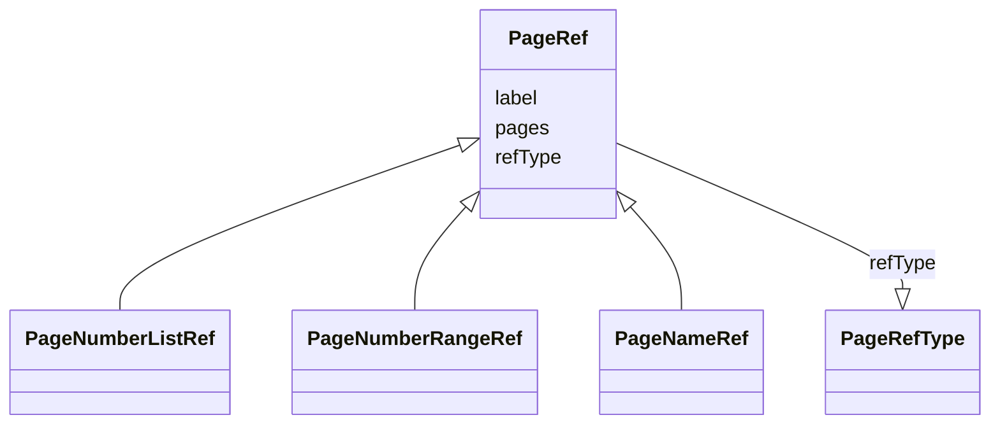

# Class: PageRef


URI: [ars:PageRef](https://www.cdisc.org/ars/1-0PageRef)





## Inheritance
* **PageRef**
    * [PageNumberListRef](PageNumberListRef.md)
    * [PageNumberRangeRef](PageNumberRangeRef.md)
    * [PageNameRef](PageNameRef.md)


## Slots

| Name | Cardinality and Range | Description | Inheritance |
| ---  | --- | --- | --- |
| [refType](refType.md) | 1..1 <br/> [PageRefType](PageRefType.md) |  | direct |
| [label](label.md) | 0..1 <br/> [String](String.md) |  | direct |
| [pages](pages.md) | 0..1 <br/> [String](String.md) |  | direct |


## Usages

| used by | used in | type | used |
| ---  | --- | --- | --- |
| [DocumentRef](DocumentRef.md) | [pageRefs](pageRefs.md) | range | [PageRef](PageRef.md) |


## Identifier and Mapping Information


### Schema Source


* from schema: https://www.cdisc.org/ars/1-0


## Mappings

| Mapping Type | Mapped Value |
| ---  | ---  |
| self | ars:PageRef |
| native | ars:PageRef |


## LinkML Source

<!-- TODO: investigate https://stackoverflow.com/questions/37606292/how-to-create-tabbed-code-blocks-in-mkdocs-or-sphinx -->

### Direct

<details>
```yaml
name: PageRef
from_schema: https://www.cdisc.org/ars/1-0
rank: 1000
slots:
- refType
- label
- pages

```
</details>

### Induced

<details>
```yaml
name: PageRef
from_schema: https://www.cdisc.org/ars/1-0
rank: 1000
attributes:
  refType:
    name: refType
    from_schema: https://www.cdisc.org/ars/1-0
    rank: 1000
    alias: refType
    owner: PageRef
    domain_of:
    - PageRef
    range: PageRefType
    required: true
  label:
    name: label
    from_schema: https://www.cdisc.org/ars/1-0
    rank: 1000
    alias: label
    owner: PageRef
    domain_of:
    - AnalysisCategorization
    - AnalysisCategory
    - AnalysisMethod
    - Operation
    - AnalysisSet
    - GroupingFactor
    - Group
    - DataSubset
    - PageRef
    range: string
  pages:
    name: pages
    from_schema: https://www.cdisc.org/ars/1-0
    rank: 1000
    alias: pages
    owner: PageRef
    domain_of:
    - PageRef
    range: string
    any_of:
    - range: PageNumberList
    - range: PageNameList
    - range: PageRange

```
</details>