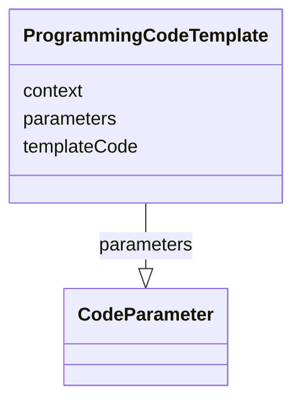

# Class: ProgrammingCodeTemplate


URI: [ars:ProgrammingCodeTemplate](https://www.cdisc.org/ars/1-0ProgrammingCodeTemplate)





<!-- no inheritance hierarchy -->


## Slots

| Name | Cardinality and Range | Description | Inheritance |
| ---  | --- | --- | --- |
| [context](context.md) | 1..1 <br/> [String](String.md) | The name and version of the computer language used for the actual programming... | direct |
| [parameters](parameters.md) | 0..* <br/> [CodeParameter](CodeParameter.md) | Replacement parameters referenced in the programming code template | direct |
| [templateCode](templateCode.md) | 0..1 <br/> [String](String.md) | Template programming statements and/or a reference to the template program us... | direct |


## Usages

| used by | used in | type | used |
| ---  | --- | --- | --- |
| [AnalysisMethod](AnalysisMethod.md) | [codeTemplate](codeTemplate.md) | range | [ProgrammingCodeTemplate](ProgrammingCodeTemplate.md) |


## Identifier and Mapping Information


### Schema Source


* from schema: https://www.cdisc.org/ars/1-0


## Mappings

| Mapping Type | Mapped Value |
| ---  | ---  |
| self | ars:ProgrammingCodeTemplate |
| native | ars:ProgrammingCodeTemplate |


## LinkML Source

<!-- TODO: investigate https://stackoverflow.com/questions/37606292/how-to-create-tabbed-code-blocks-in-mkdocs-or-sphinx -->

### Direct

<details>
```yaml
name: ProgrammingCodeTemplate
from_schema: https://www.cdisc.org/ars/1-0
rank: 1000
slots:
- context
- parameters
- templateCode

```
</details>

### Induced

<details>
```yaml
name: ProgrammingCodeTemplate
from_schema: https://www.cdisc.org/ars/1-0
rank: 1000
attributes:
  context:
    name: context
    description: The name and version of the computer language used for the actual
      programming statements provided.
    examples:
    - value: SAS Version 9.2
    from_schema: https://www.cdisc.org/ars/1-0
    rank: 1000
    alias: context
    owner: ProgrammingCodeTemplate
    domain_of:
    - ProgrammingCodeTemplate
    range: string
    required: true
  parameters:
    name: parameters
    description: Replacement parameters referenced in the programming code template.
    from_schema: https://www.cdisc.org/ars/1-0
    rank: 1000
    multivalued: true
    alias: parameters
    owner: ProgrammingCodeTemplate
    domain_of:
    - ProgrammingCodeTemplate
    range: CodeParameter
    inlined: true
    inlined_as_list: true
  templateCode:
    name: templateCode
    description: Template programming statements and/or a reference to the template
      program used to perform the specific analysis.
    from_schema: https://www.cdisc.org/ars/1-0
    rank: 1000
    alias: templateCode
    owner: ProgrammingCodeTemplate
    domain_of:
    - ProgrammingCodeTemplate
    range: string
    any_of:
    - range: string
    - range: DocumentRef

```
</details>