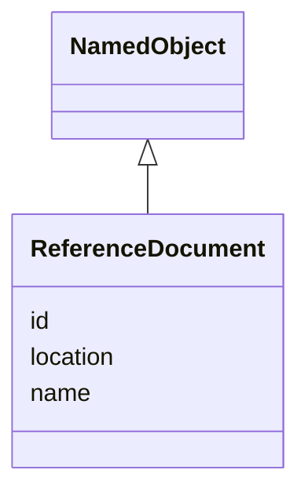

# Class: ReferenceDocument


URI: [ars:ReferenceDocument](https://www.cdisc.org/ars/1-0/ReferenceDocument)





## Inheritance
* [NamedObject](NamedObject.md)
    * **ReferenceDocument**


## Slots

| Name | Cardinality and Range | Description | Inheritance |
| ---  | --- | --- | --- |
| [id](id.md) | 1..1 <br/> [String](String.md) |  | direct |
| [location](location.md) | 0..1 <br/> [Uri](Uri.md) |  | direct |
| [name](name.md) | 1..1 <br/> [String](String.md) |  | [NamedObject](NamedObject.md) |


## Usages

| used by | used in | type | used |
| ---  | --- | --- | --- |
| [ReportingEvent](ReportingEvent.md) | [referenceDocuments](referenceDocuments.md) | range | [ReferenceDocument](ReferenceDocument.md) |
| [DocumentRef](DocumentRef.md) | [referenceDocumentId](referenceDocumentId.md) | range | [ReferenceDocument](ReferenceDocument.md) |


## Identifier and Mapping Information


### Schema Source


* from schema: https://www.cdisc.org/ars/1-0


## Mappings

| Mapping Type | Mapped Value |
| ---  | ---  |
| self | ars:ReferenceDocument |
| native | ars:ReferenceDocument |


## LinkML Source

<!-- TODO: investigate https://stackoverflow.com/questions/37606292/how-to-create-tabbed-code-blocks-in-mkdocs-or-sphinx -->

### Direct

<details>
```yaml
name: ReferenceDocument
from_schema: https://www.cdisc.org/ars/1-0
rank: 1000
is_a: NamedObject
slots:
- id
- location

```
</details>

### Induced

<details>
```yaml
name: ReferenceDocument
from_schema: https://www.cdisc.org/ars/1-0
rank: 1000
is_a: NamedObject
attributes:
  id:
    name: id
    from_schema: https://www.cdisc.org/ars/1-0
    rank: 1000
    identifier: true
    alias: id
    owner: ReferenceDocument
    domain_of:
    - AnalysisCategorization
    - AnalysisCategory
    - Analysis
    - AnalysisMethod
    - Operation
    - ReferencedOperationRelationship
    - Output
    - OutputDisplay
    - DisplaySubSection
    - AnalysisSet
    - GroupingFactor
    - Group
    - DataSubset
    - ReferenceDocument
    - SponsorTerm
    range: string
    required: true
  location:
    name: location
    from_schema: https://www.cdisc.org/ars/1-0
    rank: 1000
    alias: location
    owner: ReferenceDocument
    domain_of:
    - OutputFile
    - ReferenceDocument
    range: uri
  name:
    name: name
    from_schema: https://www.cdisc.org/ars/1-0
    rank: 1000
    alias: name
    owner: ReferenceDocument
    domain_of:
    - NamedObject
    range: string
    required: true

```
</details>