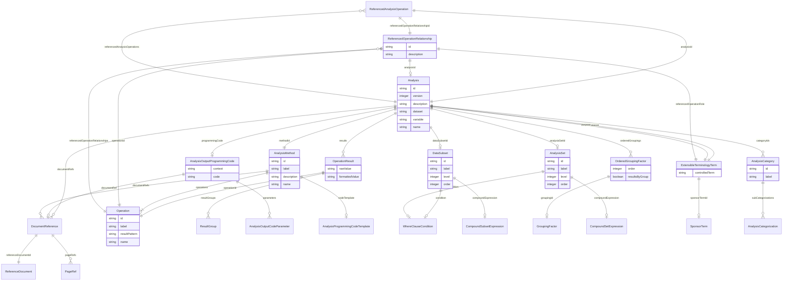

# Class: ReferencedAnalysisOperation


_An indication of the analysis that contains results of a referenced operation._


URI: [ars:ReferencedAnalysisOperation](https://www.cdisc.org/ars/1-0/ReferencedAnalysisOperation)





<!-- no inheritance hierarchy -->


## Slots

| Name | Cardinality and Range | Description | Inheritance |
| ---  | --- | --- | --- |
| [referencedOperationRelationshipId](referencedOperationRelationshipId.md) | 1..1 <br/> [ReferencedOperationRelationship](ReferencedOperationRelationship.md) | The identifier of the defined referenced operation relationship | direct |
| [analysisId](analysisId.md) | 1..1 <br/> [Analysis](Analysis.md) | The identifier of the referenced analysis | direct |


## Usages

| used by | used in | type | used |
| ---  | --- | --- | --- |
| [Analysis](Analysis.md) | [referencedAnalysisOperations](referencedAnalysisOperations.md) | range | [ReferencedAnalysisOperation](ReferencedAnalysisOperation.md) |


## Identifier and Mapping Information


### Schema Source


* from schema: https://www.cdisc.org/ars/1-0


## Mappings

| Mapping Type | Mapped Value |
| ---  | ---  |
| self | ars:ReferencedAnalysisOperation |
| native | ars:ReferencedAnalysisOperation |


## LinkML Source

<!-- TODO: investigate https://stackoverflow.com/questions/37606292/how-to-create-tabbed-code-blocks-in-mkdocs-or-sphinx -->

### Direct

<details>
```yaml
name: ReferencedAnalysisOperation
description: An indication of the analysis that contains results of a referenced operation.
from_schema: https://www.cdisc.org/ars/1-0
rank: 1000
slots:
- referencedOperationRelationshipId
- analysisId
slot_usage:
  analysisId:
    name: analysisId
    domain_of:
    - OrderedListItem
    - ReferencedAnalysisOperation
    - ReferencedOperationRelationship
    required: true

```
</details>

### Induced

<details>
```yaml
name: ReferencedAnalysisOperation
description: An indication of the analysis that contains results of a referenced operation.
from_schema: https://www.cdisc.org/ars/1-0
rank: 1000
slot_usage:
  analysisId:
    name: analysisId
    domain_of:
    - OrderedListItem
    - ReferencedAnalysisOperation
    - ReferencedOperationRelationship
    required: true
attributes:
  referencedOperationRelationshipId:
    name: referencedOperationRelationshipId
    description: The identifier of the defined referenced operation relationship.
    from_schema: https://www.cdisc.org/ars/1-0
    rank: 1000
    alias: referencedOperationRelationshipId
    owner: ReferencedAnalysisOperation
    domain_of:
    - ReferencedAnalysisOperation
    range: ReferencedOperationRelationship
    required: true
    inlined: false
  analysisId:
    name: analysisId
    description: The identifier of the referenced analysis.
    from_schema: https://www.cdisc.org/ars/1-0
    rank: 1000
    multivalued: false
    alias: analysisId
    owner: ReferencedAnalysisOperation
    domain_of:
    - OrderedListItem
    - ReferencedAnalysisOperation
    - ReferencedOperationRelationship
    range: Analysis
    required: true
    inlined: false

```
</details>