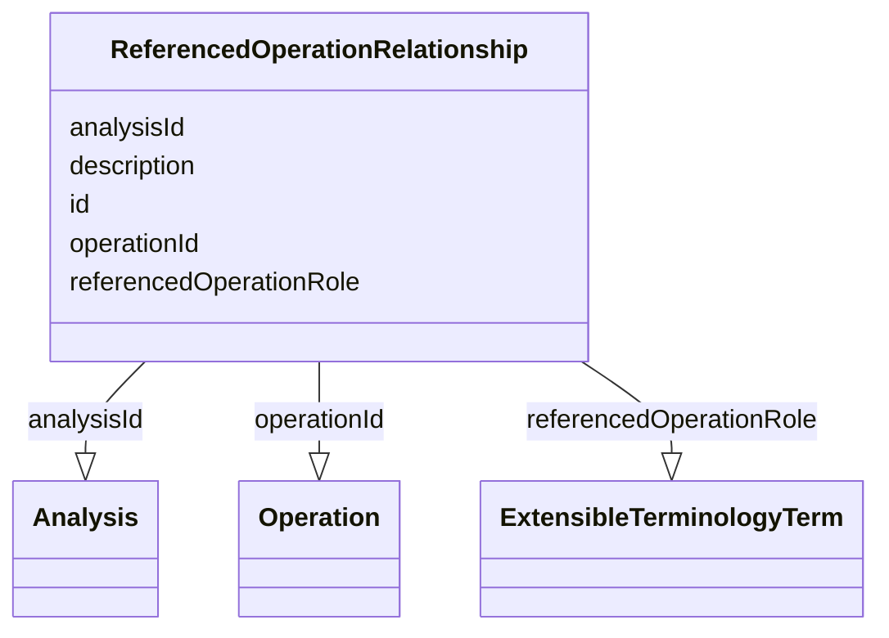

# Class: ReferencedOperationRelationship


_A reference to an statistical operation whose results is used in the calculation of the result for this operation._


URI: [ars:ReferencedOperationRelationship](https://www.cdisc.org/ars/1-0/ReferencedOperationRelationship)





<!-- no inheritance hierarchy -->


## Slots

| Name | Cardinality and Range | Description | Inheritance |
| ---  | --- | --- | --- |
| [id](id.md) | 1..1 <br/> [String](String.md) |  | direct |
| [referencedOperationRole](referencedOperationRole.md) | 1..1 <br/> [ExtensibleTerminologyTerm](ExtensibleTerminologyTerm.md) |  | direct |
| [operationId](operationId.md) | 1..1 <br/> [Operation](Operation.md) |  | direct |
| [analysisId](analysisId.md) | 0..1 <br/> [Analysis](Analysis.md) |  | direct |
| [description](description.md) | 0..1 <br/> [String](String.md) |  | direct |


## Usages

| used by | used in | type | used |
| ---  | --- | --- | --- |
| [ReferencedAnalysisOperation](ReferencedAnalysisOperation.md) | [referencedOperationId](referencedOperationId.md) | range | [ReferencedOperationRelationship](ReferencedOperationRelationship.md) |
| [Operation](Operation.md) | [referencedOperationRelationships](referencedOperationRelationships.md) | range | [ReferencedOperationRelationship](ReferencedOperationRelationship.md) |


## Identifier and Mapping Information


### Schema Source


* from schema: https://www.cdisc.org/ars/1-0


## Mappings

| Mapping Type | Mapped Value |
| ---  | ---  |
| self | ars:ReferencedOperationRelationship |
| native | ars:ReferencedOperationRelationship |


## LinkML Source

<!-- TODO: investigate https://stackoverflow.com/questions/37606292/how-to-create-tabbed-code-blocks-in-mkdocs-or-sphinx -->

### Direct

<details>
```yaml
name: ReferencedOperationRelationship
description: A reference to an statistical operation whose results is used in the
  calculation of the result for this operation.
from_schema: https://www.cdisc.org/ars/1-0
rank: 1000
slots:
- id
- referencedOperationRole
- operationId
- analysisId
- description

```
</details>

### Induced

<details>
```yaml
name: ReferencedOperationRelationship
description: A reference to an statistical operation whose results is used in the
  calculation of the result for this operation.
from_schema: https://www.cdisc.org/ars/1-0
rank: 1000
attributes:
  id:
    name: id
    from_schema: https://www.cdisc.org/ars/1-0
    rank: 1000
    identifier: true
    alias: id
    owner: ReferencedOperationRelationship
    domain_of:
    - ReportingEvent
    - AnalysisCategorization
    - AnalysisCategory
    - Analysis
    - AnalysisMethod
    - Operation
    - ReferencedOperationRelationship
    - Output
    - OutputDisplay
    - DisplaySubSection
    - AnalysisSet
    - GroupingFactor
    - Group
    - DataSubset
    - ReferenceDocument
    - TerminologyExtension
    - SponsorTerm
    range: string
    required: true
  referencedOperationRole:
    name: referencedOperationRole
    from_schema: https://www.cdisc.org/ars/1-0
    rank: 1000
    alias: referencedOperationRole
    owner: ReferencedOperationRelationship
    domain_of:
    - ReferencedOperationRelationship
    range: ExtensibleTerminologyTerm
    required: true
    any_of:
    - range: OperationRole
    - range: SponsorOperationRole
  operationId:
    name: operationId
    from_schema: https://www.cdisc.org/ars/1-0
    rank: 1000
    alias: operationId
    owner: ReferencedOperationRelationship
    domain_of:
    - OperationResult
    - ReferencedOperationRelationship
    range: Operation
    required: true
    inlined: false
  analysisId:
    name: analysisId
    from_schema: https://www.cdisc.org/ars/1-0
    rank: 1000
    multivalued: false
    alias: analysisId
    owner: ReferencedOperationRelationship
    domain_of:
    - OrderedListItem
    - ReferencedAnalysisOperation
    - ReferencedOperationRelationship
    range: Analysis
    inlined: false
  description:
    name: description
    from_schema: https://www.cdisc.org/ars/1-0
    rank: 1000
    alias: description
    owner: ReferencedOperationRelationship
    domain_of:
    - Analysis
    - AnalysisMethod
    - ReferencedOperationRelationship
    - CodeParameter
    - SponsorTerm
    range: string

```
</details>