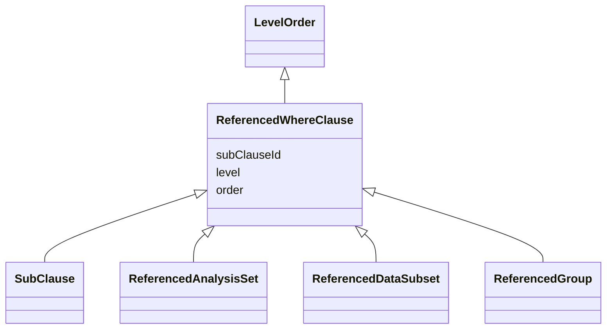

# Class: ReferencedWhereClause

_An abstract class indicating an identified where clause (i.e., `AnalysisSet`, `DataSubset` or `Group`) referenced by identifier (`subClauseId`) as the sub-clause in a compound expression._


* __NOTE__: this is an abstract class and should not be instantiated directly

URI: [ars:ReferencedWhereClause](https://www.cdisc.org/ars/1-0/ReferencedWhereClause)





## Inheritance
* **ReferencedWhereClause** [ [LevelOrder](LevelOrder.md)]
    * [ReferencedAnalysisSet](ReferencedAnalysisSet.md)
    * [ReferencedDataSubset](ReferencedDataSubset.md)
    * [ReferencedGroup](ReferencedGroup.md)


## Slots

| Name | Cardinality* and Range | Description | Inheritance |
| ---  | --- | --- | --- |
| [subClauseId](subClauseId.md) | 1..1 <br/> [String](String.md) | The identifier of the analysis set, data subset or group referenced in the co... | direct |
| [level](level.md) | 1..1 <br/> [Integer](Integer.md) | The level of the entry within a hierarchical structure | [LevelOrder](LevelOrder.md) |
| [order](order.md) | 1..1 <br/> [Integer](Integer.md) | The ordinal of the instance with respect to other instances | [LevelOrder](LevelOrder.md) |

_* See [LinkML documentation](https://linkml.io/linkml/schemas/slots.html#slot-cardinality) for cardinality definitions._


## Identifier and Mapping Information


### Schema Source


* from schema: https://www.cdisc.org/ars/1-0


## Mappings

| Mapping Type | Mapped Value |
| ---  | ---  |
| self | ars:ReferencedWhereClause |
| native | ars:ReferencedWhereClause |


## LinkML Source

<!-- TODO: investigate https://stackoverflow.com/questions/37606292/how-to-create-tabbed-code-blocks-in-mkdocs-or-sphinx -->

### Direct

<details>
```yaml
name: ReferencedWhereClause
description: An abstract class indicating an identified where clause (i.e., `AnalysisSet`,
  `DataSubset` or `Group`) referenced by identifier (`subClauseId`) as the sub-clause
  in a compound expression.
from_schema: https://www.cdisc.org/ars/1-0
rank: 1000
abstract: true
mixins:
- LevelOrder
slots:
- subClauseId
slot_usage:
  subClauseId:
    name: subClauseId
    domain_of:
    - ReferencedWhereClause
    required: true

```
</details>

### Induced

<details>
```yaml
name: ReferencedWhereClause
description: An abstract class indicating an identified where clause (i.e., `AnalysisSet`,
  `DataSubset` or `Group`) referenced by identifier (`subClauseId`) as the sub-clause
  in a compound expression.
from_schema: https://www.cdisc.org/ars/1-0
rank: 1000
abstract: true
mixins:
- LevelOrder
slot_usage:
  subClauseId:
    name: subClauseId
    domain_of:
    - ReferencedWhereClause
    required: true
attributes:
  subClauseId:
    name: subClauseId
    description: The identifier of the analysis set, data subset or group referenced
      in the compound expression.
    from_schema: https://www.cdisc.org/ars/1-0
    rank: 1000
    alias: subClauseId
    owner: ReferencedWhereClause
    domain_of:
    - ReferencedWhereClause
    range: string
    required: true
    inlined: false
    inlined_as_list: false
  level:
    name: level
    description: The level of the entry within a hierarchical structure.
    comments:
    - 1 is the top level.
    from_schema: https://www.cdisc.org/ars/1-0
    rank: 1000
    alias: level
    owner: ReferencedWhereClause
    domain_of:
    - LevelOrder
    range: integer
    required: true
  order:
    name: order
    description: The ordinal of the instance with respect to other instances.
    from_schema: https://www.cdisc.org/ars/1-0
    rank: 1000
    alias: order
    owner: ReferencedWhereClause
    domain_of:
    - LevelOrder
    - Operation
    - OrderedGroupingFactor
    - OrderedDisplay
    - OrderedDisplaySubSection
    range: integer
    required: true

```
</details>