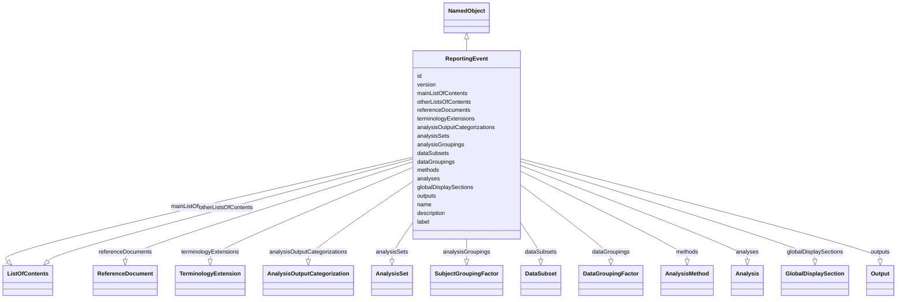

# Class: ReportingEvent

_A set of analyses and outputs created to meet a specific reporting requirement, such as a CSR or interim analysis._


URI: [ars:ReportingEvent](https://www.cdisc.org/ars/1-0/ReportingEvent)





## Inheritance
* [NamedObject](NamedObject.md)
    * **ReportingEvent**


## Slots

| Name | Cardinality* and Range | Description | Inheritance |
| ---  | --- | --- | --- |
| [id](id.md) | 1..1 <br/> [String](String.md) | The assigned identifying value for the instance of the class | direct |
| [version](version.md) | 0..1 <br/> [Integer](Integer.md) | An ordinal indicating the version of the identified instance of the class | direct |
| [mainListOfContents](mainListOfContents.md) | 1..1 <br/> [ListOfContents](ListOfContents.md) | The main list of the analyses and outputs defined for the reporting event | direct |
| [otherListsOfContents](otherListsOfContents.md) | 0..* <br/> [ListOfContents](ListOfContents.md) | Other lists of the analyses and outputs defined for the reporting event | direct |
| [referenceDocuments](referenceDocuments.md) | 0..* <br/> [ReferenceDocument](ReferenceDocument.md) | External documents containing information referenced for the reporting event | direct |
| [terminologyExtensions](terminologyExtensions.md) | 0..* <br/> [TerminologyExtension](TerminologyExtension.md) | Any sponsor-defined extensions to extensible terminology | direct |
| [analysisOutputCategorizations](analysisOutputCategorizations.md) | 0..* <br/> [AnalysisOutputCategorization](AnalysisOutputCategorization.md) | Sets of related implementer-defined categories that can be used to categorize... | direct |
| [analysisSets](analysisSets.md) | 0..* <br/> [AnalysisSet](AnalysisSet.md) | The analysis sets (subject populations) defined for the reporting event | direct |
| [analysisGroupings](analysisGroupings.md) | 0..* <br/> [SubjectGroupingFactor](SubjectGroupingFactor.md) | Characteristics used to subdivide the subject population (e | direct |
| [dataSubsets](dataSubsets.md) | 0..* <br/> [DataSubset](DataSubset.md) | Subsets of data identified by selection criteria for inclusion in analysis de... | direct |
| [dataGroupings](dataGroupings.md) | 0..* <br/> [DataGroupingFactor](DataGroupingFactor.md) | Characteristics used to subdivide data records in analysis datasets (e | direct |
| [methods](methods.md) | 0..* <br/> [AnalysisMethod](AnalysisMethod.md) | The defined methods used to analyze any analysis variable | direct |
| [analyses](analyses.md) | 0..* <br/> [Analysis](Analysis.md) | The analyses defined for the reporting event | direct |
| [globalDisplaySections](globalDisplaySections.md) | 0..* <br/> [GlobalDisplaySection](GlobalDisplaySection.md) | Display section specifications that may be applied to any display | direct |
| [outputs](outputs.md) | 0..* <br/> [Output](Output.md) | The outputs defined for the reporting event | direct |
| [name](name.md) | 1..1 <br/> [String](String.md) | The name for the instance of the class | [NamedObject](NamedObject.md) |
| [description](description.md) | 0..1 <br/> [String](String.md) | A textual description of the instance of the class | [NamedObject](NamedObject.md) |
| [label](label.md) | 0..1 <br/> [String](String.md) | A short informative description that may be used for display | [NamedObject](NamedObject.md) |

_* See [LinkML documentation](https://linkml.io/linkml/schemas/slots.html#slot-cardinality) for cardinality definitions._


## Identifier and Mapping Information


### Schema Source


* from schema: https://www.cdisc.org/ars/1-0


## Mappings

| Mapping Type | Mapped Value |
| ---  | ---  |
| self | ars:ReportingEvent |
| native | ars:ReportingEvent |


## LinkML Source

<!-- TODO: investigate https://stackoverflow.com/questions/37606292/how-to-create-tabbed-code-blocks-in-mkdocs-or-sphinx -->

### Direct

<details>
```yaml
name: ReportingEvent
description: A set of analyses and outputs created to meet a specific reporting requirement,
  such as a CSR or interim analysis.
from_schema: https://www.cdisc.org/ars/1-0
rank: 1000
is_a: NamedObject
slots:
- id
- version
- mainListOfContents
- otherListsOfContents
- referenceDocuments
- terminologyExtensions
- analysisOutputCategorizations
- analysisSets
- analysisGroupings
- dataSubsets
- dataGroupings
- methods
- analyses
- globalDisplaySections
- outputs
tree_root: true

```
</details>

### Induced

<details>
```yaml
name: ReportingEvent
description: A set of analyses and outputs created to meet a specific reporting requirement,
  such as a CSR or interim analysis.
from_schema: https://www.cdisc.org/ars/1-0
rank: 1000
is_a: NamedObject
attributes:
  id:
    name: id
    description: The assigned identifying value for the instance of the class.
    from_schema: https://www.cdisc.org/ars/1-0
    rank: 1000
    identifier: true
    alias: id
    owner: ReportingEvent
    domain_of:
    - ReportingEvent
    - ReferenceDocument
    - TerminologyExtension
    - SponsorTerm
    - AnalysisOutputCategorization
    - AnalysisOutputCategory
    - AnalysisSet
    - DataSubset
    - GroupingFactor
    - Group
    - AnalysisMethod
    - Operation
    - ReferencedOperationRelationship
    - Analysis
    - DisplaySubSection
    - Output
    - OutputDisplay
    range: string
    required: true
  version:
    name: version
    description: An ordinal indicating the version of the identified instance of the
      class.
    from_schema: https://www.cdisc.org/ars/1-0
    rank: 1000
    alias: version
    owner: ReportingEvent
    domain_of:
    - ReportingEvent
    - Analysis
    - Output
    - OutputDisplay
    range: integer
  mainListOfContents:
    name: mainListOfContents
    description: The main list of the analyses and outputs defined for the reporting
      event.
    from_schema: https://www.cdisc.org/ars/1-0
    rank: 1000
    alias: mainListOfContents
    owner: ReportingEvent
    domain_of:
    - ReportingEvent
    range: ListOfContents
    required: true
    inlined: true
    inlined_as_list: true
  otherListsOfContents:
    name: otherListsOfContents
    description: Other lists of the analyses and outputs defined for the reporting
      event.
    from_schema: https://www.cdisc.org/ars/1-0
    rank: 1000
    multivalued: true
    alias: otherListsOfContents
    owner: ReportingEvent
    domain_of:
    - ReportingEvent
    range: ListOfContents
    required: false
    inlined: true
    inlined_as_list: true
  referenceDocuments:
    name: referenceDocuments
    description: External documents containing information referenced for the reporting
      event.
    comments:
    - May include specification or report documents (e.g. the SAP or CSR) and program
      files.
    from_schema: https://www.cdisc.org/ars/1-0
    rank: 1000
    multivalued: true
    alias: referenceDocuments
    owner: ReportingEvent
    domain_of:
    - ReportingEvent
    range: ReferenceDocument
    inlined: true
    inlined_as_list: true
  terminologyExtensions:
    name: terminologyExtensions
    description: Any sponsor-defined extensions to extensible terminology.
    from_schema: https://www.cdisc.org/ars/1-0
    rank: 1000
    multivalued: true
    alias: terminologyExtensions
    owner: ReportingEvent
    domain_of:
    - ReportingEvent
    range: TerminologyExtension
    inlined: true
    inlined_as_list: true
  analysisOutputCategorizations:
    name: analysisOutputCategorizations
    description: Sets of related implementer-defined categories that can be used to
      categorize analyses or outputs.
    from_schema: https://www.cdisc.org/ars/1-0
    rank: 1000
    multivalued: true
    alias: analysisOutputCategorizations
    owner: ReportingEvent
    domain_of:
    - ReportingEvent
    range: AnalysisOutputCategorization
    inlined: true
    inlined_as_list: true
  analysisSets:
    name: analysisSets
    description: The analysis sets (subject populations) defined for the reporting
      event.
    from_schema: https://www.cdisc.org/ars/1-0
    rank: 1000
    multivalued: true
    alias: analysisSets
    owner: ReportingEvent
    domain_of:
    - ReportingEvent
    range: AnalysisSet
    inlined: true
    inlined_as_list: true
  analysisGroupings:
    name: analysisGroupings
    description: Characteristics used to subdivide the subject population (e.g., treatment,
      sex, age group).
    from_schema: https://www.cdisc.org/ars/1-0
    rank: 1000
    multivalued: true
    alias: analysisGroupings
    owner: ReportingEvent
    domain_of:
    - ReportingEvent
    range: SubjectGroupingFactor
    inlined: true
    inlined_as_list: true
  dataSubsets:
    name: dataSubsets
    description: Subsets of data identified by selection criteria for inclusion in
      analysis definitions.
    from_schema: https://www.cdisc.org/ars/1-0
    rank: 1000
    multivalued: true
    alias: dataSubsets
    owner: ReportingEvent
    domain_of:
    - ReportingEvent
    range: DataSubset
    inlined: true
    inlined_as_list: true
  dataGroupings:
    name: dataGroupings
    description: Characteristics used to subdivide data records in analysis datasets
      (e.g., visit, system organ class).
    from_schema: https://www.cdisc.org/ars/1-0
    rank: 1000
    multivalued: true
    alias: dataGroupings
    owner: ReportingEvent
    domain_of:
    - ReportingEvent
    range: DataGroupingFactor
    inlined: true
    inlined_as_list: true
  methods:
    name: methods
    description: The defined methods used to analyze any analysis variable.
    from_schema: https://www.cdisc.org/ars/1-0
    rank: 1000
    multivalued: true
    alias: methods
    owner: ReportingEvent
    domain_of:
    - ReportingEvent
    range: AnalysisMethod
    inlined: true
    inlined_as_list: true
  analyses:
    name: analyses
    description: The analyses defined for the reporting event.
    from_schema: https://www.cdisc.org/ars/1-0
    rank: 1000
    multivalued: true
    alias: analyses
    owner: ReportingEvent
    domain_of:
    - ReportingEvent
    range: Analysis
    inlined: true
    inlined_as_list: true
  globalDisplaySections:
    name: globalDisplaySections
    description: Display section specifications that may be applied to any display.
    from_schema: https://www.cdisc.org/ars/1-0
    rank: 1000
    multivalued: true
    alias: globalDisplaySections
    owner: ReportingEvent
    domain_of:
    - ReportingEvent
    range: GlobalDisplaySection
    inlined: true
    inlined_as_list: true
  outputs:
    name: outputs
    description: The outputs defined for the reporting event.
    from_schema: https://www.cdisc.org/ars/1-0
    rank: 1000
    multivalued: true
    alias: outputs
    owner: ReportingEvent
    domain_of:
    - ReportingEvent
    range: Output
    inlined: true
    inlined_as_list: true
  name:
    name: name
    description: The name for the instance of the class.
    from_schema: https://www.cdisc.org/ars/1-0
    rank: 1000
    alias: name
    owner: ReportingEvent
    domain_of:
    - NamedObject
    range: string
    required: true
  description:
    name: description
    description: A textual description of the instance of the class.
    from_schema: https://www.cdisc.org/ars/1-0
    rank: 1000
    alias: description
    owner: ReportingEvent
    domain_of:
    - NamedObject
    - SponsorTerm
    - ReferencedOperationRelationship
    range: string
  label:
    name: label
    description: A short informative description that may be used for display.
    from_schema: https://www.cdisc.org/ars/1-0
    rank: 1000
    alias: label
    owner: ReportingEvent
    domain_of:
    - NamedObject
    - AnalysisOutputCategorization
    - AnalysisOutputCategory
    - AnalysisSet
    - DataSubset
    - GroupingFactor
    - Group
    - PageRef
    range: string
tree_root: true

```
</details>